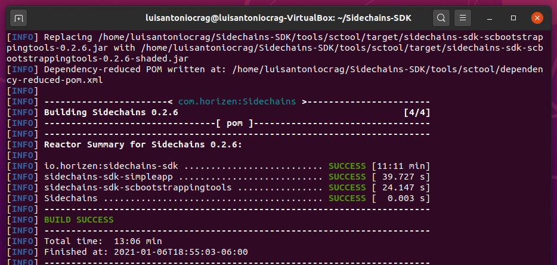

# Create a new sidechain - task
| Task | Create a New Sidechain|
| ----- | ---- |
| Link | https://hde.horizen.io/task/647569182 |
| OS | linux: ubuntu-20.04.1 |
| Zend_oo  | v2.1.0-beta4 |
| Sidechain SDK | v0.2.6 |

## 1. Zend_oo and Sidechains-SDK build
I got dependencies with
```
$ sudo apt-get install \
      build-essential pkg-config libc6-dev m4 g++-multilib \
      autoconf libtool ncurses-dev unzip git python \
      zlib1g-dev bsdmainutils automake curl
```
I moved to `home/usr` and installed with:
```
$ git clone https://github.com/HorizenOfficial/zend_oo.git
$ cd zend_oo
# Build
$ ./zcutil/build.sh -j$(nproc)
# fetch key
$ ./zcutil/fetch-params.sh
# set regtest mode
$ sed -i -e "s/#regtest=0/regtest=1/" ~/.zen/zen.conf
# Run
$ ./src/zend -regtest -websocket
```

## 2. Sidechain SDK
First I installed the requirements of
- Java 8 or newer (Java 11 recommended)
- Scala 2.12.10+
- Python 2.7
- Maven

Basically I followed the same steps as in the task: [Test sidechain functionalities with Sphere by Horizen 2.0.0
](https://github.com/luisantoniocrag/test-sidechain-functionalities-with-Sphere-by-Horizen-2.0.0). 



```
[INFO] -----------------------< com.horizen:Sidechains >-----------------------
[INFO] Building Sidechains 0.2.6                                      	[4/4]
[INFO] --------------------------------[ pom ]---------------------------------
[INFO] ------------------------------------------------------------------------
[INFO] Reactor Summary for Sidechains 0.2.6:
[INFO]
[INFO] io.horizen:sidechains-sdk .......................... SUCCESS [11:11 min]
[INFO] sidechains-sdk-simpleapp ........................... SUCCESS [ 39.727 s]
[INFO] sidechains-sdk-scbootstrappingtools ................ SUCCESS [ 24.147 s]
[INFO] Sidechains ......................................... SUCCESS [  0.003 s]
[INFO] ------------------------------------------------------------------------
[INFO] BUILD SUCCESS
[INFO] ------------------------------------------------------------------------
[INFO] Total time:  13:06 min
[INFO] Finished at: 2021-01-06T18:55:03-06:00
[INFO] ------------------------------------------------------------------------
```

and then `java -jar tools/sctool/target/sidechains-sdk-scbootstrappingtools-0.2.6.jar` to activate the bootstrapping tools.
