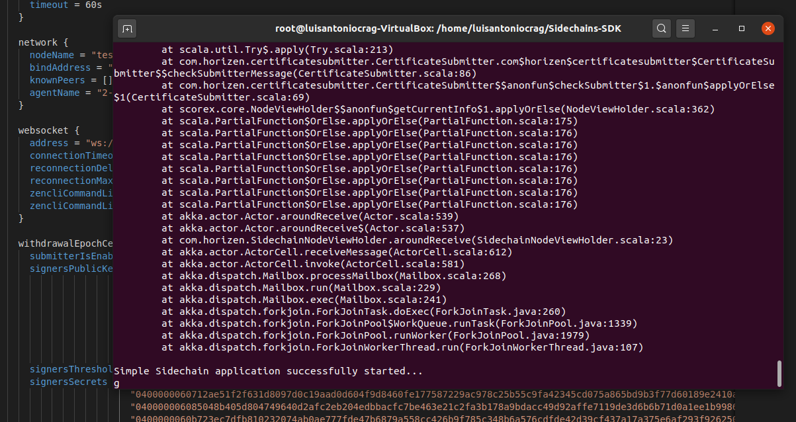

# Create a new sidechain - task
| Task | Create a New Sidechain|
| ----- | ---- |
| Link | https://hde.horizen.io/task/647569182 |
| OS | linux: ubuntu-20.04.1 |
| Zend_oo  | v2.1.0-beta4 |
| Sidechain SDK | v0.2.6 |

## Zend_oo and Sidechains-SDK build

| | |
| ----- | ---- |
| Zend_oo | https://github.com/luisantoniocrag/create-a-new-sidechain/blob/main/building-zend-oo.md |
| Sidechains SDK | https://github.com/luisantoniocrag/create-a-new-sidechain/blob/main/building-sidechains-sdk.md |


## Sidechain declaration

Generate 220 block to enable Sidechain logic (otherwise sidechain can't be created):
`$ ./src/zen-cli -regtest generate 220`

```
[
  "0ac1fc43f72669dc45f547f035ff7e8c30d8e37169b250b679c206c2677e72ff",
  "0a696681cc18c7f6e1e759f5d16d3f45923e73fffee1a3ab1d4ceb9a9be9dc81",
  "0940728506919417bd721a84e256f1dfa904dd610663591c7b3e66ba877a1fda",
  "0a798395926181a5729f07c0fb2e8614247809c34a7400c75ef7a7c5badef947",
  "075d823a5b2471a5924e77d9cc567be918effc75fcb584c8d3b3c191e0fc387a",
  "055a1c0ada2708a6b289c204836b171322a925f713a3d69e7009af03f6cb2422",
  "08f6e88b2a3d3b46abd6fce6fb6c483d90f8d46c3115e26e5091dec5515ea057",
  "0c56657f893b9cf79a73e7e707e764dc0d9c77af6b4bd92f504b55c1d7eadb50",
  "050c125cfefc1f2826b07c84fb849a4f3db55859f41e2d31d01f0ed20a96f1df",
  "00dd21b789f4231ae3d1f68f9dd26a7959f186f6022e0ac7d07b3c915fb17c10",
  "02a897c50b8359cda6edbfc2d53ef0d0e3bc349eb6d7a98aa067acfd6c80f760",
  "0bb92b09f9291ef786caaee5f2ebdba120468feb458916c34ad647105d6b08f4",
  "0c47269470abd79e055e48f98f4ff96828a6d016875dd5debda0861a7bc20f34",
  "0bb3439107d9fd94ce2f8befa812d201b12613ac6027ecea332ee35dd9b66961",
  "0218fbf4ebf3df166972c30463c83ce05511b2afc9859df9e4d108d148afc6e1",
  "082079c364ad09d9dc99d8693a0881bac8924d7fd37db01a7d4c9475b02662ca",
  "0b292088967e8a66b3ab4b0348fce73ca39a6bcd2d9f45057201655851e4d45f",
  "0c850a7dfb3c4c37b99ebf849264570560e3ab4ddf8c2a189105b84bc2765ea3",
  "0de8e640dd5f58c06b2a36859a1dd6babf44334dd40a58d7a36b4434714d893f",
  "0340f011da834678a78fd6f611aada9ce6b7b467143acfd41e5787b3e3927b55",
  "0c44aee2f15d4bd838d3a6cadfcaeada4426f72bb2db2ec0550e5e19ad5d4303",
  "01f87ab77848093d51de8eb81d1100ded34bad97594911dcf69011cd58b4538c",
  "031b84a1f5e5e0f40debc5d6a33970610b302fc452aa3706394493ff9a76d0c5",
  "048024b5583013cc8eff9900a336e01ede9ac8fa5de54ddd118a6c5ab046fb08",
  "043199d03ffc00496b2876f7ccc582898f2a80c7e7fd7393c08877309a31c2b6",
  "0e755f5bc22895e7b6541729f920e65da8e96d14280524c4bdbd201af90e99d7",
  "00cf0d63032740d4b2137336abd3712a499b2df5c4319ba457ba7575c4bbec0f",
  "0e9681613364ff052605e8bd556b833f1b5f5f37392c08d8ba05cf4b4893dc05",
  "04488b2a1219d0da6cfa3df66d05aa759ddebc52a01091be59fe28921c9a015f",
  "0309a6643668cb34327330276c109311d546fabe339645aaf44fb742e99ce199",
  "0b6b7f0ce0b2cba46c760c55bf8ed9384914c0c2d71746e08616dfbd24bb04a3",
  "0191c9c97ca076b285cfecd088e0c5fab6060d49d1ea2e31f4e401a49d9a11f5",
  "02a657d05f058a323945b12cc07b9714edaae243563872358b84e1c9233330ae",
  "02e9cb70ab54447d32915df1dbd67ced37804adacc377864c2ec0ac5848596e5",
  "032cfaf983163cb0e6a89c22c0355415312a77e7df981c12f404ee43a031f079",
  "05bbc89a23fa9c6b819691a20889b5a88f799e1e804d985741a8748f86501647",
  "0bfc22a10d2586b5726d44196412dfc3d28b75c5b21e72f641670f001223a576",
  "0a8c25c4fedbad27b4a9830205dab5c06ec0fe19911f999619644ce6fcc8b55a",
  "05abe3cdc443542008e8bbb43f2e7a922a99a897179f326f7b7a1e33e145b1de",
  "0134ccb268bedbb5fbdcc8d7dd3813b2a99e02fe7b7f003bb702f087d99894bf",
  "05b2018b7fa2abdbbfdffc2aaa741a38692a420ae025fdd5366ca3d46c16f4bc",
  "00b7918aaeb5be63f745f93752a3b493f484c7e9fc4e586d7b27f086a2e18a30",
  "0d9515737db5aae4262a749514a62f641f08e8cd5612c4250b48d36516d15576",
  "01d38ffd9746099afcc7bc24fd1a2904dcf4a6c848bf41029bf3b2cfd34432a0",
  "0cafb85030a23eac041d0da6cd51b5182f33ad0f554f8f9e36053e292642c0ec",
  "0c641054d2d5765edd63e2c84583bb511834143d6cfe0f751a8f086a9f75cf56",
  "061a668c1adaad78d54c6db73681afbb1df4a42de2cb93924642c74a71275ec4",
  "0ba9f68c17d78293030e64a62936da7895484b1390e5c38e9df76ae2742eefe6",
  "02fb564cda32fec78a317485f129bfdd0549bf26e26cb093c79dc0dc63a504a2",
  "092b1061f6b911996469aba72558a9eae9044e757e82950d1b416f05a48b04eb",
  "0db0b8310cadc5f030dabe87c235f52878649e9eb7e525608258dfe38019c91f",
  "02ea34e04e8d5e4e1e7949fde6ec9f1af4b1e7dd97a43aa01b1e6261f8f42f3f",
  "076533dd51fd951141e3b1da126add50328ad300336ef81105e5947e0b70e6a5",
  "08b0ae6d17f8ac90ca1b040fc61092eb4ce6280b737a40c92c08098624d0cb9b",
  "076de42543ac7940973f7caa7d422091b681b8440a788cf7023f5a440196fd5c",
  "0999db41497b10a2eb34eff79e6f55abd8b0a0da6583bbd325e06d5cbcb4b92f",
  "00edbeacf7d99b4fbe45218834e668281444803a1ad198daec1211d467af894b",
  "0631c546f842dce93f21371d5249e4ac3601058859f04f511e4864a10341826a",
  "0c4abe535be46e4040f7448ddf0dbc42b15a242074c58f23dcfdabf1be4fadb7",
  "0b121d622fc4357ed7371597ae0bb3de9beec52ad912709695cf51ae60d7f4cf",
  "00f2308a60d5fa5ec89c402f74f38d7797291a201a38391d702fd64996351f72",
  "0bce670f8ece610f1f442a86764eb9e9445de2d865c1b578b489b1f121f5fe0d",
  "09a46e075f1b094928db3498944e94e0e3bfb1386f0848fd8a3200d9715f59a3",
  "0aafd0daa51055abbd87296724c8f2292eab233422a24cd1e424d6f55688fae7",
  "04fc8978c201f4ba038b6925f6c7b520cb21aa913185ef769bed0659d4509ec5",
  "0b7ed55752e47aaba4b60a17a9f8bbcc9c539e27f747046ac44004f05c569758",
  "06a5452af44fc39a74811c2c79fc137b4dcebdd9d707c70e82e7134b149e90bc",
  "0b9a43a532493cd5423f524d910839b868b738c02561a1046a76bd62d47e4194",
  "082d4f667d03889e757a1b082717c4bfb2f5bccd8d1553b101daf86d40e1afb6",
  "06d04ebc6601e793dd2b1c23e803a3bfeab1a18c18e2566b36845836f884bcd4",
  "00d3e278ee1e3aae35fc5ccf15dd12c7e7fdf3046c2ae2c8729fe667f142a169",
  "0eb355e816b94cd4235ab46152825385403d25ea74fb06df98b690b06f45e95e",
  "043df0ba75ed922bec766c7783f74e7d722a46660818ea768f48dba24a27df5e",
  "0ddfac2f69dae8fba5205ba9b2780465482ca6f112b54fb871591208a4bb0c79",
  "0832ad32ea914c101fff8c1501526bbcb5761b3a8c6627d98ad9452b45a5d5f8",
  "060990abbd21898b7cb4dd49db3bd5736ed8d1a0daa243d0816def1439de715d",
  "07444683ac52af6c13ab4358b7e809ff30cce001535eb07f91d41b95075e2539",
  "049cdb10212d16b8831cec30763e18baa7b964dad9181d7aae8123fe1f8b85dd",
  "0a46f281776d3b2fba20dc4486e1d30fa16a2a07972edff4eac9462e07c4c939",
  "0d2e685eb375238ca70c921d6c55b00d4ab500d47a53d8d41bc5f446f9964f21",
  "0d95ca878d83a5f69fb344b8097008bf0e89d1af33dbc1c289d70755f73c5bff",
  "0b7d84697052aab1c85631f34c7dd9ea267c7b989948c6516c887503607a84cd",
  "04e9213965659ad4eb368132891998e547c8ca78054fae132cb705ffe64b1f5b",
  "072d092015819d2d35095b995e5ff18367c854e717fb17bca1850349b7a2c707",
  "01b1fe4dcc423c58c7243d9c50aec17a117ebb293e516b72312d9fe2a255bd27",
  "040c87aff864972a748ad012a26b9dc2caddc291fb2d06ab46440f2ed70edcb0",
  "0dc810d7ad97492e1bb48572a4f962a8b445401a61a17b99565c48ebd15ca887",
  "0bd2ddcec3355b78384d890f019c20de7c66e24cfa2aeb7c92f20ee4747160b7",
  "0beb47811d59c70570802a854000955146a157d881d7761f370876603cabad6d",
  "0a97dc7642b15bfc6f9a2a8001f6d93151e389f63809534d57d85768d32af7ba",
  "038a0d5244065c9a6f685013337239c742c3c7df4fdbbc31ac677671145f5144",
  "02f358efeb699e1b5d76fd7912859726ee8838affdab35220f37da7a240e40e5",
  "0382956832cef6c839e163b893ed0a9dc8f8e40d07ffd8ac2f24baa8a6d9ebd5",
  "0751353325a594bfd50e4731d6d88b4bf3e0d0ed145605cc739d26ce5a084e93",
  "0a3837206bacafdad243d44469683cd905eabe159ccd8b9c096a9f5555a76423",
  "00aba074fa990bd9f0bcdb5a9f97f2982c06ab738b36f192c34e110355ee8999",
  "0a347568e79eb675382108678b7f2999d9e94e19ea7669e1a994d1d516f701d8",
  "0ce1644ab9f0996cf5cf7f88fba075864c7b1cf446526fdf22948b6126e66afb",
  "00657564171bebccab7f5a46d7c937241cdbc92009620455e6106f178d806612",
  "0d1b735e36f658d7a4968e57c4ba77282ccb3260d5d7ffdeee4803120df1d25b",
  "0cb1880c2af8ed4babfeb6e3f9afbfa00ea3efd006ee72df83edcf7bb61e2fa4",
  "0b6455cada732bedc5895c2b57036c0a7f182d820c543d72c6f932c0eab6ca51",
  "0a55fa4dd7111837732d3b8a0dff32b1b3367237a122ad471901557ffbc7bb7c",
  "0356b782deeb233b022fb4f071959019d32b0044a105f28ffc8e5e9051690eac",
  "00b36d2651773846d1d6eeafe9c377b687ed67e1f6af6df8f506e6c83018384c",
  "08aca912f49e9afc5c38de3f960e3c267833bfd9ac495788717ded110589fd02",
  "0314dd9d2421a0f8dc68b1130734ee00c2934a35f1afb23b94588f2f2f072083",
  "03d42e6528a7c0312679fe8c2be935dd0bf5d22151af32815cf1d4c97d753c9a",
  "0ad56ecdc30d91fe19ad82e61f2215930d106fa332ed2327a862f9fcdd24457c",
  "024064ac60fcfbc4f753b5c2fe75c1669107c3f81703345f039393c807145269",
  "08af20f6045fc0c71db40d2123f0eed877a17fab5d6c461c16f898f7b34e38ad",
  "0b85963e3d957bc8b48cfa3aeed86dd91c2c853ad376fdc1b155a15debd846cc",
  "0e78e99b41670c9ffa1ac86802f8b364c25c8c58fa438849de4be8f0e5b3fdbe",
  "0484eba1bc35931806cd8567efeda4fa61df7c4869b83cb378f891fcabe45c85",
  "07184238eeecf93bb8926cafb368fde0beff7de5e8940aff09e4a184917848dd",
  "01db4c8deab505b292bda6b748b14fe68e0da6c209596fa13b1ffeb2d7471b39",
  "01ef0e74dcddfba01c2404a8a79912a82bf855fc74a358e143bc9d6657e585e6",
  "03b3312e96ac5d0d1993bc7c140890ece66ebf6db5cfb53df42b845d198bb3cd",
  "0e4224312dc73b2d6be564971d63d6950a465f77d34381b708a44e42e83df0b6",
  "044915316cddc74adcd6d4adfdacb49fba444b3f970e2877a2927dbc631f0e50",
  "05fc8244b54b32bc0f3ec86a8c0f2865f25a5c2cdac8f67014d105e864a8e91b",
  "02d2fa3a6c778727f6971ac8a652556a43632979a470044a62d9ea043974675c",
  "051e679b9bff84b0f8d0156160b7bd37474e6c971399791b87d607bb335b6a5b",
  "05d03de45df336c0d8d4ff9cdfad9ddd81a0bcbe6b6322a1aa24ea655dea7ea0",
  "0d95e60a8fadc963a5b308753fde84ef07d63ca2268e09138bbb2095e51949b1",
  "04f91b3e60e2167f35738e526365d15d70bf8a87e7ca79bb47eac7a38f5c04a1",
  "08de22f75d8e68e88d2898c8e0871cc508b1cd7690c3d869222354bde320bdeb",
  "0d8590b10072d9d9e666eda50189dfda10a0956c5f9b2c32189e95f27070d781",
  "0e9c54614a7984237d4d33d6ba464d76bdbc0654a25dcfeaba7fb98330e2ca1a",
  "06a003307c5b4f88a8b44403aaa969f21cb264ff8dfcaa492a57e9552f59e7f2",
  "0cf282dd0aa66091b53ce604e3fdad4f5b1675db487864012f9f23d6b10abc65",
  "0824b8f8049f572e9e66579cd85ea5cc61f273c935d5911286d61bba3f39f653",
  "0173824e859b2f3dbdf00147bf2411673d59dd8056df4b23dff6ab079bef167f",
  "045465aa6c8b19d26bef4892e6235537f1b0aff26c11bd4f70d7c57a6fe5eddd",
  "0774f929997f05dbf7e2fa44b9de234ec1714d1a88f1a8afd8ff443633b8fc22",
  "0237d037e76843351b95231833cf5a4fc1c181fcb55019e721d36a8a52e578f0",
  "04993db03bf158ed642980f3528a5b789992923e7cf6dc862a453945b47d7bdb",
  "028db2e0e6cf6f78c1a36ff22015070d82ee1c132a1677a04de87c3ca7abfe8b",
  "0328f95633bfde9b7212fa37f48f5224ac2bbe2183964836c98c9c7ca75f97d0",
  "021ed3f5d09a6eaadd658a16c21505c051d7fdfe4299bfa77164bd771421674c",
  "050d5c59759da0573a08b117e332c8c18538265d36acc9acc6ae100925b7eb1b",
  "03fd3b40ab97513b2b6972e6642ea690a8f80bc825ce33b8d185d0b38229665d",
  "0ac4eb8cbf4f027eee0e30b820b1e4fa442cb5f0af0edecb60f32632cd7f8314",
  "0be375e9b445858b2e16fc13ad9e6a67257399fbe96e3d5044c30d20083da369",
  "0a33f47832c5ad35438fa3e6c76e7bcfa31771ff87684776c77ecb878ec7dd2c",
  "0123f8e121e0d113c36be832904b3af22b478cec5c9b52277a166f1e0d352a4f",
  "077b5f2b1c89e768a10ac95b6f57f4575f7a2c25373a89fd4404c5480e02553f",
  "0c1951c705a3b7416f35c8481321b169b172c4d83546a2b5cc037c1cef8c1131",
  "095113bade7aa69db37aa04393505bbd154641f8a8de33849cc05805bdb547e0",
  "0da6141843c468710072c917a8176795c57dc74df58a1fcf5d9cf46e06b7a883",
  "0aad77d7f61a1d6e9eaa6e23dc80857a226d0f7f735961520f9a101105c35dc4",
  "003c8d2dab70bed2b6400142783fdf95c705b587d51e3d0129b2bd2f95a79ffb",
  "0890bdca3e669fee1717156bdee3a783bfe22f28f5389f660853306b6e9b960a",
  "03be7b875702064e4d59bcae529d52da25f93b894bf9ec9182a4b735e0fc0122",
  "00e0ec1dffd4aceacc8b1a6f0527e30294c5e6d2b96d7c4fcd8f99e36fba11c8",
  "09311afd5d46084dd5b7d538274878f463a0a1bd14ec9ea4c207ffb5aeba0a2f",
  "08ec4fe524094c5c6edf197aca157f93d4a1812253bb3b81a80bd890b0512fd4",
  "07eb169102eabca5016fd2330ba3cf0016466035bb4a303bd1b5ff4a42e6e587",
  "007a24c0768581cbe86af4e0acb41307a40c2e500c162eed85fadaf77a032ef7",
  "0cf65a325e4a698682676d1d7085f9b2068f461580a19aa0f8a91e0e35a02baa",
  "0796b244dee4c67ff8ba71c45400a1cbaf9ba402a924b404b7611c3f18e6f949",
  "09e55fd827262146b6f8193b8d7a8db747b1770a958bee7ba531366413868110",
  "02fb965bc89e6e1cde51006363dc1bda7a76c8cfd1dab5155ff5072320217095",
  "0d6b33f555fe38225b400d8c96f3ab10c24c86a4f4ff7a6a447a3baa815c5f53",
  "038baabcebe15783a88ab4ace1c7e3611a16a18c398180310efe0e2ad669940b",
  "02b9dbe562ae9ffc5f67e184d5d8bdbae8ad2dd24279288269f682aeacef428a",
  "03dc5e69ea39cdeb7fe5ba12ade8c33a43de7a65aa31486b58519f5865776d0c",
  "0108937461b54053daeb79cb3896db6b947a1da19a411f6c586be561485ed246",
  "085d32009c339f710808c8fe2851df9c309ff34627d5000bef5d1bb34c22fbae",
  "04fb1876ea430d2f5bff1b0e449338052d6b4463169edc5d1c1017c2c4060de8",
  "0c2bd63124e285b4d059ac5c0afdc3349051cbfa1a2d04b69891bd22cdb44421",
  "0ea88a0ea8a235352d2a28305a560ab5afaf4211b5d88d517c5731fd9fe5422b",
  "0368c3daf909775e3a37c6724dfdf3f33d730078c27478702bfb4c3ad63f1db6",
  "0e1171a1eef829b826111d6e89978c563f8e88c7c27864e4ae4b73ba5bf81ae5",
  "06959985bb5e7a5440a0126c538698e1db184c1a89662764b677b8531b088e74",
  "0ab296f4d56d29321582f97d19450ff0b3b31e297060b67c293373385118cbca",
  "0e8dcbbb3c11af5fc19dbb8bc8f064fc2e91660ddadc5810e70d52e3540bd3b5",
  "0667959be644de46970797214d7c165889e210aa1e42756f725aff96b8ab0253",
  "03ff4e927d248407146d35726dc60fd18c8ee87049a731cd8d682c2741eb8993",
  "07ae43e08bd5edf42dc4684a84e1c34628eb9d8c190ff24331b169f823cb5a36",
  "02ed371620f289e7b3a57a2bba3d8f9d57b83e7f92df649a8af6d5dbb0476fb2",
  "0519fc62eb4d2659276946e5507fba13d4366d86b77c964435a24f3cdfd737b7",
  "02c278aac0a9578be7bd73d1c013fabad4b8eecea452f047a341eb2d112c9b66",
  "0c86b5c05aeda4dad7e7bd87e8431e58f9585c513d73fe1f449eeaaeb4150deb",
  "0e53a1738cefdc78c9eb2856900b58ca7c4781fa854c95cf1a42d553072f5d12",
  "0427f68202da74ba7f420f948bc7a19a1a58ace021f27bab4c8060a002c01f57",
  "032f9bb3f40dcf4932172650ad156ac83a1eee0313f407c350bafcf5b22778f1",
  "02bc05ea94e2b24a1b31e6995d09d6c58151d35873358fd21ac1d5e5e51bf62a",
  "038b7b62bdeadd9bcffbfde3384af2030e4e665b09ace6bdcc2c5db51a789fe0",
  "02665d06433c4a9895d52dab46218f272adbe184960478ae85dc77fd1419a753",
  "018bd2ee6d8bc82b050d59b2950530545e5c3c517451845264b792df2486434a",
  "06ad4a298b5c2f67bff70df599dfb261147cde5e62282a385ff12fc426f76931",
  "00b289870c6e628910e6961d1022cac8b68bb200023b16720d93cd188ff2b718",
  "0d66d21d2e9cd0f4e8059e874523966c4295e3ee9f9341434e6ab63606eec5a1",
  "060b8f7ca6b6d27c5a8d89a02c24a939fe8059f3fdc62d63f2a89bdaa5fae292",
  "06026f8bbb67be7b3e77c09afe7520e889ec10b2dbb0e485dad06548081867fd",
  "05d07f34647154b7a917ead2b8aec9fdc715a9d644214284fd03d95707cbd020",
  "07fb08d4899abae72ddf28600af03fab8776e069bd73366a4ee3d25b0ec5311e",
  "0272f598b94ea80196fcdd27917139dc7967cb09a5bc435a4a3f0fe2fd51cfa0",
  "095419239601bedac15e00335ca4568fb69273f8e68a8798322bde040936a820",
  "0627b02375671cd90f0462683d8cd19db494b8ef0cbb8d5641f9e2936f04c6db",
  "0ab18cab68e07a2a047e3bc70ef443786709f4be6a3165cb091e47c51e758d1b",
  "000d58d2fd6174b28846d76996a8396ab5fbe5c8bb7c9745765d126ff3e0d090",
  "05f81d4d8914fe56b7e143a9ba3659417a9dd5628b0fc05fc7253733771abdd3",
  "09945da2c1ef1066e916471a7f093e570f99ac04366a42acf2cf1a0f7e808443",
  "0ba28e95f0ec268be2606e868a73bb69427b0db2049ea26d3b16dc3cfac7fb80",
  "0c59e52c7406a4a6016637f69326a0925d24fbdc60abcf7f066d2e67658f3d1d",
  "0989415053fa8c122d7c2a610abd0b330f651ba0c53c463f0b47f3622e191235",
  "0099ca776136d90ed1e874eabe3f37b5757c2540ba12c8782ecf214eb573cd47",
  "0dbacfeadf5dcef497b545bb13339cd7fa64be3858a236f2ff8967257b24c637",
  "0c0873b8708711fe6ba9d82ff92a88a0cbd74fbd5e40a194d597ca517a57a0f7",
  "0deaa34af06abcdaeb0cd056feb29ab862b0d9ea48ae3da72363c02432782f97",
  "089408ef09aa56d4cb836fed5d2624924a6367836d8aea5fbda60d99a44e8774",
  "0ae98b12d5ed99b8a7f36b3fee4d3b40794c02ceb40d04e843440971c3b23b2b",
  "0610843f6d8baf3c9ef67dfe3a02c24431bd52dcc7da938ff039ab2dab9f3f3f",
  "0821c43eeaab7247fd75dc36b56259b6cf77b0171e97ce4deec0ebacaad65935",
  "009663752c09d95d08094a79ff0e0e60b612d2ed4d92f3a1e15279274e1c3fe2",
  "090d91dd204d84faf50ae1bd14d4cc5f842cb88ed647800cc7d0e88fcee898d0",
  "0e657744ed03174deab116e3c0dbc1ad4ae5e1a2fe3d4ca5c2f3eda42130293b",
  "0a233562dd7d23e5ce91803400106d339f9fa13b2a2bc4806edd0887dd49a896"
]

```

Sidechain declaration

```
./src/zen-cli -regtest sc_create 10 "3861dd7302604227f74869345990cc7daebe135792fc3b0f8deb85ff9025a6be" 1000 "5e7b462cc84ae0faaa5884bd5c4a5a5edf13db210599aeeb4d273c0f5f32967b7071ce2b4d490b9f08f6ce66a8405735c79197cd6773d1c5aeb2a38da1c102df07b05879c77198e5aafa7feed25d4137e86b3d98d9edd9547a460f1615b10000ee9570fbffedd44170477b37500a0a1cb3f94b6361f10f8a68c4075fbc17542d7174b3d95e12ddb8aea5d6b6c53c1df6c8f60010cd2e69902ba5e89e86747569463a23254730fc8d2aabf39648a505df9dcce461443b181ef3eda46074070000550836db2c97820971db6b1421e348d946ed4d3f255295abea46556615e3123de33ec56f784f70302901a4bc10c79c6a8b1e32477aeff9fba75876592981b678fc5a2703ac0b3055e567a6cb1ebab578fc4f9121fd968680250696cb85790000078fcfb60bdfc79aa1e377cb120480538e0236156f23129a88824ca5a1d77e371e5e98a16e6f32087c91aa02a4f5e00e412e515c3b678f6535141203c6886c637b626a2ada4062d037503359a680979091c68941a307db6e4ed8bc49d21b00002f0e6f88fb69309873fdefb015569e5511fb5399295204876543d065d177bf36ab79183a7c5e504b50691bc5b4ed0293324cfe2555d3fc8e39485822a90a91afcd4ef79ec3aefbd4cbe25cbccd802d8334ce1dce238c3f7505330a14615500001f89fbe1922ab3aa31a28fd29e19673714a7e48050dee59859d68345bb7bee7d5e888d8b798a58d7c650f9138304c05a92b668294c6114185ccb2c67ce0bbbb7e1dcbb6d76f5cacd7c9732a33b21d69bd7a28c9cca68b5735d50413862bc0100308bb0dd0bd53f3d1134966702dd3c7cc8b58b270a6996a646493250b0d5f3978d0c971f8fa7a0c958f3efe2fa5269244973fafb701c2eb66dd25901f93d677ab6c538c1ed11f115e52d3f2c7087ea40c3e8cd089376baa38842e9429b5f0000d19a8d874d791f952f13d3c8ecd92e44009c09815e5ae6a8e5def7ea52fe3de4accfb5ba2aa401fbcec14b069cd0dc0f66ab025b45ef9831a26acf58673db7487043654e7980fcb2b6c1bd7593a4dfff810436f653e309121c7ccf2df70b010000732254ec6df184be360cd9ed383ed7c8c236d7761cfc0ce4e7f0cac5a06f4edab9cfc75a7dc1449c0e18ed9564c974c2e1b6847c637f74e5d391cbc80fc6e672ffd66b5ce4fb73bda8359ab8a0ea1e855df1e07d82f93c935c7e1a9a55c5000065efdbb7c3e82291a482b2f24cbd46f4dd02c370cf6dcfe8fb3c00b8b004b5ad51369b1f1b134a824d1f16d72ca6a27ba2d6190150329139cf2c6d9e5a14722f8d39b96b882c1f60a7b230e929819e2abe1cd9d7f3e8c726b1a94d20c8010100732c396eca6ffa1bf851cef449f2f087edd93e4f641b4bd93a482d9f129e675aedb688993d4e2cee824d2803301364ba10fbb66895927adb53bad8aefe8a1caab6f4ccb45883e414a1223ac7f90a89087cd752dfa0c7b3e19bbae000edd5000028d1d23c627d1252d2a2a20a246af2280f50e3fde667873aadd9893ba6833118358398e7428e717128f764714a8d52b090c1f554f58e25ea815338d7bc7326c949567e74f2f2ab3c88f5075fea75594608b8937c9059a42d712ffbd1bd980100000000000250c1a474689e375a309446e5cdd3a0c26cecdcff5c7b8cdc0728868983f1a35a49e3a1bae6f969c3d47356c08d3d169d2c0a2be908d82cd35f41a23d8c2924a9f790ab3a00d53061d440a176670d6a32de2ecd19cf8a9774729c09a6ea4d0100d8838bf55d95521291da12294b302c66042eda0dc2acc79360a1fdd8c9a366fa790c52bf926c2d96b5ba88a3a443487c5235f7c476f350c2101cfbe3bd0361dd291ebc5e42c097a158704b71006886a3662ca6db7d816b4ad12444835d89000000795ce2b34aef921ccb3d9b9695f5d3fe0a03743c955cfcf01f8a1815a7c8b03de85fe15201d4b4b6f401cb334a6988ea5bde8986a468c47c3c6a5ae96a3160ff15e06699ea82bd40c0d5547fe1be77af7817861bbfcca3f4232f05a9cec800006c216565cee4d57b32d2d70bb3cb8d4a967c0eb5d7137b2ec58466f3d4d3b5375e4baa823bcc29c6ad877d9708cd5dc1c31fa3883a80710431110c4aa22e97b67fa639f54e86cfab87187011270139df7873bed12f6fb8cd9ab48f389338010000" "9ee92ae00ee091279e73ef0307bc0ab1022d7b4629c411661ef5c38e5a894718002f0ea76b88718f0c0f1098b49b6a312710b9ca2147fb2837f4a8974d046aaec3fddd4fa9f4871e767964ff6d091fc46e59e407c8e907f32720f04cbe6e0100c197b2e18e4b2c7367dc9a16c026283df12b8b4eb82c495f15edb61ea61497c01c59213bb392af4251bf9e4129925cf329d62501ce406f4901b6ac1ac67db32698d35933989908adc382c991f2b9c0f29f705515a60d58b98d664159401d000000" "8da25ca3fe5989800961ca023df8ecee3cce561dcf84f2c31c6f0f2b59767b3801dd4b21332e8df6ae169abd88c205255d0278c9ec543aea2d61722bf1c956742639eacbc458221af3d5d35d8e205efcd8e7bd8f254ca5af871bfa081cd70000"
```

Response
```
{
  "txid": "9a76d11e80c9bff3836a4c87829508a91027e426fe218c754d3295bcda240e7a",
  "scid": "3390c8c792f3c3fe2b98f235e16f0b4ba212f852e2a769d7902729aeb98c449b"
}

```
`gettransaction` command to confirm data.

```
$ ./src/zen-cli -regtest gettransaction "9a76d11e80c9bff3836a4c87829508a91027e426fe218c754d3295bcda240e7a"
```
Response
```
{
  "amount": -1000.00000000,
  "fee": -0.00015085,
  "confirmations": 0,
  "txid": "9a76d11e80c9bff3836a4c87829508a91027e426fe218c754d3295bcda240e7a",
  "walletconflicts": [
  ],
  "time": 1610068549,
  "timereceived": 1610068549,
  "vsc_ccout": [
    {
      "scid": "3390c8c792f3c3fe2b98f235e16f0b4ba212f852e2a769d7902729aeb98c449b",
      "n": 0,
      "withdrawal epoch length": 10,
      "value": 1000.00000000,
      "address": "3861dd7302604227f74869345990cc7daebe135792fc3b0f8deb85ff9025a6be",
      "wCertVk": "5e7b462cc84ae0faaa5884bd5c4a5a5edf13db210599aeeb4d273c0f5f32967b7071ce2b4d490b9f08f6ce66a8405735c79197cd6773d1c5aeb2a38da1c102df07b05879c77198e5aafa7feed25d4137e86b3d98d9edd9547a460f1615b10000ee9570fbffedd44170477b37500a0a1cb3f94b6361f10f8a68c4075fbc17542d7174b3d95e12ddb8aea5d6b6c53c1df6c8f60010cd2e69902ba5e89e86747569463a23254730fc8d2aabf39648a505df9dcce461443b181ef3eda46074070000550836db2c97820971db6b1421e348d946ed4d3f255295abea46556615e3123de33ec56f784f70302901a4bc10c79c6a8b1e32477aeff9fba75876592981b678fc5a2703ac0b3055e567a6cb1ebab578fc4f9121fd968680250696cb85790000078fcfb60bdfc79aa1e377cb120480538e0236156f23129a88824ca5a1d77e371e5e98a16e6f32087c91aa02a4f5e00e412e515c3b678f6535141203c6886c637b626a2ada4062d037503359a680979091c68941a307db6e4ed8bc49d21b00002f0e6f88fb69309873fdefb015569e5511fb5399295204876543d065d177bf36ab79183a7c5e504b50691bc5b4ed0293324cfe2555d3fc8e39485822a90a91afcd4ef79ec3aefbd4cbe25cbccd802d8334ce1dce238c3f7505330a14615500001f89fbe1922ab3aa31a28fd29e19673714a7e48050dee59859d68345bb7bee7d5e888d8b798a58d7c650f9138304c05a92b668294c6114185ccb2c67ce0bbbb7e1dcbb6d76f5cacd7c9732a33b21d69bd7a28c9cca68b5735d50413862bc0100308bb0dd0bd53f3d1134966702dd3c7cc8b58b270a6996a646493250b0d5f3978d0c971f8fa7a0c958f3efe2fa5269244973fafb701c2eb66dd25901f93d677ab6c538c1ed11f115e52d3f2c7087ea40c3e8cd089376baa38842e9429b5f0000d19a8d874d791f952f13d3c8ecd92e44009c09815e5ae6a8e5def7ea52fe3de4accfb5ba2aa401fbcec14b069cd0dc0f66ab025b45ef9831a26acf58673db7487043654e7980fcb2b6c1bd7593a4dfff810436f653e309121c7ccf2df70b010000732254ec6df184be360cd9ed383ed7c8c236d7761cfc0ce4e7f0cac5a06f4edab9cfc75a7dc1449c0e18ed9564c974c2e1b6847c637f74e5d391cbc80fc6e672ffd66b5ce4fb73bda8359ab8a0ea1e855df1e07d82f93c935c7e1a9a55c5000065efdbb7c3e82291a482b2f24cbd46f4dd02c370cf6dcfe8fb3c00b8b004b5ad51369b1f1b134a824d1f16d72ca6a27ba2d6190150329139cf2c6d9e5a14722f8d39b96b882c1f60a7b230e929819e2abe1cd9d7f3e8c726b1a94d20c8010100732c396eca6ffa1bf851cef449f2f087edd93e4f641b4bd93a482d9f129e675aedb688993d4e2cee824d2803301364ba10fbb66895927adb53bad8aefe8a1caab6f4ccb45883e414a1223ac7f90a89087cd752dfa0c7b3e19bbae000edd5000028d1d23c627d1252d2a2a20a246af2280f50e3fde667873aadd9893ba6833118358398e7428e717128f764714a8d52b090c1f554f58e25ea815338d7bc7326c949567e74f2f2ab3c88f5075fea75594608b8937c9059a42d712ffbd1bd980100000000000250c1a474689e375a309446e5cdd3a0c26cecdcff5c7b8cdc0728868983f1a35a49e3a1bae6f969c3d47356c08d3d169d2c0a2be908d82cd35f41a23d8c2924a9f790ab3a00d53061d440a176670d6a32de2ecd19cf8a9774729c09a6ea4d0100d8838bf55d95521291da12294b302c66042eda0dc2acc79360a1fdd8c9a366fa790c52bf926c2d96b5ba88a3a443487c5235f7c476f350c2101cfbe3bd0361dd291ebc5e42c097a158704b71006886a3662ca6db7d816b4ad12444835d89000000795ce2b34aef921ccb3d9b9695f5d3fe0a03743c955cfcf01f8a1815a7c8b03de85fe15201d4b4b6f401cb334a6988ea5bde8986a468c47c3c6a5ae96a3160ff15e06699ea82bd40c0d5547fe1be77af7817861bbfcca3f4232f05a9cec800006c216565cee4d57b32d2d70bb3cb8d4a967c0eb5d7137b2ec58466f3d4d3b5375e4baa823bcc29c6ad877d9708cd5dc1c31fa3883a80710431110c4aa22e97b67fa639f54e86cfab87187011270139df7873bed12f6fb8cd9ab48f389338010000",
      "customData": "9ee92ae00ee091279e73ef0307bc0ab1022d7b4629c411661ef5c38e5a894718002f0ea76b88718f0c0f1098b49b6a312710b9ca2147fb2837f4a8974d046aaec3fddd4fa9f4871e767964ff6d091fc46e59e407c8e907f32720f04cbe6e0100c197b2e18e4b2c7367dc9a16c026283df12b8b4eb82c495f15edb61ea61497c01c59213bb392af4251bf9e4129925cf329d62501ce406f4901b6ac1ac67db32698d35933989908adc382c991f2b9c0f29f705515a60d58b98d664159401d000000",
      "constant": "8da25ca3fe5989800961ca023df8ecee3cce561dcf84f2c31c6f0f2b59767b3801dd4b21332e8df6ae169abd88c205255d0278c9ec543aea2d61722bf1c956742639eacbc458221af3d5d35d8e205efcd8e7bd8f254ca5af871bfa081cd70000"
    }
  ],
  "vft_ccout": [
  ],
  "vjoinsplit": [
  ],
  "details": [
    {
      "sc address": "3861dd7302604227f74869345990cc7daebe135792fc3b0f8deb85ff9025a6be",
      "category": "crosschain",
      "amount": -1000.00000000,
      "fee": -0.00015085,
      "size": 15083
    }
  ],
  "hex": "fcffffff5978ce73f4b606186a1b1275f28217d1af65010da1058682d4e55d5fd89a8a6342000000006b483045022100a356649a154e216f3bbdeeac75bcda5dbbdbb9990e677a6b17c4a81d7e96ab2902207257a3625e3dad05cc9f40cf82cc9f7d3f7e55751752378dc916a806f6fa0b2f0121033b12a09d9603be87645dde204c5b7dd45c1c5c30a4e4ada7797911b51a73afe5feffffffc7d0c0162afb9ff522b0c8dfe5ca2d64cae3989b53ae1f886a60306d3952734c000000006a47304402204ae5cab078e0956f344e649bf2cb0d68eafe9b755a6331005b86a532fae1431a0220584ac98b0b83944d6d82fd23463db0b345813e7a39c2596613d65dcf7f1662090121033b12a09d9603be87645dde204c5b7dd45c1c5c30a4e4ada7797911b51a73afe5feffffff39347c758f95cb4f3e29641ae6ddcd9bb227118fa1c831ac87aba285f52d5e3b000000006a47304402203b848504c9b411e4cde5fc7655a791a6c0e23b391236aa0eca62a30810c0556c022001282583bfea901883779a8c0965d4350f3ebcd021ebcea29084ac50e49e87a00121033b12a09d9603be87645dde204c5b7dd45c1c5c30a4e4ada7797911b51a73afe5feffffff6970f0754e86ac4a7ac7d120e05ecf5ad7a4dff8260e489637c06bfcb694a8ac000000006a473044022007d0c577db386282321693488d216857599ea94ba47fee59f82fe4b9427af3f5022063fe8fba5316a57454c7e787b72af4216045aa998c53e188259a8bf099d0e19f0121033b12a09d9603be87645dde204c5b7dd45c1c5c30a4e4ada7797911b51a73afe5feffffff33871daeb9d7cb4bbb2f0cd230a0d23d3d22bfe14ff6faac87b1fd9b766c31e7000000006b48304502210096ff673c9e3cc37c15612a985484654c5c516b6be46f44708d16e6c44409e94b022052a9c8217357fca0a1f13c27e6a28af6bbebc932b6718104034eb037fbb353c60121033b12a09d9603be87645dde204c5b7dd45c1c5c30a4e4ada7797911b51a73afe5feffffff9bed9149593b64c3391e52841cb2ee6fce26e42042885532a915bc27dc8bf534000000006b483045022100b8b95056ed337f1eed9728f9c47235d1d80b11aff8b7f32b98154c88de51942e02200cb2adb459ca3601cb923b617c02f8fb0f059cc5ce68ae1b7e6d9aa190b43e0d0121033b12a09d9603be87645dde204c5b7dd45c1c5c30a4e4ada7797911b51a73afe5feffffffc09d462711307f811a88baf55798d43eb8adb6b7cfa55c57e84b97ed0455f6c1000000006a473044022077a96e75e1eafc856215f006d20d926bab4b4f0a0c7099b9e76ab19240928d2202204b03d092a6eb97905a27828e0f1eaff57bafdd2de13a15a61eba973184a8acea0121033b12a09d9603be87645dde204c5b7dd45c1c5c30a4e4ada7797911b51a73afe5feffffff8eaa1f3d4657a12afea9891f48516538b5d706e74d4971571e64b89059c3a0f3000000006b483045022100af305ead829e0f1d7cafec81dff37af019a9322f21b656e751101795060bca8202206f28e6e24c683925173a553e35ceb44609c3d8f4d12acd9ac63c110903cf1de70121033b12a09d9603be87645dde204c5b7dd45c1c5c30a4e4ada7797911b51a73afe5feffffffe9952bdf0fd0b2ed20f0b972992a1f54204dd62a495ab851430341a6cdbd8dec000000006a47304402206d5af2477bb4a8056773ab39071a2a2cc71f77f967c8920ec21e624cf8778ad2022033d33e6cbb2b6f62230c5676407ab26f5ebd6cd2e90873389e82359415d444260121033b12a09d9603be87645dde204c5b7dd45c1c5c30a4e4ada7797911b51a73afe5feffffff7da1ca6aa5236f74496ddbe2e35103fb494b67b3f6f3f1c81bd5e27156923476000000006b483045022100ca46ba342caa22e6b032347d23daf36fcbb1c9fa7aa1b2b4f549731338c973c2022076569a0990a8113baf03fb0292dfe1adeb1134eeef6e7fd3ec8a8eebb6b3186e0121033b12a09d9603be87645dde204c5b7dd45c1c5c30a4e4ada7797911b51a73afe5feffffffb0c2c264863591b593fda5ed21e4bd56416828587251831f55cb4d32b2092ecb000000006a47304402200a19711b255b49be81038784a3af0e7d9d7f4fa97ac8408e29454fe3f653dca20220172ceeb63adcd07c5561083f29919409a5ba73f85ca640874c42cf640f3b78810121033b12a09d9603be87645dde204c5b7dd45c1c5c30a4e4ada7797911b51a73afe5feffffff4490017754aa092c2e4a15b06840a90f3b4b6714dbb769a3c705ace0ab8c5db9000000006a47304402200bbd1b70e679741896485b056d4cc87e00e8befe28b90caae9a66dab2a5fe76c022056c095b1ffe155cffe5499c580183b414f6394302231186bda11d41b2225ec0e0121033b12a09d9603be87645dde204c5b7dd45c1c5c30a4e4ada7797911b51a73afe5feffffff5e5d3bf689da64171d3704b7c88473e0d0d6483b2ac6d069be9248fe7bd021c5000000006b483045022100e7e4e78ca1349ae9dee544e53fe1da0e5583668a464f845d087017d6ce3420ce02200e14dfa390ec1fd3e7ac2848c331aff359d2581e69f279e3e6791706a544b1b70121033b12a09d9603be87645dde204c5b7dd45c1c5c30a4e4ada7797911b51a73afe5feffffff1a90ca483bf76be503592caca1ad032d2edc12887406923b71ff95c362492aee000000006b483045022100ea9fee7d6210bb78b1b5b35ac8eeb6b50be778d629c0fe7c048da28627d9145a02205c3dc560f589014488228f70a3287dc3610fee4f878289332d2219469a6888160121033b12a09d9603be87645dde204c5b7dd45c1c5c30a4e4ada7797911b51a73afe5feffffff25daf92c54b25f1cb687c08f763b0307b33724b64eda8a5b0ef717e263ae0872000000006b483045022100c36221b0503ce80b9d95e3cea439ff63333b314b63ef0b7e1f9c2d9d657b30eb022014b1b6f7c3bc9e92a73f6244be5819742b04043cf903bf2aca3b209991996c3f0121033b12a09d9603be87645dde204c5b7dd45c1c5c30a4e4ada7797911b51a73afe5feffffff488decd8dc57ea9b45139ccb099a966c303f7006da725860c717e952a54f54f4000000006a47304402201f147582b0984038e15e840afc54c9a8985dc077c7ef9b64e44ab8286b9d891002204639dadb1f5e9564a996c3750a0566daa4231346fc7753a2933ba041909604f60121033b12a09d9603be87645dde204c5b7dd45c1c5c30a4e4ada7797911b51a73afe5feffffffe76142c118dc3caf50137716bf881a192cfae3abd628380237128c8b5e73a249000000006a47304402201485e29fe789a1a7b4cd726cbd8b40756678e8d441b6cb1babbdf6a03c3b98e00220512ccb2987906559b626d8c03a42083fabfdee6e84a1fc0c8481609cbb009e6f0121033b12a09d9603be87645dde204c5b7dd45c1c5c30a4e4ada7797911b51a73afe5feffffffecaa1adb1f4df1c40778ac498c68b0184028f3904bdb48380fd2293c0c3b878f000000006a47304402201754b9ccd86ed774087d33c59ac5ac3b79b9bd0777902827b5af0882dd8bd25402203b23ac7ca32d59ad50d11440e74e58d82179d548001714f20e3884919598a9770121033b12a09d9603be87645dde204c5b7dd45c1c5c30a4e4ada7797911b51a73afe5feffffff8a9f6b803a7e467803d29bba144ddf4d1153082d40e226a54fc8750f1ef79854000000006b483045022100a5424a47d6e57ebdce3399b168857a4ff6b0ff954f6cdd773171433b29bade2d02204684da49b3bf6c54b663776a7abfa74693e38d0891d37cb277de41c463d59f2a0121033b12a09d9603be87645dde204c5b7dd45c1c5c30a4e4ada7797911b51a73afe5feffffffe550079985499232149a0d4500c80f427300e5db8136ed15d21d30b5dfef7f10000000006a47304402203db796eb6d8375419c12042ce060c67df1b71ed7681e8f2357b2d4b2cb089af30220706d27ce46b4575568761ecd1f0cc2712990c581bd459bbf36471f50fb7040f50121033b12a09d9603be87645dde204c5b7dd45c1c5c30a4e4ada7797911b51a73afe5feffffff70af264f8d48a5a5cb02a3af4ee7f91e24eb5506080b3bced681df316359020e000000006b483045022100b9546ba474135691a88043dd606fb8ad2851bd968f0555688b2c60d13f96fde5022022bcc28a78a0732a2b9873c8aa9d8adee6f9aea8eb6d0472d15bf058e7b0cf6f0121033b12a09d9603be87645dde204c5b7dd45c1c5c30a4e4ada7797911b51a73afe5feffffff7dcc11aec62badd94d43817c0c8820d43ade27503828f9a1ba091bc7956f3514000000006b483045022100e4f3ded9d914bae7173f932692010b6559c6d82dd19e0de21de146cd63be56d002204c4c56b395ad4e95d9caab5cad714ab457bb5642e1c8b5ddfc511234c8a838070121033b12a09d9603be87645dde204c5b7dd45c1c5c30a4e4ada7797911b51a73afe5feffffffd9485c755c87225e51ca49072c9754f917d273985acbd24c23ea83dcf0495d99000000006b483045022100f03d9bd5125d21fbcbcd5f7e5ae33e87f48b40a39d0494b9e2538656fdd81680022023bc6a8b7bfef1db2ac920c30782bed3dbc6f20d9f5b78ee0a0f74816eb2cf1e0121033b12a09d9603be87645dde204c5b7dd45c1c5c30a4e4ada7797911b51a73afe5feffffff12a36d7c84d4cd91befcbfe915cf3bb8146f5098247879cc7f42220e9b0c8c1c000000006a4730440220168928c46a60399a7391ce10e7fa716e0448a447b231493a889fef976cc4da3e022013e0a29ec7902b3b97aacf2794e0e7048dc5662ae2f983111df7f5a2950f697d0121033b12a09d9603be87645dde204c5b7dd45c1c5c30a4e4ada7797911b51a73afe5feffffff8cce476c28bc93eefbe89720e04954045bea158f198ff6dae573fc470ae92f0d000000006b483045022100bb1c723d0b1464080e20e9648dfd3bfdf4a1470f0bdb49bb39f366cb1d8eff9c02206e0dda675d57292e77dc675193015ec768a86236986c39cd40e0b93bf0584efc0121033b12a09d9603be87645dde204c5b7dd45c1c5c30a4e4ada7797911b51a73afe5feffffffbe558a3b0986d980a6686fd14cd918501301d1c73987576425c76e3caad902d8000000006a47304402204c4b3828e09db369d7b9210d52b360065e55e6d2af61d1c4d5383338117bf18f0220221c97e769bb34edbc8f16dbd33fd22c25c45b7eb79ce3892ca5df0dfbab943e0121033b12a09d9603be87645dde204c5b7dd45c1c5c30a4e4ada7797911b51a73afe5feffffffc72235d0edb111a6dabad35a7aa180a703ca32a15cd8935e18cd0aad01c2148f000000006b483045022100e827919ad81479149e0f7fd01dac3d416d43088af478660816c91fb6664d7d4802201c14caa904281bb150fc1d42f88ddb68d7ed9583a3affc4e5affad732379c7d30121033b12a09d9603be87645dde204c5b7dd45c1c5c30a4e4ada7797911b51a73afe5feffffffbf62009e6ce85d22f2be37914b993184aa5d6d735590ab3c2ad810a88c633924000000006b483045022100e09252c985bb4431742bf0668dfa44ca3e61d429b249f8a735a959d3288c40e70220279969441d6791665f896c5a657997e4901d4fdbc0ccf2c32af19ea7128cb7790121033b12a09d9603be87645dde204c5b7dd45c1c5c30a4e4ada7797911b51a73afe5feffffff3285a5454853e463e17ad755995625cd1337ad25ac61728fa7c8343239a41a91000000006a4730440220241114d3ca46d49bcddea0d5733a4ace01c4a464c7a806bc52a6c5f8f7d9aa5a0220714bfd0b92d93b81f7f8cdc36732cf3c326f928999e1a9e6b944782b90a66eda0121033b12a09d9603be87645dde204c5b7dd45c1c5c30a4e4ada7797911b51a73afe5feffffffcd777a3da20060c311c9afc98118725ad0e45c490d0ad9fff9c0d55c00ce971d000000006a473044022019ededed077d68421c6373eb4494bc882346d090b34b3803aeaa2982b7e538c00220178891453dfc49652c58dfc3778856c5b3bc4142da04b53f18e079a5618a25710121033b12a09d9603be87645dde204c5b7dd45c1c5c30a4e4ada7797911b51a73afe5feffffffc7c38681584fbbdf84661fbabb8d1cf5713598c8aeaba16967688d545044acf4000000006b483045022100b3298db47dd1d5acaf2aaab1685d9a88ea402a934bfa39c551ef53cff8efdc800220757056d1328aaacf5f72efce1da871639f9edda7d49af636102eea2ccbb577cd0121033b12a09d9603be87645dde204c5b7dd45c1c5c30a4e4ada7797911b51a73afe5feffffff088d0e03f8c4e5b53db0704449ffd77536585faf1f5d5af6dbb1576ababfe128000000006b483045022100d64e6313e1cbe220f3ef05065413675e49752f97d9893ac210a71c074a0c31f10220046b18bf2c2a4b449d14207f020c521d42fc5a3d42c03e422e147ea2da2492eb0121033b12a09d9603be87645dde204c5b7dd45c1c5c30a4e4ada7797911b51a73afe5feffffffad560088557ae596427139f846a91507bbb6844a36c46412c538d06466960d96000000006b48304502210095d17ee21e082d006868e02e45a49ab8223e897d41e4cc7854c0afeaa7d3732e0220426f58273604c5a1585cef483945f35113205fb349d8e2e7771cae5a936c70110121033b12a09d9603be87645dde204c5b7dd45c1c5c30a4e4ada7797911b51a73afe5feffffff5da7a0f06d78cb64e1e7d86afaac85fe89017838b92032b3f71451d215a5473b000000006a4730440220581658dc591e22eced15a04e9288aeb35ea88137ce7167f6e7e3810925eb777f022028469a0e2881c5d0fd93ef0e09240b0f6fae404ba59376dfbc0a1ba54e920f700121033b12a09d9603be87645dde204c5b7dd45c1c5c30a4e4ada7797911b51a73afe5feffffffc01856cf71a411d2bdf091c1a766559a453fd67b86c778c2284e347c2a2068fc000000006a47304402206a963e1e3aa058c8b1798fdcdf0896df67cf78f2eb8d7efb793ff2281523644102206977c312990ae9227608c06657633d441d48655731d0b0d270c0473ebc334c660121033b12a09d9603be87645dde204c5b7dd45c1c5c30a4e4ada7797911b51a73afe5feffffffafb77e0d85378abc06d7ff806fc06f18c66af168163f7739e3c192ea5fb523a8000000006a473044022030a2bbcb9ed9e4d2836a87e326228b0b7e75ee0b31700c067000cbf35941601e02205fce59c1deaf2c52f2d90c406ed34a1a551335b78b533ba91aa89cdfc5701ebb0121033b12a09d9603be87645dde204c5b7dd45c1c5c30a4e4ada7797911b51a73afe5feffffff3b13113dc6386bfb3d27c0f064587453f08f107d90a43d2bbc90bf18dffd56a4000000006a47304402202ed018c2ef53af0a79c88bcfb55aa8e834a7364002a7e86efc49c813580599d9022029af928bf61ce8f27bfc4256faaa898c469642a4d738a0cde5a2a2b74da703950121033b12a09d9603be87645dde204c5b7dd45c1c5c30a4e4ada7797911b51a73afe5feffffff8ce6658acc2ac2d7066fd886c4abb7f6036800b4ecdab89c548138eb0bd3858e000000006a4730440220347ee9a51435a734a8ea1a541d4de5553ded75a1c71024782ce0faafe1c0c3d102202ed6db279a1e188014468e0c7f5849998d44458b85eee319e24bc3edd06824180121033b12a09d9603be87645dde204c5b7dd45c1c5c30a4e4ada7797911b51a73afe5feffffff0feb9cb28f7aee5fb2631606bda84c91b15022fe827c5cb5d4bb0a636cd55d38000000006b483045022100a90e137b1b08c84ea9a2263c8ec7993cd36abcc9c671e4839688cea227c3c30802207db9c8bb072958d2aca791c16605b0a3d817ca6d3c45560d4eb2e8b2a8cb297f0121033b12a09d9603be87645dde204c5b7dd45c1c5c30a4e4ada7797911b51a73afe5feffffff72ca8633f989d3694c722ebd40f7ebdbe3e8d66f63e5a8129ad5631929188202000000006b483045022100a7e3c6d9f36ef3810d1517119d3d6f79c0a1812ea62594b239901e3d550f1776022062903239729ff7819744742a8f41075c75eec739ce7d132717bd1d15ceabc84a0121033b12a09d9603be87645dde204c5b7dd45c1c5c30a4e4ada7797911b51a73afe5feffffff63fded5778c806e9817299d6d96c659cd580d9ee52ae1a9ab83fedd3b25410e6000000006a4730440220454c45a5df2c1170cddc70db350aef51c33bbcff2ceadb71fd212a298b662ffb02200586404f59d5768ae2f0ea5bcacd44940bc1b2a09f501b56e2ec1243356f0f420121033b12a09d9603be87645dde204c5b7dd45c1c5c30a4e4ada7797911b51a73afe5feffffff159525260cde7377440f6d9b52f3175af9f153622bd3db2c14f8330005882ab5000000006a47304402207ce4f7026915c89aa0a8c4ee835d8b39c30c2af9005825e4ea32ac7b4ac792ed022010a1b73a16207b5933dcc0345c48f3fa22237002b1e64161f1c65333651a633e0121033b12a09d9603be87645dde204c5b7dd45c1c5c30a4e4ada7797911b51a73afe5feffffff0dd7873797912fea7abba6bf139e63370005d2ce39f3b70db08074c01367b418000000006946304302201ac4121f07bffd7b4c1dc2100313a7265daac8699d7417bdbea9c9fba7b8760b021f021ce707291afce7e187f481dd89ecb13ef6e70e4e2fdbedd2f9c63f5713650121033b12a09d9603be87645dde204c5b7dd45c1c5c30a4e4ada7797911b51a73afe5feffffff804c21af4d23cbe6364e57333b04a17753c8f60b51b5c7bd678e680979b81759000000006a473044022046ac5efd1f478abe2a4975bc6925ec0e4320f835e9a969932b6589ced230472b022007f7f27e74481911db9d408dba4fcf49235d85422df3fd46144fc3d6a7a12a790121033b12a09d9603be87645dde204c5b7dd45c1c5c30a4e4ada7797911b51a73afe5feffffff8ff723d0573382a126399579168e6d4e79f16ee4f09e7971ede7296a5fc93640000000006b483045022100f5fe4941bcb4eb7f21f477f770ccfd29f913caa296da735809e2078bb351d59002205aa428609bc3f33cfbe3a2a1eebb471964e94626b4eff137d89a2f5b619431fd0121033b12a09d9603be87645dde204c5b7dd45c1c5c30a4e4ada7797911b51a73afe5feffffff9d7cdd0b7bfed7e37a02e90c20d7c14e3e6cb00908d5dac83a43dd2b7300a555000000006b483045022100ac93d8abc05e359f60293b7555f09c66049456fde7a9952a598b374ed113d1f002206557a70344b0d252c5369fa3a4f1866b096a67d8f4ca8bfa25426ee6035a792e0121033b12a09d9603be87645dde204c5b7dd45c1c5c30a4e4ada7797911b51a73afe5feffffff73922a5a35ca66d2c5f0a6bd0ce4a6a4b6ad290a63e5a06e29e9b22e38dcb53f000000006b483045022100aac21a62a1ec443f5196634959e7d3f6bbb2df5a6102db914297579cad8de4f10220043636ec59756c1d8e1831dfdb744714214e1e8224b4489731c9de155c6754530121033b12a09d9603be87645dde204c5b7dd45c1c5c30a4e4ada7797911b51a73afe5feffffff3dddf1e339cdb2d7f0dbe2cf5016e9dd2580c6e02c715d2e3b7e1753264aa49e000000006b4830450221009eb1340272bf962c697fcd04ea6a7ca48308fb2b9f7da7ec757cf5b06801c2660220187607854d4eada4a45fedbed84ef54044d0f2fe4468207026248455b22ba8f70121033b12a09d9603be87645dde204c5b7dd45c1c5c30a4e4ada7797911b51a73afe5feffffff03c9e266fa2b856e25ff8835838d04fa47e33bfa49b38dd5a0af061a2fc4507e000000006b483045022100df21d101e55409a67ce9570bf82b745990c579f04c1cbbfbc6105f932178f3db022056847e4f3387cb147fb8ecfe752a37236760eb869923beed6ad0138152237f120121033b12a09d9603be87645dde204c5b7dd45c1c5c30a4e4ada7797911b51a73afe5feffffffbcfb8cba1a889c498a12bd1ba2d844458dfc5f38a2762c1069ef726a7b4562ee000000006a47304402207b28225d6621ff184ecd589968b46c7baa0aa09c286a76817fa9e8f810acd4c3022040fe5ce96936f4b23651e3f9954917a7f6233be61c3b2531d133e7d8e596f3a40121033b12a09d9603be87645dde204c5b7dd45c1c5c30a4e4ada7797911b51a73afe5feffffff8502fd8618dc3438de291a73dac2e546e414a255d0d8f8337f5c85bb85b7b519000000006a47304402206287cff4d11dabb13847982132cc9f90371ab6b54459c5c3b0589aee9e188f5502203924522164566dcd3e90ef5f9001ddf70a9089ccfd6843420de94d14f27537bf0121033b12a09d9603be87645dde204c5b7dd45c1c5c30a4e4ada7797911b51a73afe5feffffffb56ec0e216277b8bb9d358209ed50a396323517ce5efdc8962018fdac9b403e8000000006a47304402204526207cf8698ffdba6c2770b233997c543a2bde8d4f9f902839b0aae1a927a4022038bc9eecee1015eddbbc78744044c2401c1487325f1491adf62f97a8b4512fec0121033b12a09d9603be87645dde204c5b7dd45c1c5c30a4e4ada7797911b51a73afe5feffffff7d40246e4b26aef87fee3cd0714db2132bdaba3cefb7c67fe72c08cf78346d07000000006a4730440220055e5da247c745b66d4cccb3bd50fcd524670262759f83c8c41fe74e5228dc19022012f42d98d9e1816186cb8ed6e852d2da8d27bd0c10c9f2f40dd2e4fa9c03e9460121033b12a09d9603be87645dde204c5b7dd45c1c5c30a4e4ada7797911b51a73afe5feffffff54b9f1c2005abc171bcb0bc15c78adf6fd7caf4c9e1b652292eb89d8fa39c405000000006a47304402206ba7f217f336c59201c9606fd2521e2fd7f4ea2142789614115a806d1fe4c51d0220169d0a16b8d0b995f7bf0887107e2d87bad520da59521f492e51eb76861e69040121033b12a09d9603be87645dde204c5b7dd45c1c5c30a4e4ada7797911b51a73afe5feffffffa8347af51b22664eb2d675a5706a2dbe6358c25fa0b3824e150b425bdb7281d9000000006a47304402203a222265eb1f72ba7d633d22031a594c5fc4cf45e94ac58b5495285bd30c2caf022078e82d45e3a24f691f59e5dace33a0c30d7c3d737e9b0d8c8c6cd7bc00b3365d0121033b12a09d9603be87645dde204c5b7dd45c1c5c30a4e4ada7797911b51a73afe5feffffff2fa71b42984c2300debcb1a6ac517aacc5d4173c2472be4a2b4f4d0334733ce7000000006b483045022100e9905488fc34b95aabc2c5d3a2ccb3e49dd6a5d1e74169c47f9654f55fb324df02206735486e9337dec1cd4a3562fdc4ea9cb02a806f8617b7bf60989248c62c105c0121033b12a09d9603be87645dde204c5b7dd45c1c5c30a4e4ada7797911b51a73afe5feffffff5042f76ede138e3baddcaa6b641ef42ad848f765fc7fe304ba1b16e9aa758da9000000006b483045022100ea9d5b45e5f1ba7945a4bbb26b174aa8c1353984008aa2bc312890806b39297b02203def7a279c3a0e7489e083e8dd8f2468b0326544a45fe6f31a0ee720778cc2430121033b12a09d9603be87645dde204c5b7dd45c1c5c30a4e4ada7797911b51a73afe5feffffff818800204ad2a158c0df122ef7105b26a156e1e8243a7ad11267f2d70f6b7a79000000006b483045022100a46b055e0405072c5bd464181a4d7df760cef71b92e8bfa97dbe4638227f236d02203a4ffdbed73ddadfdf969602b058969a4324521dbbbaa144877444a96d9b0d610121033b12a09d9603be87645dde204c5b7dd45c1c5c30a4e4ada7797911b51a73afe5feffffff986433de6301e34bae968d15cd711384ca5ddbd6abb52ca30a570c5345fddae1000000006b483045022100aaa30115861ddceb62048177556d2669e7342a95a0b7b79dae0dd5a1e3bfee710220110cb00b4fd04fade1231361ad2451821258f72ace72fbbea93940729a1b2a270121033b12a09d9603be87645dde204c5b7dd45c1c5c30a4e4ada7797911b51a73afe5feffffffc719f5e8d8306891c2da9eb5eb34845e1f57528fd537e88c5e766b226c47a213000000006a4730440220176d7fcaf90c3ab3524bab23e9aeb7cb736b5274f333471f7c71d035e418b74b02206cda2c0cbda9cf9f0a504c04c4cedee0a399e86ed3e863c0b645f9684dc4704e0121033b12a09d9603be87645dde204c5b7dd45c1c5c30a4e4ada7797911b51a73afe5feffffffc9602327964c4f1b55ddf230bc217f247b9379cd4deb6fbca2f4262b81840645000000006b483045022100fe15974c459901b7e101811eb1d94133e3c99407ee83bc7cbc05e1cab9ad3758022043cde7c871724115172b0a8287122e14d7fb227c28e9b3f738ab2f8544408c780121033b12a09d9603be87645dde204c5b7dd45c1c5c30a4e4ada7797911b51a73afe5feffffffcd7d317297f9682a99d8574d78e9d24176c70f7e759fc997b87fbf9dfd6265dc000000006a47304402200a1132a716d09f7a87eee2ddb9b02de2136d23acf9ec3c5d3c039c4947ebd4f002200ad450ec7f699cda0748996c7dcda13600bd06e5a05d4e617924ec3664a58d4f0121033b12a09d9603be87645dde204c5b7dd45c1c5c30a4e4ada7797911b51a73afe5feffffff0088cc228af0964a6afbc60f16928994efbedc4f303298365896d10acd036170000000006b483045022100cc7ecba653a66f60e238d26881c9414f41b81f85110e80772e93afce7818db0a0220582e37fba2f7624d4870c4e98db5725ad3cac5333c9b3686c7e094a3155766470121033b12a09d9603be87645dde204c5b7dd45c1c5c30a4e4ada7797911b51a73afe5feffffff65a6cf68d4c2e140a562430ff5fe999ae0095e9e73abe136fcd80d2b4ddb9125000000006a473044022033d1cdb952dbe6498379f8bed947d2b358c587af4e96d2417a6f338462e1393d022062d4ba135f93d19b907ca2c51fa43e14c9c261022874e215317612f86931a77d0121033b12a09d9603be87645dde204c5b7dd45c1c5c30a4e4ada7797911b51a73afe5feffffffc1852957dd1189d7b8b542c8c8fa5dc601bf3aa53c8037f680213f38b83f5210000000006a47304402200b01c3a06bb5eee1f5dfb9b1513bb54561def872b217c7a41afc69e22fc68c890220130e7f68979a4225cdb01f982c09548302509240948b0e986979cddcc452e7da0121033b12a09d9603be87645dde204c5b7dd45c1c5c30a4e4ada7797911b51a73afe5feffffff653fc41721a512764d9047c01e82855158e26d880a80ceeffa01ab52374d7c63000000006a473044022028eeeaf9c2ee0b4089b47988ae2e5a5760fd13fa16582e51d3368c31ec7be23c022049808726e3b83a52469f3664576b3a7ea7896078630b79a977662b7c07eeef230121033b12a09d9603be87645dde204c5b7dd45c1c5c30a4e4ada7797911b51a73afe5feffffff17d99aed98c6935f87546c3f82ea19caac0caea7673b45fd6190ec518eae4987000000006b483045022100e412d456c2011bf59d957d6dc438b8fba1c7f76181bb4250a9412cf9d37905fd02206eacaafe3a9df3c16c9d6e17f1bd28886793b0312a5a27064dfa807a8273e4180121033b12a09d9603be87645dde204c5b7dd45c1c5c30a4e4ada7797911b51a73afe5feffffff76c5631775514d76afd13d03891990cbd5dd9059abb1b54a1eab5a2ff1548b7d000000006a473044022018698d03263d7e874cafc2814f6af06a99ac75af48386f033f2c69dffdfbb4cb0220247e75c5cfca70f115e6d3dc5c56f2314b1bc656d0107401291a932d31f7218a0121033b12a09d9603be87645dde204c5b7dd45c1c5c30a4e4ada7797911b51a73afe5feffffff7614a1bdf6993452c56b7814ec584eec39e9a06205dd5b3dee54f0c02a072551000000006b483045022100c6c2b6cb9fd76cbd8849c8a90c811be3ff23984161fcdb39db8c799847e7fe81022049d5b380f2c67987e040295bad9abd475f14601d588b656161763e6e6134b22f0121033b12a09d9603be87645dde204c5b7dd45c1c5c30a4e4ada7797911b51a73afe5feffffffbfb0c0c5493604336678ca4a41d590fb644ae1087ad8f9b6c4d6bbfb2ff3973c000000006b483045022100bc0ac2a7012d9365db0acd214d76ec8fc18d6b79b024e1abb7df4a149c80a5970220252703e86e9e2e24591aa1ac1bf079a668e0791d26373691b6af4a2d8b4d252a0121033b12a09d9603be87645dde204c5b7dd45c1c5c30a4e4ada7797911b51a73afe5feffffff9f4f338c9509bc3c8384c7f4fb0a316200dc6f196bfc0244a24ea8e8936a0cd6000000006a473044022025851745f4232c9c0fef239b5c85b598532b81a6336f828374c288ea858e2cc902200f4b406e9e03643a0e11d9d5c52a90717bc324b9b43af5233f9c3b2e0ef36fe30121033b12a09d9603be87645dde204c5b7dd45c1c5c30a4e4ada7797911b51a73afe5feffffff12c40ff53deec81ee72f54e510d7044bc872d602516ea6a349c727c98829d179000000006a473044022063ae0185f92c669f6a324bc2a2b7c8cdcfa4e9040aac89f5e67bb0c9fe126eee0220145ff348f216bc34ef1e6a6645bd08497b9f48063b19207d21ca9ea25ace53340121033b12a09d9603be87645dde204c5b7dd45c1c5c30a4e4ada7797911b51a73afe5feffffffaf0a0758d038a6f7b4c2ae79453990ea94a61a22d0070cba6db04dc35b279da2000000006a473044022046a5a754ead4fd81fdd387896f2851194f0b31e2380bf2c1a97535991d0cdb36022076702a074051344a4c90bf5a71de6646d0569ff97d3dc76f9185e5bb302e37590121033b12a09d9603be87645dde204c5b7dd45c1c5c30a4e4ada7797911b51a73afe5feffffff715537336758e7f2316137782b9f33bd95d7cf85ce9b733bc2b1e3e8d1b40dbf000000006a47304402201d28281bd0a767c32966f5165db9c18fdadfcb87252a48175f4bee7684fadb9302204abc1660538169a3f9bd2d47c2485e08164b22d5e7137cc618078c169fbccaef0121033b12a09d9603be87645dde204c5b7dd45c1c5c30a4e4ada7797911b51a73afe5feffffff3bdd61ec70b362c326fcfcb03e6fa44d325967d40a3ae1d3c42bef400ffb241e000000006b483045022100a4f2b8b1b1cb57425a0636f34c3ee8b41bab3fcd8434fe6f019a71f4f2245ee302206e2b7f53c1f930104d69b85c9a7fb22ce3b6606eefe4b098d8728f84281aa8ec0121033b12a09d9603be87645dde204c5b7dd45c1c5c30a4e4ada7797911b51a73afe5feffffff5adfeff049553ccaa641b122f74e16a4369c339aa6085fd152a1cfd97e496e44000000006b483045022100b290a9586dab83fe88248c796737b767fea316cc2acac3ed09f270d9523158e102203f78a39636cb2579367d2fbd43f31ceb39cca68bc7f1f28aa4fe15d339efc8850121033b12a09d9603be87645dde204c5b7dd45c1c5c30a4e4ada7797911b51a73afe5feffffff55c2fae499416979334f16280d7ab00f7ed21cc986cdf7d8f5d9646e8182d8cc000000006a473044022050cdabe77a9968d6b8af521385fa14aa380e776524e004403279ea30afd66c6502203a234281a2299d3b8ccf4e4377e53c90f239359c9982783fe6e8652b050d84f50121033b12a09d9603be87645dde204c5b7dd45c1c5c30a4e4ada7797911b51a73afe5feffffff472f33f3ae7bdb0133ee71ab5092a39f5172f5e995dc3fb52b71474065d0a5ac000000006b483045022100f4f1ea4ccf764afa72cdf8aa7f3ac660ab4950b66d784b2ad925f346118912d202205b4344f56805340379eec4a24aa2410c5596cff89231fa6ebb9669c5161385ba0121033b12a09d9603be87645dde204c5b7dd45c1c5c30a4e4ada7797911b51a73afe5feffffff340bb010eaff165c141faa3dd819135cabb536fb3c0133b259c8aa92e9c82cc0000000006a47304402201f0c6460ed63a1ad4f3a47d9a48b21ed1829cb891841dcafe3b03745b4b4277902204e3eeaaf5afa516a746dbfa2200d155af301e0da486df12f8a8bf67764ee2be50121033b12a09d9603be87645dde204c5b7dd45c1c5c30a4e4ada7797911b51a73afe5feffffffa2dc2d2c9b27d3389f2e36167cd1ce8e3c2d9176d2078f73d2d9f74d188f7c08000000006a4730440220386e64fe7a2cbf0405ea3873845cab4098e485c721c81073977a18f9f0b5f3ca02202746318a44fb3641e3d0264a804d0912e970ff52b00255c66a4973d785ceafa20121033b12a09d9603be87645dde204c5b7dd45c1c5c30a4e4ada7797911b51a73afe5feffffff5484792af010270477ae1eb54c5f56e43c3de2fef77890789100164d15ea2a07000000006b4830450221008017658b817f773ad64a4eb948bb804592b8ff68a3ff569063bf683b6ae61d17022010388bb2c36fabd1b6b6c8f6e7e6470870f24950f1d76dfb10a02be6dd3165de0121033b12a09d9603be87645dde204c5b7dd45c1c5c30a4e4ada7797911b51a73afe5feffffffda726e0cf683761aee5753ed5113bd1c5504ab9d0cdf53270f2c35e71bbcdc69000000006b483045022100eb7746b18bffcfa672b2a1ff02a3f91d6820a12674245adb5ce9750fedf81c1a022062a689a863c67649d37653f1fd50a87f4eb8290c297c8bcdf8a892f290b7a1470121033b12a09d9603be87645dde204c5b7dd45c1c5c30a4e4ada7797911b51a73afe5feffffffd1bc9813b998e3abe910acc24f05afeb9fbb9d210dd1aa16f4c1829458831067000000006b4830450221009f1eeae224deb5e907776d7b96789b62d88e2b6d2446e4aa30271fa3747aafdb02200440d6db5680c158c03d2b9fc5f9c0a8e3493a5459fb7b9626ccd3d30c16e0770121033b12a09d9603be87645dde204c5b7dd45c1c5c30a4e4ada7797911b51a73afe5feffffff64ef4f86cd43f8b6773817b6e6005cef586f9ad976a1b16c02fd1323e79ef0d0000000006b4830450221008e77f444c7f0274e5e389efe5719c64a6dec2f9e21342c800b0ed423723bb418022022a1c3925869e6e9149e9a33975a9e5c41cb2f731bfd7dbd9505f7be938f01ec0121033b12a09d9603be87645dde204c5b7dd45c1c5c30a4e4ada7797911b51a73afe5feffffff4fcb03b7adb0e62d69acaf1f5359d5b3f320143c76e5c6d98fdf9f3ccebdd0dd000000006a47304402204f0e6b31bb4b875254fa8e408c0379081e7116918839967bf4d202192b06d1100220271cff60b1dad7a8fdf5db1d5d0e8741c69e70e29cc8a3eb0b88ca31a25722ca0121033b12a09d9603be87645dde204c5b7dd45c1c5c30a4e4ada7797911b51a73afe5fefffffff8c3a60011cb6acf7707d00270afcea78f95e5b2d3dd36c4173f0c8d3c2f5354000000006a473044022050b1daeee429a90208443067f732a95b48d00cf7f5014cb3cf7a87ef89a2371f0220236564b36914b5dcdb9cf122450da4688f80dfb72f31098dce0cf55fef3d57990121033b12a09d9603be87645dde204c5b7dd45c1c5c30a4e4ada7797911b51a73afe5feffffffcc78425b515667c4b330132e2e4ab652387c0623a2fd844a3561220571ede80f000000006a47304402206519a92a0d6ab7e8d7025beb490d425d930f813a735464157d75bed7e6a99394022070e39ba155ee63d8868bd11927c74b0e10d42181a19c69b468219ea5c5fe87bf0121033b12a09d9603be87645dde204c5b7dd45c1c5c30a4e4ada7797911b51a73afe5feffffff349ce963516bbb4e6ef7bdfad1938df7aab48674b54b49d1d6d636d1188c4f66000000006a47304402207a0791ab7d9ba261710ca454ce9fe0d5a3b135407fc484c52ccfcff885ba4eda02207aec262773c8f81cd6f4af2c8e5f1d2f399c6ea49f4da0e4665bd7b929ce08830121033b12a09d9603be87645dde204c5b7dd45c1c5c30a4e4ada7797911b51a73afe5feffffff246781ad19ca4e6a9372d8efe0068a735ead4980fb2841309e18f3acf8cfa30b000000006a473044022020696b07db773cfa0f887fd3a951a7ea1089d35aa0626b368cb32680a6d8765502204f0181576a92cfdfc6f345b714bbac8ff60ec02ac403e05d132d491b347e9c750121033b12a09d9603be87645dde204c5b7dd45c1c5c30a4e4ada7797911b51a73afe5feffffff0123235f00000000003c76a914fba02fa409690bd802aeff52714e861c59057dca88ac20bb1acf2c1fc1228967a611c7db30632098f0c641855180b5fe23793b72eea50d00b4010a00000000e8764817000000bea62590ff85eb8d0f3bfc925713beae7dcc9059346948f72742600273dd6138c19ee92ae00ee091279e73ef0307bc0ab1022d7b4629c411661ef5c38e5a894718002f0ea76b88718f0c0f1098b49b6a312710b9ca2147fb2837f4a8974d046aaec3fddd4fa9f4871e767964ff6d091fc46e59e407c8e907f32720f04cbe6e0100c197b2e18e4b2c7367dc9a16c026283df12b8b4eb82c495f15edb61ea61497c01c59213bb392af4251bf9e4129925cf329d62501ce406f4901b6ac1ac67db32698d35933989908adc382c991f2b9c0f29f705515a60d58b98d664159401d000000608da25ca3fe5989800961ca023df8ecee3cce561dcf84f2c31c6f0f2b59767b3801dd4b21332e8df6ae169abd88c205255d0278c9ec543aea2d61722bf1c956742639eacbc458221af3d5d35d8e205efcd8e7bd8f254ca5af871bfa081cd700005e7b462cc84ae0faaa5884bd5c4a5a5edf13db210599aeeb4d273c0f5f32967b7071ce2b4d490b9f08f6ce66a8405735c79197cd6773d1c5aeb2a38da1c102df07b05879c77198e5aafa7feed25d4137e86b3d98d9edd9547a460f1615b10000ee9570fbffedd44170477b37500a0a1cb3f94b6361f10f8a68c4075fbc17542d7174b3d95e12ddb8aea5d6b6c53c1df6c8f60010cd2e69902ba5e89e86747569463a23254730fc8d2aabf39648a505df9dcce461443b181ef3eda46074070000550836db2c97820971db6b1421e348d946ed4d3f255295abea46556615e3123de33ec56f784f70302901a4bc10c79c6a8b1e32477aeff9fba75876592981b678fc5a2703ac0b3055e567a6cb1ebab578fc4f9121fd968680250696cb85790000078fcfb60bdfc79aa1e377cb120480538e0236156f23129a88824ca5a1d77e371e5e98a16e6f32087c91aa02a4f5e00e412e515c3b678f6535141203c6886c637b626a2ada4062d037503359a680979091c68941a307db6e4ed8bc49d21b00002f0e6f88fb69309873fdefb015569e5511fb5399295204876543d065d177bf36ab79183a7c5e504b50691bc5b4ed0293324cfe2555d3fc8e39485822a90a91afcd4ef79ec3aefbd4cbe25cbccd802d8334ce1dce238c3f7505330a14615500001f89fbe1922ab3aa31a28fd29e19673714a7e48050dee59859d68345bb7bee7d5e888d8b798a58d7c650f9138304c05a92b668294c6114185ccb2c67ce0bbbb7e1dcbb6d76f5cacd7c9732a33b21d69bd7a28c9cca68b5735d50413862bc0100308bb0dd0bd53f3d1134966702dd3c7cc8b58b270a6996a646493250b0d5f3978d0c971f8fa7a0c958f3efe2fa5269244973fafb701c2eb66dd25901f93d677ab6c538c1ed11f115e52d3f2c7087ea40c3e8cd089376baa38842e9429b5f0000d19a8d874d791f952f13d3c8ecd92e44009c09815e5ae6a8e5def7ea52fe3de4accfb5ba2aa401fbcec14b069cd0dc0f66ab025b45ef9831a26acf58673db7487043654e7980fcb2b6c1bd7593a4dfff810436f653e309121c7ccf2df70b010000732254ec6df184be360cd9ed383ed7c8c236d7761cfc0ce4e7f0cac5a06f4edab9cfc75a7dc1449c0e18ed9564c974c2e1b6847c637f74e5d391cbc80fc6e672ffd66b5ce4fb73bda8359ab8a0ea1e855df1e07d82f93c935c7e1a9a55c5000065efdbb7c3e82291a482b2f24cbd46f4dd02c370cf6dcfe8fb3c00b8b004b5ad51369b1f1b134a824d1f16d72ca6a27ba2d6190150329139cf2c6d9e5a14722f8d39b96b882c1f60a7b230e929819e2abe1cd9d7f3e8c726b1a94d20c8010100732c396eca6ffa1bf851cef449f2f087edd93e4f641b4bd93a482d9f129e675aedb688993d4e2cee824d2803301364ba10fbb66895927adb53bad8aefe8a1caab6f4ccb45883e414a1223ac7f90a89087cd752dfa0c7b3e19bbae000edd5000028d1d23c627d1252d2a2a20a246af2280f50e3fde667873aadd9893ba6833118358398e7428e717128f764714a8d52b090c1f554f58e25ea815338d7bc7326c949567e74f2f2ab3c88f5075fea75594608b8937c9059a42d712ffbd1bd980100000000000250c1a474689e375a309446e5cdd3a0c26cecdcff5c7b8cdc0728868983f1a35a49e3a1bae6f969c3d47356c08d3d169d2c0a2be908d82cd35f41a23d8c2924a9f790ab3a00d53061d440a176670d6a32de2ecd19cf8a9774729c09a6ea4d0100d8838bf55d95521291da12294b302c66042eda0dc2acc79360a1fdd8c9a366fa790c52bf926c2d96b5ba88a3a443487c5235f7c476f350c2101cfbe3bd0361dd291ebc5e42c097a158704b71006886a3662ca6db7d816b4ad12444835d89000000795ce2b34aef921ccb3d9b9695f5d3fe0a03743c955cfcf01f8a1815a7c8b03de85fe15201d4b4b6f401cb334a6988ea5bde8986a468c47c3c6a5ae96a3160ff15e06699ea82bd40c0d5547fe1be77af7817861bbfcca3f4232f05a9cec800006c216565cee4d57b32d2d70bb3cb8d4a967c0eb5d7137b2ec58466f3d4d3b5375e4baa823bcc29c6ad877d9708cd5dc1c31fa3883a80710431110c4aa22e97b67fa639f54e86cfab87187011270139df7873bed12f6fb8cd9ab48f38933801000000d2000000"
}
```
This is the sidechain declaration, after this step I continued creating it and got started.

## Sidechain creation
I created the sidechain generating the block.
```
./src/zen-cli -regtest generate 1
```
Response
```
[
  "03ffea34c5ce309b92ff60199be0a72e9cca61cc6304e1a04a7997cffd09a454"
]

```

I'll see again if he reached a confirmation

```
$ ./src/zen-cli -regtest gettransaction "9a76d11e80c9bff3836a4c87829508a91027e426fe218c754d3295bcda240e7a"
```

Response 
```
{
  "amount": -1000.00000000,
  "fee": -0.00015085,
  "confirmations": 1,
  "blockhash": "03ffea34c5ce309b92ff60199be0a72e9cca61cc6304e1a04a7997cffd09a454",
  "blockindex": 1,
  "blocktime": 1610068878,
  "txid": "9a76d11e80c9bff3836a4c87829508a91027e426fe218c754d3295bcda240e7a",
  "walletconflicts": [
  ],
  "time": 1610068549,
  "timereceived": 1610068549,
  "vsc_ccout": [
    {
      "scid": "3390c8c792f3c3fe2b98f235e16f0b4ba212f852e2a769d7902729aeb98c449b",
      "n": 0,
      "withdrawal epoch length": 10,
      "value": 1000.00000000,
      "address": "3861dd7302604227f74869345990cc7daebe135792fc3b0f8deb85ff9025a6be",
      "wCertVk": "5e7b462cc84ae0faaa5884bd5c4a5a5edf13db210599aeeb4d273c0f5f32967b7071ce2b4d490b9f08f6ce66a8405735c79197cd6773d1c5aeb2a38da1c102df07b05879c77198e5aafa7feed25d4137e86b3d98d9edd9547a460f1615b10000ee9570fbffedd44170477b37500a0a1cb3f94b6361f10f8a68c4075fbc17542d7174b3d95e12ddb8aea5d6b6c53c1df6c8f60010cd2e69902ba5e89e86747569463a23254730fc8d2aabf39648a505df9dcce461443b181ef3eda46074070000550836db2c97820971db6b1421e348d946ed4d3f255295abea46556615e3123de33ec56f784f70302901a4bc10c79c6a8b1e32477aeff9fba75876592981b678fc5a2703ac0b3055e567a6cb1ebab578fc4f9121fd968680250696cb85790000078fcfb60bdfc79aa1e377cb120480538e0236156f23129a88824ca5a1d77e371e5e98a16e6f32087c91aa02a4f5e00e412e515c3b678f6535141203c6886c637b626a2ada4062d037503359a680979091c68941a307db6e4ed8bc49d21b00002f0e6f88fb69309873fdefb015569e5511fb5399295204876543d065d177bf36ab79183a7c5e504b50691bc5b4ed0293324cfe2555d3fc8e39485822a90a91afcd4ef79ec3aefbd4cbe25cbccd802d8334ce1dce238c3f7505330a14615500001f89fbe1922ab3aa31a28fd29e19673714a7e48050dee59859d68345bb7bee7d5e888d8b798a58d7c650f9138304c05a92b668294c6114185ccb2c67ce0bbbb7e1dcbb6d76f5cacd7c9732a33b21d69bd7a28c9cca68b5735d50413862bc0100308bb0dd0bd53f3d1134966702dd3c7cc8b58b270a6996a646493250b0d5f3978d0c971f8fa7a0c958f3efe2fa5269244973fafb701c2eb66dd25901f93d677ab6c538c1ed11f115e52d3f2c7087ea40c3e8cd089376baa38842e9429b5f0000d19a8d874d791f952f13d3c8ecd92e44009c09815e5ae6a8e5def7ea52fe3de4accfb5ba2aa401fbcec14b069cd0dc0f66ab025b45ef9831a26acf58673db7487043654e7980fcb2b6c1bd7593a4dfff810436f653e309121c7ccf2df70b010000732254ec6df184be360cd9ed383ed7c8c236d7761cfc0ce4e7f0cac5a06f4edab9cfc75a7dc1449c0e18ed9564c974c2e1b6847c637f74e5d391cbc80fc6e672ffd66b5ce4fb73bda8359ab8a0ea1e855df1e07d82f93c935c7e1a9a55c5000065efdbb7c3e82291a482b2f24cbd46f4dd02c370cf6dcfe8fb3c00b8b004b5ad51369b1f1b134a824d1f16d72ca6a27ba2d6190150329139cf2c6d9e5a14722f8d39b96b882c1f60a7b230e929819e2abe1cd9d7f3e8c726b1a94d20c8010100732c396eca6ffa1bf851cef449f2f087edd93e4f641b4bd93a482d9f129e675aedb688993d4e2cee824d2803301364ba10fbb66895927adb53bad8aefe8a1caab6f4ccb45883e414a1223ac7f90a89087cd752dfa0c7b3e19bbae000edd5000028d1d23c627d1252d2a2a20a246af2280f50e3fde667873aadd9893ba6833118358398e7428e717128f764714a8d52b090c1f554f58e25ea815338d7bc7326c949567e74f2f2ab3c88f5075fea75594608b8937c9059a42d712ffbd1bd980100000000000250c1a474689e375a309446e5cdd3a0c26cecdcff5c7b8cdc0728868983f1a35a49e3a1bae6f969c3d47356c08d3d169d2c0a2be908d82cd35f41a23d8c2924a9f790ab3a00d53061d440a176670d6a32de2ecd19cf8a9774729c09a6ea4d0100d8838bf55d95521291da12294b302c66042eda0dc2acc79360a1fdd8c9a366fa790c52bf926c2d96b5ba88a3a443487c5235f7c476f350c2101cfbe3bd0361dd291ebc5e42c097a158704b71006886a3662ca6db7d816b4ad12444835d89000000795ce2b34aef921ccb3d9b9695f5d3fe0a03743c955cfcf01f8a1815a7c8b03de85fe15201d4b4b6f401cb334a6988ea5bde8986a468c47c3c6a5ae96a3160ff15e06699ea82bd40c0d5547fe1be77af7817861bbfcca3f4232f05a9cec800006c216565cee4d57b32d2d70bb3cb8d4a967c0eb5d7137b2ec58466f3d4d3b5375e4baa823bcc29c6ad877d9708cd5dc1c31fa3883a80710431110c4aa22e97b67fa639f54e86cfab87187011270139df7873bed12f6fb8cd9ab48f389338010000",
      "customData": "9ee92ae00ee091279e73ef0307bc0ab1022d7b4629c411661ef5c38e5a894718002f0ea76b88718f0c0f1098b49b6a312710b9ca2147fb2837f4a8974d046aaec3fddd4fa9f4871e767964ff6d091fc46e59e407c8e907f32720f04cbe6e0100c197b2e18e4b2c7367dc9a16c026283df12b8b4eb82c495f15edb61ea61497c01c59213bb392af4251bf9e4129925cf329d62501ce406f4901b6ac1ac67db32698d35933989908adc382c991f2b9c0f29f705515a60d58b98d664159401d000000",
      "constant": "8da25ca3fe5989800961ca023df8ecee3cce561dcf84f2c31c6f0f2b59767b3801dd4b21332e8df6ae169abd88c205255d0278c9ec543aea2d61722bf1c956742639eacbc458221af3d5d35d8e205efcd8e7bd8f254ca5af871bfa081cd70000"
    }
  ],
  "vft_ccout": [
  ],
  "vjoinsplit": [
  ],
  "details": [
    {
      "sc address": "3861dd7302604227f74869345990cc7daebe135792fc3b0f8deb85ff9025a6be",
      "category": "crosschain",
      "amount": -1000.00000000,
      "fee": -0.00015085,
      "size": 15083
    }
  ],
  "hex": "fcffffff5978ce73f4b606186a1b1275f28217d1af65010da1058682d4e55d5fd89a8a6342000000006b483045022100a356649a154e216f3bbdeeac75bcda5dbbdbb9990e677a6b17c4a81d7e96ab2902207257a3625e3dad05cc9f40cf82cc9f7d3f7e55751752378dc916a806f6fa0b2f0121033b12a09d9603be87645dde204c5b7dd45c1c5c30a4e4ada7797911b51a73afe5feffffffc7d0c0162afb9ff522b0c8dfe5ca2d64cae3989b53ae1f886a60306d3952734c000000006a47304402204ae5cab078e0956f344e649bf2cb0d68eafe9b755a6331005b86a532fae1431a0220584ac98b0b83944d6d82fd23463db0b345813e7a39c2596613d65dcf7f1662090121033b12a09d9603be87645dde204c5b7dd45c1c5c30a4e4ada7797911b51a73afe5feffffff39347c758f95cb4f3e29641ae6ddcd9bb227118fa1c831ac87aba285f52d5e3b000000006a47304402203b848504c9b411e4cde5fc7655a791a6c0e23b391236aa0eca62a30810c0556c022001282583bfea901883779a8c0965d4350f3ebcd021ebcea29084ac50e49e87a00121033b12a09d9603be87645dde204c5b7dd45c1c5c30a4e4ada7797911b51a73afe5feffffff6970f0754e86ac4a7ac7d120e05ecf5ad7a4dff8260e489637c06bfcb694a8ac000000006a473044022007d0c577db386282321693488d216857599ea94ba47fee59f82fe4b9427af3f5022063fe8fba5316a57454c7e787b72af4216045aa998c53e188259a8bf099d0e19f0121033b12a09d9603be87645dde204c5b7dd45c1c5c30a4e4ada7797911b51a73afe5feffffff33871daeb9d7cb4bbb2f0cd230a0d23d3d22bfe14ff6faac87b1fd9b766c31e7000000006b48304502210096ff673c9e3cc37c15612a985484654c5c516b6be46f44708d16e6c44409e94b022052a9c8217357fca0a1f13c27e6a28af6bbebc932b6718104034eb037fbb353c60121033b12a09d9603be87645dde204c5b7dd45c1c5c30a4e4ada7797911b51a73afe5feffffff9bed9149593b64c3391e52841cb2ee6fce26e42042885532a915bc27dc8bf534000000006b483045022100b8b95056ed337f1eed9728f9c47235d1d80b11aff8b7f32b98154c88de51942e02200cb2adb459ca3601cb923b617c02f8fb0f059cc5ce68ae1b7e6d9aa190b43e0d0121033b12a09d9603be87645dde204c5b7dd45c1c5c30a4e4ada7797911b51a73afe5feffffffc09d462711307f811a88baf55798d43eb8adb6b7cfa55c57e84b97ed0455f6c1000000006a473044022077a96e75e1eafc856215f006d20d926bab4b4f0a0c7099b9e76ab19240928d2202204b03d092a6eb97905a27828e0f1eaff57bafdd2de13a15a61eba973184a8acea0121033b12a09d9603be87645dde204c5b7dd45c1c5c30a4e4ada7797911b51a73afe5feffffff8eaa1f3d4657a12afea9891f48516538b5d706e74d4971571e64b89059c3a0f3000000006b483045022100af305ead829e0f1d7cafec81dff37af019a9322f21b656e751101795060bca8202206f28e6e24c683925173a553e35ceb44609c3d8f4d12acd9ac63c110903cf1de70121033b12a09d9603be87645dde204c5b7dd45c1c5c30a4e4ada7797911b51a73afe5feffffffe9952bdf0fd0b2ed20f0b972992a1f54204dd62a495ab851430341a6cdbd8dec000000006a47304402206d5af2477bb4a8056773ab39071a2a2cc71f77f967c8920ec21e624cf8778ad2022033d33e6cbb2b6f62230c5676407ab26f5ebd6cd2e90873389e82359415d444260121033b12a09d9603be87645dde204c5b7dd45c1c5c30a4e4ada7797911b51a73afe5feffffff7da1ca6aa5236f74496ddbe2e35103fb494b67b3f6f3f1c81bd5e27156923476000000006b483045022100ca46ba342caa22e6b032347d23daf36fcbb1c9fa7aa1b2b4f549731338c973c2022076569a0990a8113baf03fb0292dfe1adeb1134eeef6e7fd3ec8a8eebb6b3186e0121033b12a09d9603be87645dde204c5b7dd45c1c5c30a4e4ada7797911b51a73afe5feffffffb0c2c264863591b593fda5ed21e4bd56416828587251831f55cb4d32b2092ecb000000006a47304402200a19711b255b49be81038784a3af0e7d9d7f4fa97ac8408e29454fe3f653dca20220172ceeb63adcd07c5561083f29919409a5ba73f85ca640874c42cf640f3b78810121033b12a09d9603be87645dde204c5b7dd45c1c5c30a4e4ada7797911b51a73afe5feffffff4490017754aa092c2e4a15b06840a90f3b4b6714dbb769a3c705ace0ab8c5db9000000006a47304402200bbd1b70e679741896485b056d4cc87e00e8befe28b90caae9a66dab2a5fe76c022056c095b1ffe155cffe5499c580183b414f6394302231186bda11d41b2225ec0e0121033b12a09d9603be87645dde204c5b7dd45c1c5c30a4e4ada7797911b51a73afe5feffffff5e5d3bf689da64171d3704b7c88473e0d0d6483b2ac6d069be9248fe7bd021c5000000006b483045022100e7e4e78ca1349ae9dee544e53fe1da0e5583668a464f845d087017d6ce3420ce02200e14dfa390ec1fd3e7ac2848c331aff359d2581e69f279e3e6791706a544b1b70121033b12a09d9603be87645dde204c5b7dd45c1c5c30a4e4ada7797911b51a73afe5feffffff1a90ca483bf76be503592caca1ad032d2edc12887406923b71ff95c362492aee000000006b483045022100ea9fee7d6210bb78b1b5b35ac8eeb6b50be778d629c0fe7c048da28627d9145a02205c3dc560f589014488228f70a3287dc3610fee4f878289332d2219469a6888160121033b12a09d9603be87645dde204c5b7dd45c1c5c30a4e4ada7797911b51a73afe5feffffff25daf92c54b25f1cb687c08f763b0307b33724b64eda8a5b0ef717e263ae0872000000006b483045022100c36221b0503ce80b9d95e3cea439ff63333b314b63ef0b7e1f9c2d9d657b30eb022014b1b6f7c3bc9e92a73f6244be5819742b04043cf903bf2aca3b209991996c3f0121033b12a09d9603be87645dde204c5b7dd45c1c5c30a4e4ada7797911b51a73afe5feffffff488decd8dc57ea9b45139ccb099a966c303f7006da725860c717e952a54f54f4000000006a47304402201f147582b0984038e15e840afc54c9a8985dc077c7ef9b64e44ab8286b9d891002204639dadb1f5e9564a996c3750a0566daa4231346fc7753a2933ba041909604f60121033b12a09d9603be87645dde204c5b7dd45c1c5c30a4e4ada7797911b51a73afe5feffffffe76142c118dc3caf50137716bf881a192cfae3abd628380237128c8b5e73a249000000006a47304402201485e29fe789a1a7b4cd726cbd8b40756678e8d441b6cb1babbdf6a03c3b98e00220512ccb2987906559b626d8c03a42083fabfdee6e84a1fc0c8481609cbb009e6f0121033b12a09d9603be87645dde204c5b7dd45c1c5c30a4e4ada7797911b51a73afe5feffffffecaa1adb1f4df1c40778ac498c68b0184028f3904bdb48380fd2293c0c3b878f000000006a47304402201754b9ccd86ed774087d33c59ac5ac3b79b9bd0777902827b5af0882dd8bd25402203b23ac7ca32d59ad50d11440e74e58d82179d548001714f20e3884919598a9770121033b12a09d9603be87645dde204c5b7dd45c1c5c30a4e4ada7797911b51a73afe5feffffff8a9f6b803a7e467803d29bba144ddf4d1153082d40e226a54fc8750f1ef79854000000006b483045022100a5424a47d6e57ebdce3399b168857a4ff6b0ff954f6cdd773171433b29bade2d02204684da49b3bf6c54b663776a7abfa74693e38d0891d37cb277de41c463d59f2a0121033b12a09d9603be87645dde204c5b7dd45c1c5c30a4e4ada7797911b51a73afe5feffffffe550079985499232149a0d4500c80f427300e5db8136ed15d21d30b5dfef7f10000000006a47304402203db796eb6d8375419c12042ce060c67df1b71ed7681e8f2357b2d4b2cb089af30220706d27ce46b4575568761ecd1f0cc2712990c581bd459bbf36471f50fb7040f50121033b12a09d9603be87645dde204c5b7dd45c1c5c30a4e4ada7797911b51a73afe5feffffff70af264f8d48a5a5cb02a3af4ee7f91e24eb5506080b3bced681df316359020e000000006b483045022100b9546ba474135691a88043dd606fb8ad2851bd968f0555688b2c60d13f96fde5022022bcc28a78a0732a2b9873c8aa9d8adee6f9aea8eb6d0472d15bf058e7b0cf6f0121033b12a09d9603be87645dde204c5b7dd45c1c5c30a4e4ada7797911b51a73afe5feffffff7dcc11aec62badd94d43817c0c8820d43ade27503828f9a1ba091bc7956f3514000000006b483045022100e4f3ded9d914bae7173f932692010b6559c6d82dd19e0de21de146cd63be56d002204c4c56b395ad4e95d9caab5cad714ab457bb5642e1c8b5ddfc511234c8a838070121033b12a09d9603be87645dde204c5b7dd45c1c5c30a4e4ada7797911b51a73afe5feffffffd9485c755c87225e51ca49072c9754f917d273985acbd24c23ea83dcf0495d99000000006b483045022100f03d9bd5125d21fbcbcd5f7e5ae33e87f48b40a39d0494b9e2538656fdd81680022023bc6a8b7bfef1db2ac920c30782bed3dbc6f20d9f5b78ee0a0f74816eb2cf1e0121033b12a09d9603be87645dde204c5b7dd45c1c5c30a4e4ada7797911b51a73afe5feffffff12a36d7c84d4cd91befcbfe915cf3bb8146f5098247879cc7f42220e9b0c8c1c000000006a4730440220168928c46a60399a7391ce10e7fa716e0448a447b231493a889fef976cc4da3e022013e0a29ec7902b3b97aacf2794e0e7048dc5662ae2f983111df7f5a2950f697d0121033b12a09d9603be87645dde204c5b7dd45c1c5c30a4e4ada7797911b51a73afe5feffffff8cce476c28bc93eefbe89720e04954045bea158f198ff6dae573fc470ae92f0d000000006b483045022100bb1c723d0b1464080e20e9648dfd3bfdf4a1470f0bdb49bb39f366cb1d8eff9c02206e0dda675d57292e77dc675193015ec768a86236986c39cd40e0b93bf0584efc0121033b12a09d9603be87645dde204c5b7dd45c1c5c30a4e4ada7797911b51a73afe5feffffffbe558a3b0986d980a6686fd14cd918501301d1c73987576425c76e3caad902d8000000006a47304402204c4b3828e09db369d7b9210d52b360065e55e6d2af61d1c4d5383338117bf18f0220221c97e769bb34edbc8f16dbd33fd22c25c45b7eb79ce3892ca5df0dfbab943e0121033b12a09d9603be87645dde204c5b7dd45c1c5c30a4e4ada7797911b51a73afe5feffffffc72235d0edb111a6dabad35a7aa180a703ca32a15cd8935e18cd0aad01c2148f000000006b483045022100e827919ad81479149e0f7fd01dac3d416d43088af478660816c91fb6664d7d4802201c14caa904281bb150fc1d42f88ddb68d7ed9583a3affc4e5affad732379c7d30121033b12a09d9603be87645dde204c5b7dd45c1c5c30a4e4ada7797911b51a73afe5feffffffbf62009e6ce85d22f2be37914b993184aa5d6d735590ab3c2ad810a88c633924000000006b483045022100e09252c985bb4431742bf0668dfa44ca3e61d429b249f8a735a959d3288c40e70220279969441d6791665f896c5a657997e4901d4fdbc0ccf2c32af19ea7128cb7790121033b12a09d9603be87645dde204c5b7dd45c1c5c30a4e4ada7797911b51a73afe5feffffff3285a5454853e463e17ad755995625cd1337ad25ac61728fa7c8343239a41a91000000006a4730440220241114d3ca46d49bcddea0d5733a4ace01c4a464c7a806bc52a6c5f8f7d9aa5a0220714bfd0b92d93b81f7f8cdc36732cf3c326f928999e1a9e6b944782b90a66eda0121033b12a09d9603be87645dde204c5b7dd45c1c5c30a4e4ada7797911b51a73afe5feffffffcd777a3da20060c311c9afc98118725ad0e45c490d0ad9fff9c0d55c00ce971d000000006a473044022019ededed077d68421c6373eb4494bc882346d090b34b3803aeaa2982b7e538c00220178891453dfc49652c58dfc3778856c5b3bc4142da04b53f18e079a5618a25710121033b12a09d9603be87645dde204c5b7dd45c1c5c30a4e4ada7797911b51a73afe5feffffffc7c38681584fbbdf84661fbabb8d1cf5713598c8aeaba16967688d545044acf4000000006b483045022100b3298db47dd1d5acaf2aaab1685d9a88ea402a934bfa39c551ef53cff8efdc800220757056d1328aaacf5f72efce1da871639f9edda7d49af636102eea2ccbb577cd0121033b12a09d9603be87645dde204c5b7dd45c1c5c30a4e4ada7797911b51a73afe5feffffff088d0e03f8c4e5b53db0704449ffd77536585faf1f5d5af6dbb1576ababfe128000000006b483045022100d64e6313e1cbe220f3ef05065413675e49752f97d9893ac210a71c074a0c31f10220046b18bf2c2a4b449d14207f020c521d42fc5a3d42c03e422e147ea2da2492eb0121033b12a09d9603be87645dde204c5b7dd45c1c5c30a4e4ada7797911b51a73afe5feffffffad560088557ae596427139f846a91507bbb6844a36c46412c538d06466960d96000000006b48304502210095d17ee21e082d006868e02e45a49ab8223e897d41e4cc7854c0afeaa7d3732e0220426f58273604c5a1585cef483945f35113205fb349d8e2e7771cae5a936c70110121033b12a09d9603be87645dde204c5b7dd45c1c5c30a4e4ada7797911b51a73afe5feffffff5da7a0f06d78cb64e1e7d86afaac85fe89017838b92032b3f71451d215a5473b000000006a4730440220581658dc591e22eced15a04e9288aeb35ea88137ce7167f6e7e3810925eb777f022028469a0e2881c5d0fd93ef0e09240b0f6fae404ba59376dfbc0a1ba54e920f700121033b12a09d9603be87645dde204c5b7dd45c1c5c30a4e4ada7797911b51a73afe5feffffffc01856cf71a411d2bdf091c1a766559a453fd67b86c778c2284e347c2a2068fc000000006a47304402206a963e1e3aa058c8b1798fdcdf0896df67cf78f2eb8d7efb793ff2281523644102206977c312990ae9227608c06657633d441d48655731d0b0d270c0473ebc334c660121033b12a09d9603be87645dde204c5b7dd45c1c5c30a4e4ada7797911b51a73afe5feffffffafb77e0d85378abc06d7ff806fc06f18c66af168163f7739e3c192ea5fb523a8000000006a473044022030a2bbcb9ed9e4d2836a87e326228b0b7e75ee0b31700c067000cbf35941601e02205fce59c1deaf2c52f2d90c406ed34a1a551335b78b533ba91aa89cdfc5701ebb0121033b12a09d9603be87645dde204c5b7dd45c1c5c30a4e4ada7797911b51a73afe5feffffff3b13113dc6386bfb3d27c0f064587453f08f107d90a43d2bbc90bf18dffd56a4000000006a47304402202ed018c2ef53af0a79c88bcfb55aa8e834a7364002a7e86efc49c813580599d9022029af928bf61ce8f27bfc4256faaa898c469642a4d738a0cde5a2a2b74da703950121033b12a09d9603be87645dde204c5b7dd45c1c5c30a4e4ada7797911b51a73afe5feffffff8ce6658acc2ac2d7066fd886c4abb7f6036800b4ecdab89c548138eb0bd3858e000000006a4730440220347ee9a51435a734a8ea1a541d4de5553ded75a1c71024782ce0faafe1c0c3d102202ed6db279a1e188014468e0c7f5849998d44458b85eee319e24bc3edd06824180121033b12a09d9603be87645dde204c5b7dd45c1c5c30a4e4ada7797911b51a73afe5feffffff0feb9cb28f7aee5fb2631606bda84c91b15022fe827c5cb5d4bb0a636cd55d38000000006b483045022100a90e137b1b08c84ea9a2263c8ec7993cd36abcc9c671e4839688cea227c3c30802207db9c8bb072958d2aca791c16605b0a3d817ca6d3c45560d4eb2e8b2a8cb297f0121033b12a09d9603be87645dde204c5b7dd45c1c5c30a4e4ada7797911b51a73afe5feffffff72ca8633f989d3694c722ebd40f7ebdbe3e8d66f63e5a8129ad5631929188202000000006b483045022100a7e3c6d9f36ef3810d1517119d3d6f79c0a1812ea62594b239901e3d550f1776022062903239729ff7819744742a8f41075c75eec739ce7d132717bd1d15ceabc84a0121033b12a09d9603be87645dde204c5b7dd45c1c5c30a4e4ada7797911b51a73afe5feffffff63fded5778c806e9817299d6d96c659cd580d9ee52ae1a9ab83fedd3b25410e6000000006a4730440220454c45a5df2c1170cddc70db350aef51c33bbcff2ceadb71fd212a298b662ffb02200586404f59d5768ae2f0ea5bcacd44940bc1b2a09f501b56e2ec1243356f0f420121033b12a09d9603be87645dde204c5b7dd45c1c5c30a4e4ada7797911b51a73afe5feffffff159525260cde7377440f6d9b52f3175af9f153622bd3db2c14f8330005882ab5000000006a47304402207ce4f7026915c89aa0a8c4ee835d8b39c30c2af9005825e4ea32ac7b4ac792ed022010a1b73a16207b5933dcc0345c48f3fa22237002b1e64161f1c65333651a633e0121033b12a09d9603be87645dde204c5b7dd45c1c5c30a4e4ada7797911b51a73afe5feffffff0dd7873797912fea7abba6bf139e63370005d2ce39f3b70db08074c01367b418000000006946304302201ac4121f07bffd7b4c1dc2100313a7265daac8699d7417bdbea9c9fba7b8760b021f021ce707291afce7e187f481dd89ecb13ef6e70e4e2fdbedd2f9c63f5713650121033b12a09d9603be87645dde204c5b7dd45c1c5c30a4e4ada7797911b51a73afe5feffffff804c21af4d23cbe6364e57333b04a17753c8f60b51b5c7bd678e680979b81759000000006a473044022046ac5efd1f478abe2a4975bc6925ec0e4320f835e9a969932b6589ced230472b022007f7f27e74481911db9d408dba4fcf49235d85422df3fd46144fc3d6a7a12a790121033b12a09d9603be87645dde204c5b7dd45c1c5c30a4e4ada7797911b51a73afe5feffffff8ff723d0573382a126399579168e6d4e79f16ee4f09e7971ede7296a5fc93640000000006b483045022100f5fe4941bcb4eb7f21f477f770ccfd29f913caa296da735809e2078bb351d59002205aa428609bc3f33cfbe3a2a1eebb471964e94626b4eff137d89a2f5b619431fd0121033b12a09d9603be87645dde204c5b7dd45c1c5c30a4e4ada7797911b51a73afe5feffffff9d7cdd0b7bfed7e37a02e90c20d7c14e3e6cb00908d5dac83a43dd2b7300a555000000006b483045022100ac93d8abc05e359f60293b7555f09c66049456fde7a9952a598b374ed113d1f002206557a70344b0d252c5369fa3a4f1866b096a67d8f4ca8bfa25426ee6035a792e0121033b12a09d9603be87645dde204c5b7dd45c1c5c30a4e4ada7797911b51a73afe5feffffff73922a5a35ca66d2c5f0a6bd0ce4a6a4b6ad290a63e5a06e29e9b22e38dcb53f000000006b483045022100aac21a62a1ec443f5196634959e7d3f6bbb2df5a6102db914297579cad8de4f10220043636ec59756c1d8e1831dfdb744714214e1e8224b4489731c9de155c6754530121033b12a09d9603be87645dde204c5b7dd45c1c5c30a4e4ada7797911b51a73afe5feffffff3dddf1e339cdb2d7f0dbe2cf5016e9dd2580c6e02c715d2e3b7e1753264aa49e000000006b4830450221009eb1340272bf962c697fcd04ea6a7ca48308fb2b9f7da7ec757cf5b06801c2660220187607854d4eada4a45fedbed84ef54044d0f2fe4468207026248455b22ba8f70121033b12a09d9603be87645dde204c5b7dd45c1c5c30a4e4ada7797911b51a73afe5feffffff03c9e266fa2b856e25ff8835838d04fa47e33bfa49b38dd5a0af061a2fc4507e000000006b483045022100df21d101e55409a67ce9570bf82b745990c579f04c1cbbfbc6105f932178f3db022056847e4f3387cb147fb8ecfe752a37236760eb869923beed6ad0138152237f120121033b12a09d9603be87645dde204c5b7dd45c1c5c30a4e4ada7797911b51a73afe5feffffffbcfb8cba1a889c498a12bd1ba2d844458dfc5f38a2762c1069ef726a7b4562ee000000006a47304402207b28225d6621ff184ecd589968b46c7baa0aa09c286a76817fa9e8f810acd4c3022040fe5ce96936f4b23651e3f9954917a7f6233be61c3b2531d133e7d8e596f3a40121033b12a09d9603be87645dde204c5b7dd45c1c5c30a4e4ada7797911b51a73afe5feffffff8502fd8618dc3438de291a73dac2e546e414a255d0d8f8337f5c85bb85b7b519000000006a47304402206287cff4d11dabb13847982132cc9f90371ab6b54459c5c3b0589aee9e188f5502203924522164566dcd3e90ef5f9001ddf70a9089ccfd6843420de94d14f27537bf0121033b12a09d9603be87645dde204c5b7dd45c1c5c30a4e4ada7797911b51a73afe5feffffffb56ec0e216277b8bb9d358209ed50a396323517ce5efdc8962018fdac9b403e8000000006a47304402204526207cf8698ffdba6c2770b233997c543a2bde8d4f9f902839b0aae1a927a4022038bc9eecee1015eddbbc78744044c2401c1487325f1491adf62f97a8b4512fec0121033b12a09d9603be87645dde204c5b7dd45c1c5c30a4e4ada7797911b51a73afe5feffffff7d40246e4b26aef87fee3cd0714db2132bdaba3cefb7c67fe72c08cf78346d07000000006a4730440220055e5da247c745b66d4cccb3bd50fcd524670262759f83c8c41fe74e5228dc19022012f42d98d9e1816186cb8ed6e852d2da8d27bd0c10c9f2f40dd2e4fa9c03e9460121033b12a09d9603be87645dde204c5b7dd45c1c5c30a4e4ada7797911b51a73afe5feffffff54b9f1c2005abc171bcb0bc15c78adf6fd7caf4c9e1b652292eb89d8fa39c405000000006a47304402206ba7f217f336c59201c9606fd2521e2fd7f4ea2142789614115a806d1fe4c51d0220169d0a16b8d0b995f7bf0887107e2d87bad520da59521f492e51eb76861e69040121033b12a09d9603be87645dde204c5b7dd45c1c5c30a4e4ada7797911b51a73afe5feffffffa8347af51b22664eb2d675a5706a2dbe6358c25fa0b3824e150b425bdb7281d9000000006a47304402203a222265eb1f72ba7d633d22031a594c5fc4cf45e94ac58b5495285bd30c2caf022078e82d45e3a24f691f59e5dace33a0c30d7c3d737e9b0d8c8c6cd7bc00b3365d0121033b12a09d9603be87645dde204c5b7dd45c1c5c30a4e4ada7797911b51a73afe5feffffff2fa71b42984c2300debcb1a6ac517aacc5d4173c2472be4a2b4f4d0334733ce7000000006b483045022100e9905488fc34b95aabc2c5d3a2ccb3e49dd6a5d1e74169c47f9654f55fb324df02206735486e9337dec1cd4a3562fdc4ea9cb02a806f8617b7bf60989248c62c105c0121033b12a09d9603be87645dde204c5b7dd45c1c5c30a4e4ada7797911b51a73afe5feffffff5042f76ede138e3baddcaa6b641ef42ad848f765fc7fe304ba1b16e9aa758da9000000006b483045022100ea9d5b45e5f1ba7945a4bbb26b174aa8c1353984008aa2bc312890806b39297b02203def7a279c3a0e7489e083e8dd8f2468b0326544a45fe6f31a0ee720778cc2430121033b12a09d9603be87645dde204c5b7dd45c1c5c30a4e4ada7797911b51a73afe5feffffff818800204ad2a158c0df122ef7105b26a156e1e8243a7ad11267f2d70f6b7a79000000006b483045022100a46b055e0405072c5bd464181a4d7df760cef71b92e8bfa97dbe4638227f236d02203a4ffdbed73ddadfdf969602b058969a4324521dbbbaa144877444a96d9b0d610121033b12a09d9603be87645dde204c5b7dd45c1c5c30a4e4ada7797911b51a73afe5feffffff986433de6301e34bae968d15cd711384ca5ddbd6abb52ca30a570c5345fddae1000000006b483045022100aaa30115861ddceb62048177556d2669e7342a95a0b7b79dae0dd5a1e3bfee710220110cb00b4fd04fade1231361ad2451821258f72ace72fbbea93940729a1b2a270121033b12a09d9603be87645dde204c5b7dd45c1c5c30a4e4ada7797911b51a73afe5feffffffc719f5e8d8306891c2da9eb5eb34845e1f57528fd537e88c5e766b226c47a213000000006a4730440220176d7fcaf90c3ab3524bab23e9aeb7cb736b5274f333471f7c71d035e418b74b02206cda2c0cbda9cf9f0a504c04c4cedee0a399e86ed3e863c0b645f9684dc4704e0121033b12a09d9603be87645dde204c5b7dd45c1c5c30a4e4ada7797911b51a73afe5feffffffc9602327964c4f1b55ddf230bc217f247b9379cd4deb6fbca2f4262b81840645000000006b483045022100fe15974c459901b7e101811eb1d94133e3c99407ee83bc7cbc05e1cab9ad3758022043cde7c871724115172b0a8287122e14d7fb227c28e9b3f738ab2f8544408c780121033b12a09d9603be87645dde204c5b7dd45c1c5c30a4e4ada7797911b51a73afe5feffffffcd7d317297f9682a99d8574d78e9d24176c70f7e759fc997b87fbf9dfd6265dc000000006a47304402200a1132a716d09f7a87eee2ddb9b02de2136d23acf9ec3c5d3c039c4947ebd4f002200ad450ec7f699cda0748996c7dcda13600bd06e5a05d4e617924ec3664a58d4f0121033b12a09d9603be87645dde204c5b7dd45c1c5c30a4e4ada7797911b51a73afe5feffffff0088cc228af0964a6afbc60f16928994efbedc4f303298365896d10acd036170000000006b483045022100cc7ecba653a66f60e238d26881c9414f41b81f85110e80772e93afce7818db0a0220582e37fba2f7624d4870c4e98db5725ad3cac5333c9b3686c7e094a3155766470121033b12a09d9603be87645dde204c5b7dd45c1c5c30a4e4ada7797911b51a73afe5feffffff65a6cf68d4c2e140a562430ff5fe999ae0095e9e73abe136fcd80d2b4ddb9125000000006a473044022033d1cdb952dbe6498379f8bed947d2b358c587af4e96d2417a6f338462e1393d022062d4ba135f93d19b907ca2c51fa43e14c9c261022874e215317612f86931a77d0121033b12a09d9603be87645dde204c5b7dd45c1c5c30a4e4ada7797911b51a73afe5feffffffc1852957dd1189d7b8b542c8c8fa5dc601bf3aa53c8037f680213f38b83f5210000000006a47304402200b01c3a06bb5eee1f5dfb9b1513bb54561def872b217c7a41afc69e22fc68c890220130e7f68979a4225cdb01f982c09548302509240948b0e986979cddcc452e7da0121033b12a09d9603be87645dde204c5b7dd45c1c5c30a4e4ada7797911b51a73afe5feffffff653fc41721a512764d9047c01e82855158e26d880a80ceeffa01ab52374d7c63000000006a473044022028eeeaf9c2ee0b4089b47988ae2e5a5760fd13fa16582e51d3368c31ec7be23c022049808726e3b83a52469f3664576b3a7ea7896078630b79a977662b7c07eeef230121033b12a09d9603be87645dde204c5b7dd45c1c5c30a4e4ada7797911b51a73afe5feffffff17d99aed98c6935f87546c3f82ea19caac0caea7673b45fd6190ec518eae4987000000006b483045022100e412d456c2011bf59d957d6dc438b8fba1c7f76181bb4250a9412cf9d37905fd02206eacaafe3a9df3c16c9d6e17f1bd28886793b0312a5a27064dfa807a8273e4180121033b12a09d9603be87645dde204c5b7dd45c1c5c30a4e4ada7797911b51a73afe5feffffff76c5631775514d76afd13d03891990cbd5dd9059abb1b54a1eab5a2ff1548b7d000000006a473044022018698d03263d7e874cafc2814f6af06a99ac75af48386f033f2c69dffdfbb4cb0220247e75c5cfca70f115e6d3dc5c56f2314b1bc656d0107401291a932d31f7218a0121033b12a09d9603be87645dde204c5b7dd45c1c5c30a4e4ada7797911b51a73afe5feffffff7614a1bdf6993452c56b7814ec584eec39e9a06205dd5b3dee54f0c02a072551000000006b483045022100c6c2b6cb9fd76cbd8849c8a90c811be3ff23984161fcdb39db8c799847e7fe81022049d5b380f2c67987e040295bad9abd475f14601d588b656161763e6e6134b22f0121033b12a09d9603be87645dde204c5b7dd45c1c5c30a4e4ada7797911b51a73afe5feffffffbfb0c0c5493604336678ca4a41d590fb644ae1087ad8f9b6c4d6bbfb2ff3973c000000006b483045022100bc0ac2a7012d9365db0acd214d76ec8fc18d6b79b024e1abb7df4a149c80a5970220252703e86e9e2e24591aa1ac1bf079a668e0791d26373691b6af4a2d8b4d252a0121033b12a09d9603be87645dde204c5b7dd45c1c5c30a4e4ada7797911b51a73afe5feffffff9f4f338c9509bc3c8384c7f4fb0a316200dc6f196bfc0244a24ea8e8936a0cd6000000006a473044022025851745f4232c9c0fef239b5c85b598532b81a6336f828374c288ea858e2cc902200f4b406e9e03643a0e11d9d5c52a90717bc324b9b43af5233f9c3b2e0ef36fe30121033b12a09d9603be87645dde204c5b7dd45c1c5c30a4e4ada7797911b51a73afe5feffffff12c40ff53deec81ee72f54e510d7044bc872d602516ea6a349c727c98829d179000000006a473044022063ae0185f92c669f6a324bc2a2b7c8cdcfa4e9040aac89f5e67bb0c9fe126eee0220145ff348f216bc34ef1e6a6645bd08497b9f48063b19207d21ca9ea25ace53340121033b12a09d9603be87645dde204c5b7dd45c1c5c30a4e4ada7797911b51a73afe5feffffffaf0a0758d038a6f7b4c2ae79453990ea94a61a22d0070cba6db04dc35b279da2000000006a473044022046a5a754ead4fd81fdd387896f2851194f0b31e2380bf2c1a97535991d0cdb36022076702a074051344a4c90bf5a71de6646d0569ff97d3dc76f9185e5bb302e37590121033b12a09d9603be87645dde204c5b7dd45c1c5c30a4e4ada7797911b51a73afe5feffffff715537336758e7f2316137782b9f33bd95d7cf85ce9b733bc2b1e3e8d1b40dbf000000006a47304402201d28281bd0a767c32966f5165db9c18fdadfcb87252a48175f4bee7684fadb9302204abc1660538169a3f9bd2d47c2485e08164b22d5e7137cc618078c169fbccaef0121033b12a09d9603be87645dde204c5b7dd45c1c5c30a4e4ada7797911b51a73afe5feffffff3bdd61ec70b362c326fcfcb03e6fa44d325967d40a3ae1d3c42bef400ffb241e000000006b483045022100a4f2b8b1b1cb57425a0636f34c3ee8b41bab3fcd8434fe6f019a71f4f2245ee302206e2b7f53c1f930104d69b85c9a7fb22ce3b6606eefe4b098d8728f84281aa8ec0121033b12a09d9603be87645dde204c5b7dd45c1c5c30a4e4ada7797911b51a73afe5feffffff5adfeff049553ccaa641b122f74e16a4369c339aa6085fd152a1cfd97e496e44000000006b483045022100b290a9586dab83fe88248c796737b767fea316cc2acac3ed09f270d9523158e102203f78a39636cb2579367d2fbd43f31ceb39cca68bc7f1f28aa4fe15d339efc8850121033b12a09d9603be87645dde204c5b7dd45c1c5c30a4e4ada7797911b51a73afe5feffffff55c2fae499416979334f16280d7ab00f7ed21cc986cdf7d8f5d9646e8182d8cc000000006a473044022050cdabe77a9968d6b8af521385fa14aa380e776524e004403279ea30afd66c6502203a234281a2299d3b8ccf4e4377e53c90f239359c9982783fe6e8652b050d84f50121033b12a09d9603be87645dde204c5b7dd45c1c5c30a4e4ada7797911b51a73afe5feffffff472f33f3ae7bdb0133ee71ab5092a39f5172f5e995dc3fb52b71474065d0a5ac000000006b483045022100f4f1ea4ccf764afa72cdf8aa7f3ac660ab4950b66d784b2ad925f346118912d202205b4344f56805340379eec4a24aa2410c5596cff89231fa6ebb9669c5161385ba0121033b12a09d9603be87645dde204c5b7dd45c1c5c30a4e4ada7797911b51a73afe5feffffff340bb010eaff165c141faa3dd819135cabb536fb3c0133b259c8aa92e9c82cc0000000006a47304402201f0c6460ed63a1ad4f3a47d9a48b21ed1829cb891841dcafe3b03745b4b4277902204e3eeaaf5afa516a746dbfa2200d155af301e0da486df12f8a8bf67764ee2be50121033b12a09d9603be87645dde204c5b7dd45c1c5c30a4e4ada7797911b51a73afe5feffffffa2dc2d2c9b27d3389f2e36167cd1ce8e3c2d9176d2078f73d2d9f74d188f7c08000000006a4730440220386e64fe7a2cbf0405ea3873845cab4098e485c721c81073977a18f9f0b5f3ca02202746318a44fb3641e3d0264a804d0912e970ff52b00255c66a4973d785ceafa20121033b12a09d9603be87645dde204c5b7dd45c1c5c30a4e4ada7797911b51a73afe5feffffff5484792af010270477ae1eb54c5f56e43c3de2fef77890789100164d15ea2a07000000006b4830450221008017658b817f773ad64a4eb948bb804592b8ff68a3ff569063bf683b6ae61d17022010388bb2c36fabd1b6b6c8f6e7e6470870f24950f1d76dfb10a02be6dd3165de0121033b12a09d9603be87645dde204c5b7dd45c1c5c30a4e4ada7797911b51a73afe5feffffffda726e0cf683761aee5753ed5113bd1c5504ab9d0cdf53270f2c35e71bbcdc69000000006b483045022100eb7746b18bffcfa672b2a1ff02a3f91d6820a12674245adb5ce9750fedf81c1a022062a689a863c67649d37653f1fd50a87f4eb8290c297c8bcdf8a892f290b7a1470121033b12a09d9603be87645dde204c5b7dd45c1c5c30a4e4ada7797911b51a73afe5feffffffd1bc9813b998e3abe910acc24f05afeb9fbb9d210dd1aa16f4c1829458831067000000006b4830450221009f1eeae224deb5e907776d7b96789b62d88e2b6d2446e4aa30271fa3747aafdb02200440d6db5680c158c03d2b9fc5f9c0a8e3493a5459fb7b9626ccd3d30c16e0770121033b12a09d9603be87645dde204c5b7dd45c1c5c30a4e4ada7797911b51a73afe5feffffff64ef4f86cd43f8b6773817b6e6005cef586f9ad976a1b16c02fd1323e79ef0d0000000006b4830450221008e77f444c7f0274e5e389efe5719c64a6dec2f9e21342c800b0ed423723bb418022022a1c3925869e6e9149e9a33975a9e5c41cb2f731bfd7dbd9505f7be938f01ec0121033b12a09d9603be87645dde204c5b7dd45c1c5c30a4e4ada7797911b51a73afe5feffffff4fcb03b7adb0e62d69acaf1f5359d5b3f320143c76e5c6d98fdf9f3ccebdd0dd000000006a47304402204f0e6b31bb4b875254fa8e408c0379081e7116918839967bf4d202192b06d1100220271cff60b1dad7a8fdf5db1d5d0e8741c69e70e29cc8a3eb0b88ca31a25722ca0121033b12a09d9603be87645dde204c5b7dd45c1c5c30a4e4ada7797911b51a73afe5fefffffff8c3a60011cb6acf7707d00270afcea78f95e5b2d3dd36c4173f0c8d3c2f5354000000006a473044022050b1daeee429a90208443067f732a95b48d00cf7f5014cb3cf7a87ef89a2371f0220236564b36914b5dcdb9cf122450da4688f80dfb72f31098dce0cf55fef3d57990121033b12a09d9603be87645dde204c5b7dd45c1c5c30a4e4ada7797911b51a73afe5feffffffcc78425b515667c4b330132e2e4ab652387c0623a2fd844a3561220571ede80f000000006a47304402206519a92a0d6ab7e8d7025beb490d425d930f813a735464157d75bed7e6a99394022070e39ba155ee63d8868bd11927c74b0e10d42181a19c69b468219ea5c5fe87bf0121033b12a09d9603be87645dde204c5b7dd45c1c5c30a4e4ada7797911b51a73afe5feffffff349ce963516bbb4e6ef7bdfad1938df7aab48674b54b49d1d6d636d1188c4f66000000006a47304402207a0791ab7d9ba261710ca454ce9fe0d5a3b135407fc484c52ccfcff885ba4eda02207aec262773c8f81cd6f4af2c8e5f1d2f399c6ea49f4da0e4665bd7b929ce08830121033b12a09d9603be87645dde204c5b7dd45c1c5c30a4e4ada7797911b51a73afe5feffffff246781ad19ca4e6a9372d8efe0068a735ead4980fb2841309e18f3acf8cfa30b000000006a473044022020696b07db773cfa0f887fd3a951a7ea1089d35aa0626b368cb32680a6d8765502204f0181576a92cfdfc6f345b714bbac8ff60ec02ac403e05d132d491b347e9c750121033b12a09d9603be87645dde204c5b7dd45c1c5c30a4e4ada7797911b51a73afe5feffffff0123235f00000000003c76a914fba02fa409690bd802aeff52714e861c59057dca88ac20bb1acf2c1fc1228967a611c7db30632098f0c641855180b5fe23793b72eea50d00b4010a00000000e8764817000000bea62590ff85eb8d0f3bfc925713beae7dcc9059346948f72742600273dd6138c19ee92ae00ee091279e73ef0307bc0ab1022d7b4629c411661ef5c38e5a894718002f0ea76b88718f0c0f1098b49b6a312710b9ca2147fb2837f4a8974d046aaec3fddd4fa9f4871e767964ff6d091fc46e59e407c8e907f32720f04cbe6e0100c197b2e18e4b2c7367dc9a16c026283df12b8b4eb82c495f15edb61ea61497c01c59213bb392af4251bf9e4129925cf329d62501ce406f4901b6ac1ac67db32698d35933989908adc382c991f2b9c0f29f705515a60d58b98d664159401d000000608da25ca3fe5989800961ca023df8ecee3cce561dcf84f2c31c6f0f2b59767b3801dd4b21332e8df6ae169abd88c205255d0278c9ec543aea2d61722bf1c956742639eacbc458221af3d5d35d8e205efcd8e7bd8f254ca5af871bfa081cd700005e7b462cc84ae0faaa5884bd5c4a5a5edf13db210599aeeb4d273c0f5f32967b7071ce2b4d490b9f08f6ce66a8405735c79197cd6773d1c5aeb2a38da1c102df07b05879c77198e5aafa7feed25d4137e86b3d98d9edd9547a460f1615b10000ee9570fbffedd44170477b37500a0a1cb3f94b6361f10f8a68c4075fbc17542d7174b3d95e12ddb8aea5d6b6c53c1df6c8f60010cd2e69902ba5e89e86747569463a23254730fc8d2aabf39648a505df9dcce461443b181ef3eda46074070000550836db2c97820971db6b1421e348d946ed4d3f255295abea46556615e3123de33ec56f784f70302901a4bc10c79c6a8b1e32477aeff9fba75876592981b678fc5a2703ac0b3055e567a6cb1ebab578fc4f9121fd968680250696cb85790000078fcfb60bdfc79aa1e377cb120480538e0236156f23129a88824ca5a1d77e371e5e98a16e6f32087c91aa02a4f5e00e412e515c3b678f6535141203c6886c637b626a2ada4062d037503359a680979091c68941a307db6e4ed8bc49d21b00002f0e6f88fb69309873fdefb015569e5511fb5399295204876543d065d177bf36ab79183a7c5e504b50691bc5b4ed0293324cfe2555d3fc8e39485822a90a91afcd4ef79ec3aefbd4cbe25cbccd802d8334ce1dce238c3f7505330a14615500001f89fbe1922ab3aa31a28fd29e19673714a7e48050dee59859d68345bb7bee7d5e888d8b798a58d7c650f9138304c05a92b668294c6114185ccb2c67ce0bbbb7e1dcbb6d76f5cacd7c9732a33b21d69bd7a28c9cca68b5735d50413862bc0100308bb0dd0bd53f3d1134966702dd3c7cc8b58b270a6996a646493250b0d5f3978d0c971f8fa7a0c958f3efe2fa5269244973fafb701c2eb66dd25901f93d677ab6c538c1ed11f115e52d3f2c7087ea40c3e8cd089376baa38842e9429b5f0000d19a8d874d791f952f13d3c8ecd92e44009c09815e5ae6a8e5def7ea52fe3de4accfb5ba2aa401fbcec14b069cd0dc0f66ab025b45ef9831a26acf58673db7487043654e7980fcb2b6c1bd7593a4dfff810436f653e309121c7ccf2df70b010000732254ec6df184be360cd9ed383ed7c8c236d7761cfc0ce4e7f0cac5a06f4edab9cfc75a7dc1449c0e18ed9564c974c2e1b6847c637f74e5d391cbc80fc6e672ffd66b5ce4fb73bda8359ab8a0ea1e855df1e07d82f93c935c7e1a9a55c5000065efdbb7c3e82291a482b2f24cbd46f4dd02c370cf6dcfe8fb3c00b8b004b5ad51369b1f1b134a824d1f16d72ca6a27ba2d6190150329139cf2c6d9e5a14722f8d39b96b882c1f60a7b230e929819e2abe1cd9d7f3e8c726b1a94d20c8010100732c396eca6ffa1bf851cef449f2f087edd93e4f641b4bd93a482d9f129e675aedb688993d4e2cee824d2803301364ba10fbb66895927adb53bad8aefe8a1caab6f4ccb45883e414a1223ac7f90a89087cd752dfa0c7b3e19bbae000edd5000028d1d23c627d1252d2a2a20a246af2280f50e3fde667873aadd9893ba6833118358398e7428e717128f764714a8d52b090c1f554f58e25ea815338d7bc7326c949567e74f2f2ab3c88f5075fea75594608b8937c9059a42d712ffbd1bd980100000000000250c1a474689e375a309446e5cdd3a0c26cecdcff5c7b8cdc0728868983f1a35a49e3a1bae6f969c3d47356c08d3d169d2c0a2be908d82cd35f41a23d8c2924a9f790ab3a00d53061d440a176670d6a32de2ecd19cf8a9774729c09a6ea4d0100d8838bf55d95521291da12294b302c66042eda0dc2acc79360a1fdd8c9a366fa790c52bf926c2d96b5ba88a3a443487c5235f7c476f350c2101cfbe3bd0361dd291ebc5e42c097a158704b71006886a3662ca6db7d816b4ad12444835d89000000795ce2b34aef921ccb3d9b9695f5d3fe0a03743c955cfcf01f8a1815a7c8b03de85fe15201d4b4b6f401cb334a6988ea5bde8986a468c47c3c6a5ae96a3160ff15e06699ea82bd40c0d5547fe1be77af7817861bbfcca3f4232f05a9cec800006c216565cee4d57b32d2d70bb3cb8d4a967c0eb5d7137b2ec58466f3d4d3b5375e4baa823bcc29c6ad877d9708cd5dc1c31fa3883a80710431110c4aa22e97b67fa639f54e86cfab87187011270139df7873bed12f6fb8cd9ab48f38933801000000d2000000"
}

```

Getting information about the sidechain with its id
```
$ ./src/zen-cli -regtest getscinfo "3390c8c792f3c3fe2b98f235e16f0b4ba212f852e2a769d7902729aeb98c449b"
```

Response
```
{
  "scid": "3390c8c792f3c3fe2b98f235e16f0b4ba212f852e2a769d7902729aeb98c449b",
  "balance": 0.00000000,
  "epoch": 0,
  "end epoch height": 230,
  "state": "ALIVE",
  "ceasing height": 233,
  "creating tx hash": "9a76d11e80c9bff3836a4c87829508a91027e426fe218c754d3295bcda240e7a",
  "created in block": "03ffea34c5ce309b92ff60199be0a72e9cca61cc6304e1a04a7997cffd09a454",
  "created at block height": 221,
  "last certificate epoch": -1,
  "last certificate hash": "0000000000000000000000000000000000000000000000000000000000000000",
  "withdrawalEpochLength": 10,
  "wCertVk": "5e7b462cc84ae0faaa5884bd5c4a5a5edf13db210599aeeb4d273c0f5f32967b7071ce2b4d490b9f08f6ce66a8405735c79197cd6773d1c5aeb2a38da1c102df07b05879c77198e5aafa7feed25d4137e86b3d98d9edd9547a460f1615b10000ee9570fbffedd44170477b37500a0a1cb3f94b6361f10f8a68c4075fbc17542d7174b3d95e12ddb8aea5d6b6c53c1df6c8f60010cd2e69902ba5e89e86747569463a23254730fc8d2aabf39648a505df9dcce461443b181ef3eda46074070000550836db2c97820971db6b1421e348d946ed4d3f255295abea46556615e3123de33ec56f784f70302901a4bc10c79c6a8b1e32477aeff9fba75876592981b678fc5a2703ac0b3055e567a6cb1ebab578fc4f9121fd968680250696cb85790000078fcfb60bdfc79aa1e377cb120480538e0236156f23129a88824ca5a1d77e371e5e98a16e6f32087c91aa02a4f5e00e412e515c3b678f6535141203c6886c637b626a2ada4062d037503359a680979091c68941a307db6e4ed8bc49d21b00002f0e6f88fb69309873fdefb015569e5511fb5399295204876543d065d177bf36ab79183a7c5e504b50691bc5b4ed0293324cfe2555d3fc8e39485822a90a91afcd4ef79ec3aefbd4cbe25cbccd802d8334ce1dce238c3f7505330a14615500001f89fbe1922ab3aa31a28fd29e19673714a7e48050dee59859d68345bb7bee7d5e888d8b798a58d7c650f9138304c05a92b668294c6114185ccb2c67ce0bbbb7e1dcbb6d76f5cacd7c9732a33b21d69bd7a28c9cca68b5735d50413862bc0100308bb0dd0bd53f3d1134966702dd3c7cc8b58b270a6996a646493250b0d5f3978d0c971f8fa7a0c958f3efe2fa5269244973fafb701c2eb66dd25901f93d677ab6c538c1ed11f115e52d3f2c7087ea40c3e8cd089376baa38842e9429b5f0000d19a8d874d791f952f13d3c8ecd92e44009c09815e5ae6a8e5def7ea52fe3de4accfb5ba2aa401fbcec14b069cd0dc0f66ab025b45ef9831a26acf58673db7487043654e7980fcb2b6c1bd7593a4dfff810436f653e309121c7ccf2df70b010000732254ec6df184be360cd9ed383ed7c8c236d7761cfc0ce4e7f0cac5a06f4edab9cfc75a7dc1449c0e18ed9564c974c2e1b6847c637f74e5d391cbc80fc6e672ffd66b5ce4fb73bda8359ab8a0ea1e855df1e07d82f93c935c7e1a9a55c5000065efdbb7c3e82291a482b2f24cbd46f4dd02c370cf6dcfe8fb3c00b8b004b5ad51369b1f1b134a824d1f16d72ca6a27ba2d6190150329139cf2c6d9e5a14722f8d39b96b882c1f60a7b230e929819e2abe1cd9d7f3e8c726b1a94d20c8010100732c396eca6ffa1bf851cef449f2f087edd93e4f641b4bd93a482d9f129e675aedb688993d4e2cee824d2803301364ba10fbb66895927adb53bad8aefe8a1caab6f4ccb45883e414a1223ac7f90a89087cd752dfa0c7b3e19bbae000edd5000028d1d23c627d1252d2a2a20a246af2280f50e3fde667873aadd9893ba6833118358398e7428e717128f764714a8d52b090c1f554f58e25ea815338d7bc7326c949567e74f2f2ab3c88f5075fea75594608b8937c9059a42d712ffbd1bd980100000000000250c1a474689e375a309446e5cdd3a0c26cecdcff5c7b8cdc0728868983f1a35a49e3a1bae6f969c3d47356c08d3d169d2c0a2be908d82cd35f41a23d8c2924a9f790ab3a00d53061d440a176670d6a32de2ecd19cf8a9774729c09a6ea4d0100d8838bf55d95521291da12294b302c66042eda0dc2acc79360a1fdd8c9a366fa790c52bf926c2d96b5ba88a3a443487c5235f7c476f350c2101cfbe3bd0361dd291ebc5e42c097a158704b71006886a3662ca6db7d816b4ad12444835d89000000795ce2b34aef921ccb3d9b9695f5d3fe0a03743c955cfcf01f8a1815a7c8b03de85fe15201d4b4b6f401cb334a6988ea5bde8986a468c47c3c6a5ae96a3160ff15e06699ea82bd40c0d5547fe1be77af7817861bbfcca3f4232f05a9cec800006c216565cee4d57b32d2d70bb3cb8d4a967c0eb5d7137b2ec58466f3d4d3b5375e4baa823bcc29c6ad877d9708cd5dc1c31fa3883a80710431110c4aa22e97b67fa639f54e86cfab87187011270139df7873bed12f6fb8cd9ab48f389338010000",
  "customData": "9ee92ae00ee091279e73ef0307bc0ab1022d7b4629c411661ef5c38e5a894718002f0ea76b88718f0c0f1098b49b6a312710b9ca2147fb2837f4a8974d046aaec3fddd4fa9f4871e767964ff6d091fc46e59e407c8e907f32720f04cbe6e0100c197b2e18e4b2c7367dc9a16c026283df12b8b4eb82c495f15edb61ea61497c01c59213bb392af4251bf9e4129925cf329d62501ce406f4901b6ac1ac67db32698d35933989908adc382c991f2b9c0f29f705515a60d58b98d664159401d000000",
  "constant": "8da25ca3fe5989800961ca023df8ecee3cce561dcf84f2c31c6f0f2b59767b3801dd4b21332e8df6ae169abd88c205255d0278c9ec543aea2d61722bf1c956742639eacbc458221af3d5d35d8e205efcd8e7bd8f254ca5af871bfa081cd70000",
  "immature amounts": [
    {
      "maturityHeight": 224,
      "amount": 1000.00000000
    }
  ]
}
```

Get information from mainchain for forming genesis Sidechain block Sidechain now is created in mainchain, but for starting Sidechain genesis Sidechain block shall be formed and put to configuration file, as well as some additional parameters. Genesis info for further using in ScBootstrappingTool could be extracted by next command:

```
$ ./src/zen-cli -regtest getscgenesisinfo 3390c8c792f3c3fe2b98f235e16f0b4ba212f852e2a769d7902729aeb98c449b
```

Response
```
029b448cb9ae292790d769a7e252f812a24b0b6fe135f2982bfec3f392c7c890331c5aaaf75f030f0f205aaaf75f030f0f205aaaf75f030f0f2059aaf75f030f0f2059aaf75f030f0f2059aaf75f030f0f2059aaf75f030f0f2059aaf75f030f0f2059aaf75f030f0f2058aaf75f030f0f2058aaf75f030f0f2058aaf75f030f0f2058aaf75f030f0f2058aaf75f030f0f2058aaf75f030f0f2057aaf75f030f0f2057aaf75f040f0f2057aaf75f040f0f2057aaf75f040f0f2057aaf75f040f0f2057aaf75f040f0f2056aaf75f040f0f2056aaf75f040f0f2056aaf75f040f0f2056aaf75f040f0f2056aaf75f040f0f2056aaf75f040f0f2055aaf75f040f0f20dd0000000300000096a849dd8708dd6e80c42b2a3ba19f9f336d1000348091cee5237ddd6235230aa9be27d78d3566abc80d22ae8c1d1743327706eef87f1419c7098b4f0de1cd6c2b8409f60fb60352e3d31c4e34cf1ffd190aa947f5b2824398e8a5d9eb4194178eb3f75f030f0f20160087c37cda0c53aafe3c1e8e4344d0ebbc0c169ba4950f256f4aef42ea0000240cebc44ba63e961d932513cf6bd5cd9ad57a0dddba3fa162aa67351ead189be2f27bdff00201000000010000000000000000000000000000000000000000000000000000000000000000ffffffff0502dd000101ffffffff046d52b42c000000001976a914cff61973a5be4c913fe3783aa4bdae4c0016076b88ac80b2e60e0000000017a914b6863b182a52745bf6d5fb190139a2aa876c08f587405973070000000017a914b6863b182a52745bf6d5fb190139a2aa876c08f587405973070000000017a914b6863b182a52745bf6d5fb190139a2aa876c08f58700000000fcffffff5978ce73f4b606186a1b1275f28217d1af65010da1058682d4e55d5fd89a8a6342000000006b483045022100a356649a154e216f3bbdeeac75bcda5dbbdbb9990e677a6b17c4a81d7e96ab2902207257a3625e3dad05cc9f40cf82cc9f7d3f7e55751752378dc916a806f6fa0b2f0121033b12a09d9603be87645dde204c5b7dd45c1c5c30a4e4ada7797911b51a73afe5feffffffc7d0c0162afb9ff522b0c8dfe5ca2d64cae3989b53ae1f886a60306d3952734c000000006a47304402204ae5cab078e0956f344e649bf2cb0d68eafe9b755a6331005b86a532fae1431a0220584ac98b0b83944d6d82fd23463db0b345813e7a39c2596613d65dcf7f1662090121033b12a09d9603be87645dde204c5b7dd45c1c5c30a4e4ada7797911b51a73afe5feffffff39347c758f95cb4f3e29641ae6ddcd9bb227118fa1c831ac87aba285f52d5e3b000000006a47304402203b848504c9b411e4cde5fc7655a791a6c0e23b391236aa0eca62a30810c0556c022001282583bfea901883779a8c0965d4350f3ebcd021ebcea29084ac50e49e87a00121033b12a09d9603be87645dde204c5b7dd45c1c5c30a4e4ada7797911b51a73afe5feffffff6970f0754e86ac4a7ac7d120e05ecf5ad7a4dff8260e489637c06bfcb694a8ac000000006a473044022007d0c577db386282321693488d216857599ea94ba47fee59f82fe4b9427af3f5022063fe8fba5316a57454c7e787b72af4216045aa998c53e188259a8bf099d0e19f0121033b12a09d9603be87645dde204c5b7dd45c1c5c30a4e4ada7797911b51a73afe5feffffff33871daeb9d7cb4bbb2f0cd230a0d23d3d22bfe14ff6faac87b1fd9b766c31e7000000006b48304502210096ff673c9e3cc37c15612a985484654c5c516b6be46f44708d16e6c44409e94b022052a9c8217357fca0a1f13c27e6a28af6bbebc932b6718104034eb037fbb353c60121033b12a09d9603be87645dde204c5b7dd45c1c5c30a4e4ada7797911b51a73afe5feffffff9bed9149593b64c3391e52841cb2ee6fce26e42042885532a915bc27dc8bf534000000006b483045022100b8b95056ed337f1eed9728f9c47235d1d80b11aff8b7f32b98154c88de51942e02200cb2adb459ca3601cb923b617c02f8fb0f059cc5ce68ae1b7e6d9aa190b43e0d0121033b12a09d9603be87645dde204c5b7dd45c1c5c30a4e4ada7797911b51a73afe5feffffffc09d462711307f811a88baf55798d43eb8adb6b7cfa55c57e84b97ed0455f6c1000000006a473044022077a96e75e1eafc856215f006d20d926bab4b4f0a0c7099b9e76ab19240928d2202204b03d092a6eb97905a27828e0f1eaff57bafdd2de13a15a61eba973184a8acea0121033b12a09d9603be87645dde204c5b7dd45c1c5c30a4e4ada7797911b51a73afe5feffffff8eaa1f3d4657a12afea9891f48516538b5d706e74d4971571e64b89059c3a0f3000000006b483045022100af305ead829e0f1d7cafec81dff37af019a9322f21b656e751101795060bca8202206f28e6e24c683925173a553e35ceb44609c3d8f4d12acd9ac63c110903cf1de70121033b12a09d9603be87645dde204c5b7dd45c1c5c30a4e4ada7797911b51a73afe5feffffffe9952bdf0fd0b2ed20f0b972992a1f54204dd62a495ab851430341a6cdbd8dec000000006a47304402206d5af2477bb4a8056773ab39071a2a2cc71f77f967c8920ec21e624cf8778ad2022033d33e6cbb2b6f62230c5676407ab26f5ebd6cd2e90873389e82359415d444260121033b12a09d9603be87645dde204c5b7dd45c1c5c30a4e4ada7797911b51a73afe5feffffff7da1ca6aa5236f74496ddbe2e35103fb494b67b3f6f3f1c81bd5e27156923476000000006b483045022100ca46ba342caa22e6b032347d23daf36fcbb1c9fa7aa1b2b4f549731338c973c2022076569a0990a8113baf03fb0292dfe1adeb1134eeef6e7fd3ec8a8eebb6b3186e0121033b12a09d9603be87645dde204c5b7dd45c1c5c30a4e4ada7797911b51a73afe5feffffffb0c2c264863591b593fda5ed21e4bd56416828587251831f55cb4d32b2092ecb000000006a47304402200a19711b255b49be81038784a3af0e7d9d7f4fa97ac8408e29454fe3f653dca20220172ceeb63adcd07c5561083f29919409a5ba73f85ca640874c42cf640f3b78810121033b12a09d9603be87645dde204c5b7dd45c1c5c30a4e4ada7797911b51a73afe5feffffff4490017754aa092c2e4a15b06840a90f3b4b6714dbb769a3c705ace0ab8c5db9000000006a47304402200bbd1b70e679741896485b056d4cc87e00e8befe28b90caae9a66dab2a5fe76c022056c095b1ffe155cffe5499c580183b414f6394302231186bda11d41b2225ec0e0121033b12a09d9603be87645dde204c5b7dd45c1c5c30a4e4ada7797911b51a73afe5feffffff5e5d3bf689da64171d3704b7c88473e0d0d6483b2ac6d069be9248fe7bd021c5000000006b483045022100e7e4e78ca1349ae9dee544e53fe1da0e5583668a464f845d087017d6ce3420ce02200e14dfa390ec1fd3e7ac2848c331aff359d2581e69f279e3e6791706a544b1b70121033b12a09d9603be87645dde204c5b7dd45c1c5c30a4e4ada7797911b51a73afe5feffffff1a90ca483bf76be503592caca1ad032d2edc12887406923b71ff95c362492aee000000006b483045022100ea9fee7d6210bb78b1b5b35ac8eeb6b50be778d629c0fe7c048da28627d9145a02205c3dc560f589014488228f70a3287dc3610fee4f878289332d2219469a6888160121033b12a09d9603be87645dde204c5b7dd45c1c5c30a4e4ada7797911b51a73afe5feffffff25daf92c54b25f1cb687c08f763b0307b33724b64eda8a5b0ef717e263ae0872000000006b483045022100c36221b0503ce80b9d95e3cea439ff63333b314b63ef0b7e1f9c2d9d657b30eb022014b1b6f7c3bc9e92a73f6244be5819742b04043cf903bf2aca3b209991996c3f0121033b12a09d9603be87645dde204c5b7dd45c1c5c30a4e4ada7797911b51a73afe5feffffff488decd8dc57ea9b45139ccb099a966c303f7006da725860c717e952a54f54f4000000006a47304402201f147582b0984038e15e840afc54c9a8985dc077c7ef9b64e44ab8286b9d891002204639dadb1f5e9564a996c3750a0566daa4231346fc7753a2933ba041909604f60121033b12a09d9603be87645dde204c5b7dd45c1c5c30a4e4ada7797911b51a73afe5feffffffe76142c118dc3caf50137716bf881a192cfae3abd628380237128c8b5e73a249000000006a47304402201485e29fe789a1a7b4cd726cbd8b40756678e8d441b6cb1babbdf6a03c3b98e00220512ccb2987906559b626d8c03a42083fabfdee6e84a1fc0c8481609cbb009e6f0121033b12a09d9603be87645dde204c5b7dd45c1c5c30a4e4ada7797911b51a73afe5feffffffecaa1adb1f4df1c40778ac498c68b0184028f3904bdb48380fd2293c0c3b878f000000006a47304402201754b9ccd86ed774087d33c59ac5ac3b79b9bd0777902827b5af0882dd8bd25402203b23ac7ca32d59ad50d11440e74e58d82179d548001714f20e3884919598a9770121033b12a09d9603be87645dde204c5b7dd45c1c5c30a4e4ada7797911b51a73afe5feffffff8a9f6b803a7e467803d29bba144ddf4d1153082d40e226a54fc8750f1ef79854000000006b483045022100a5424a47d6e57ebdce3399b168857a4ff6b0ff954f6cdd773171433b29bade2d02204684da49b3bf6c54b663776a7abfa74693e38d0891d37cb277de41c463d59f2a0121033b12a09d9603be87645dde204c5b7dd45c1c5c30a4e4ada7797911b51a73afe5feffffffe550079985499232149a0d4500c80f427300e5db8136ed15d21d30b5dfef7f10000000006a47304402203db796eb6d8375419c12042ce060c67df1b71ed7681e8f2357b2d4b2cb089af30220706d27ce46b4575568761ecd1f0cc2712990c581bd459bbf36471f50fb7040f50121033b12a09d9603be87645dde204c5b7dd45c1c5c30a4e4ada7797911b51a73afe5feffffff70af264f8d48a5a5cb02a3af4ee7f91e24eb5506080b3bced681df316359020e000000006b483045022100b9546ba474135691a88043dd606fb8ad2851bd968f0555688b2c60d13f96fde5022022bcc28a78a0732a2b9873c8aa9d8adee6f9aea8eb6d0472d15bf058e7b0cf6f0121033b12a09d9603be87645dde204c5b7dd45c1c5c30a4e4ada7797911b51a73afe5feffffff7dcc11aec62badd94d43817c0c8820d43ade27503828f9a1ba091bc7956f3514000000006b483045022100e4f3ded9d914bae7173f932692010b6559c6d82dd19e0de21de146cd63be56d002204c4c56b395ad4e95d9caab5cad714ab457bb5642e1c8b5ddfc511234c8a838070121033b12a09d9603be87645dde204c5b7dd45c1c5c30a4e4ada7797911b51a73afe5feffffffd9485c755c87225e51ca49072c9754f917d273985acbd24c23ea83dcf0495d99000000006b483045022100f03d9bd5125d21fbcbcd5f7e5ae33e87f48b40a39d0494b9e2538656fdd81680022023bc6a8b7bfef1db2ac920c30782bed3dbc6f20d9f5b78ee0a0f74816eb2cf1e0121033b12a09d9603be87645dde204c5b7dd45c1c5c30a4e4ada7797911b51a73afe5feffffff12a36d7c84d4cd91befcbfe915cf3bb8146f5098247879cc7f42220e9b0c8c1c000000006a4730440220168928c46a60399a7391ce10e7fa716e0448a447b231493a889fef976cc4da3e022013e0a29ec7902b3b97aacf2794e0e7048dc5662ae2f983111df7f5a2950f697d0121033b12a09d9603be87645dde204c5b7dd45c1c5c30a4e4ada7797911b51a73afe5feffffff8cce476c28bc93eefbe89720e04954045bea158f198ff6dae573fc470ae92f0d000000006b483045022100bb1c723d0b1464080e20e9648dfd3bfdf4a1470f0bdb49bb39f366cb1d8eff9c02206e0dda675d57292e77dc675193015ec768a86236986c39cd40e0b93bf0584efc0121033b12a09d9603be87645dde204c5b7dd45c1c5c30a4e4ada7797911b51a73afe5feffffffbe558a3b0986d980a6686fd14cd918501301d1c73987576425c76e3caad902d8000000006a47304402204c4b3828e09db369d7b9210d52b360065e55e6d2af61d1c4d5383338117bf18f0220221c97e769bb34edbc8f16dbd33fd22c25c45b7eb79ce3892ca5df0dfbab943e0121033b12a09d9603be87645dde204c5b7dd45c1c5c30a4e4ada7797911b51a73afe5feffffffc72235d0edb111a6dabad35a7aa180a703ca32a15cd8935e18cd0aad01c2148f000000006b483045022100e827919ad81479149e0f7fd01dac3d416d43088af478660816c91fb6664d7d4802201c14caa904281bb150fc1d42f88ddb68d7ed9583a3affc4e5affad732379c7d30121033b12a09d9603be87645dde204c5b7dd45c1c5c30a4e4ada7797911b51a73afe5feffffffbf62009e6ce85d22f2be37914b993184aa5d6d735590ab3c2ad810a88c633924000000006b483045022100e09252c985bb4431742bf0668dfa44ca3e61d429b249f8a735a959d3288c40e70220279969441d6791665f896c5a657997e4901d4fdbc0ccf2c32af19ea7128cb7790121033b12a09d9603be87645dde204c5b7dd45c1c5c30a4e4ada7797911b51a73afe5feffffff3285a5454853e463e17ad755995625cd1337ad25ac61728fa7c8343239a41a91000000006a4730440220241114d3ca46d49bcddea0d5733a4ace01c4a464c7a806bc52a6c5f8f7d9aa5a0220714bfd0b92d93b81f7f8cdc36732cf3c326f928999e1a9e6b944782b90a66eda0121033b12a09d9603be87645dde204c5b7dd45c1c5c30a4e4ada7797911b51a73afe5feffffffcd777a3da20060c311c9afc98118725ad0e45c490d0ad9fff9c0d55c00ce971d000000006a473044022019ededed077d68421c6373eb4494bc882346d090b34b3803aeaa2982b7e538c00220178891453dfc49652c58dfc3778856c5b3bc4142da04b53f18e079a5618a25710121033b12a09d9603be87645dde204c5b7dd45c1c5c30a4e4ada7797911b51a73afe5feffffffc7c38681584fbbdf84661fbabb8d1cf5713598c8aeaba16967688d545044acf4000000006b483045022100b3298db47dd1d5acaf2aaab1685d9a88ea402a934bfa39c551ef53cff8efdc800220757056d1328aaacf5f72efce1da871639f9edda7d49af636102eea2ccbb577cd0121033b12a09d9603be87645dde204c5b7dd45c1c5c30a4e4ada7797911b51a73afe5feffffff088d0e03f8c4e5b53db0704449ffd77536585faf1f5d5af6dbb1576ababfe128000000006b483045022100d64e6313e1cbe220f3ef05065413675e49752f97d9893ac210a71c074a0c31f10220046b18bf2c2a4b449d14207f020c521d42fc5a3d42c03e422e147ea2da2492eb0121033b12a09d9603be87645dde204c5b7dd45c1c5c30a4e4ada7797911b51a73afe5feffffffad560088557ae596427139f846a91507bbb6844a36c46412c538d06466960d96000000006b48304502210095d17ee21e082d006868e02e45a49ab8223e897d41e4cc7854c0afeaa7d3732e0220426f58273604c5a1585cef483945f35113205fb349d8e2e7771cae5a936c70110121033b12a09d9603be87645dde204c5b7dd45c1c5c30a4e4ada7797911b51a73afe5feffffff5da7a0f06d78cb64e1e7d86afaac85fe89017838b92032b3f71451d215a5473b000000006a4730440220581658dc591e22eced15a04e9288aeb35ea88137ce7167f6e7e3810925eb777f022028469a0e2881c5d0fd93ef0e09240b0f6fae404ba59376dfbc0a1ba54e920f700121033b12a09d9603be87645dde204c5b7dd45c1c5c30a4e4ada7797911b51a73afe5feffffffc01856cf71a411d2bdf091c1a766559a453fd67b86c778c2284e347c2a2068fc000000006a47304402206a963e1e3aa058c8b1798fdcdf0896df67cf78f2eb8d7efb793ff2281523644102206977c312990ae9227608c06657633d441d48655731d0b0d270c0473ebc334c660121033b12a09d9603be87645dde204c5b7dd45c1c5c30a4e4ada7797911b51a73afe5feffffffafb77e0d85378abc06d7ff806fc06f18c66af168163f7739e3c192ea5fb523a8000000006a473044022030a2bbcb9ed9e4d2836a87e326228b0b7e75ee0b31700c067000cbf35941601e02205fce59c1deaf2c52f2d90c406ed34a1a551335b78b533ba91aa89cdfc5701ebb0121033b12a09d9603be87645dde204c5b7dd45c1c5c30a4e4ada7797911b51a73afe5feffffff3b13113dc6386bfb3d27c0f064587453f08f107d90a43d2bbc90bf18dffd56a4000000006a47304402202ed018c2ef53af0a79c88bcfb55aa8e834a7364002a7e86efc49c813580599d9022029af928bf61ce8f27bfc4256faaa898c469642a4d738a0cde5a2a2b74da703950121033b12a09d9603be87645dde204c5b7dd45c1c5c30a4e4ada7797911b51a73afe5feffffff8ce6658acc2ac2d7066fd886c4abb7f6036800b4ecdab89c548138eb0bd3858e000000006a4730440220347ee9a51435a734a8ea1a541d4de5553ded75a1c71024782ce0faafe1c0c3d102202ed6db279a1e188014468e0c7f5849998d44458b85eee319e24bc3edd06824180121033b12a09d9603be87645dde204c5b7dd45c1c5c30a4e4ada7797911b51a73afe5feffffff0feb9cb28f7aee5fb2631606bda84c91b15022fe827c5cb5d4bb0a636cd55d38000000006b483045022100a90e137b1b08c84ea9a2263c8ec7993cd36abcc9c671e4839688cea227c3c30802207db9c8bb072958d2aca791c16605b0a3d817ca6d3c45560d4eb2e8b2a8cb297f0121033b12a09d9603be87645dde204c5b7dd45c1c5c30a4e4ada7797911b51a73afe5feffffff72ca8633f989d3694c722ebd40f7ebdbe3e8d66f63e5a8129ad5631929188202000000006b483045022100a7e3c6d9f36ef3810d1517119d3d6f79c0a1812ea62594b239901e3d550f1776022062903239729ff7819744742a8f41075c75eec739ce7d132717bd1d15ceabc84a0121033b12a09d9603be87645dde204c5b7dd45c1c5c30a4e4ada7797911b51a73afe5feffffff63fded5778c806e9817299d6d96c659cd580d9ee52ae1a9ab83fedd3b25410e6000000006a4730440220454c45a5df2c1170cddc70db350aef51c33bbcff2ceadb71fd212a298b662ffb02200586404f59d5768ae2f0ea5bcacd44940bc1b2a09f501b56e2ec1243356f0f420121033b12a09d9603be87645dde204c5b7dd45c1c5c30a4e4ada7797911b51a73afe5feffffff159525260cde7377440f6d9b52f3175af9f153622bd3db2c14f8330005882ab5000000006a47304402207ce4f7026915c89aa0a8c4ee835d8b39c30c2af9005825e4ea32ac7b4ac792ed022010a1b73a16207b5933dcc0345c48f3fa22237002b1e64161f1c65333651a633e0121033b12a09d9603be87645dde204c5b7dd45c1c5c30a4e4ada7797911b51a73afe5feffffff0dd7873797912fea7abba6bf139e63370005d2ce39f3b70db08074c01367b418000000006946304302201ac4121f07bffd7b4c1dc2100313a7265daac8699d7417bdbea9c9fba7b8760b021f021ce707291afce7e187f481dd89ecb13ef6e70e4e2fdbedd2f9c63f5713650121033b12a09d9603be87645dde204c5b7dd45c1c5c30a4e4ada7797911b51a73afe5feffffff804c21af4d23cbe6364e57333b04a17753c8f60b51b5c7bd678e680979b81759000000006a473044022046ac5efd1f478abe2a4975bc6925ec0e4320f835e9a969932b6589ced230472b022007f7f27e74481911db9d408dba4fcf49235d85422df3fd46144fc3d6a7a12a790121033b12a09d9603be87645dde204c5b7dd45c1c5c30a4e4ada7797911b51a73afe5feffffff8ff723d0573382a126399579168e6d4e79f16ee4f09e7971ede7296a5fc93640000000006b483045022100f5fe4941bcb4eb7f21f477f770ccfd29f913caa296da735809e2078bb351d59002205aa428609bc3f33cfbe3a2a1eebb471964e94626b4eff137d89a2f5b619431fd0121033b12a09d9603be87645dde204c5b7dd45c1c5c30a4e4ada7797911b51a73afe5feffffff9d7cdd0b7bfed7e37a02e90c20d7c14e3e6cb00908d5dac83a43dd2b7300a555000000006b483045022100ac93d8abc05e359f60293b7555f09c66049456fde7a9952a598b374ed113d1f002206557a70344b0d252c5369fa3a4f1866b096a67d8f4ca8bfa25426ee6035a792e0121033b12a09d9603be87645dde204c5b7dd45c1c5c30a4e4ada7797911b51a73afe5feffffff73922a5a35ca66d2c5f0a6bd0ce4a6a4b6ad290a63e5a06e29e9b22e38dcb53f000000006b483045022100aac21a62a1ec443f5196634959e7d3f6bbb2df5a6102db914297579cad8de4f10220043636ec59756c1d8e1831dfdb744714214e1e8224b4489731c9de155c6754530121033b12a09d9603be87645dde204c5b7dd45c1c5c30a4e4ada7797911b51a73afe5feffffff3dddf1e339cdb2d7f0dbe2cf5016e9dd2580c6e02c715d2e3b7e1753264aa49e000000006b4830450221009eb1340272bf962c697fcd04ea6a7ca48308fb2b9f7da7ec757cf5b06801c2660220187607854d4eada4a45fedbed84ef54044d0f2fe4468207026248455b22ba8f70121033b12a09d9603be87645dde204c5b7dd45c1c5c30a4e4ada7797911b51a73afe5feffffff03c9e266fa2b856e25ff8835838d04fa47e33bfa49b38dd5a0af061a2fc4507e000000006b483045022100df21d101e55409a67ce9570bf82b745990c579f04c1cbbfbc6105f932178f3db022056847e4f3387cb147fb8ecfe752a37236760eb869923beed6ad0138152237f120121033b12a09d9603be87645dde204c5b7dd45c1c5c30a4e4ada7797911b51a73afe5feffffffbcfb8cba1a889c498a12bd1ba2d844458dfc5f38a2762c1069ef726a7b4562ee000000006a47304402207b28225d6621ff184ecd589968b46c7baa0aa09c286a76817fa9e8f810acd4c3022040fe5ce96936f4b23651e3f9954917a7f6233be61c3b2531d133e7d8e596f3a40121033b12a09d9603be87645dde204c5b7dd45c1c5c30a4e4ada7797911b51a73afe5feffffff8502fd8618dc3438de291a73dac2e546e414a255d0d8f8337f5c85bb85b7b519000000006a47304402206287cff4d11dabb13847982132cc9f90371ab6b54459c5c3b0589aee9e188f5502203924522164566dcd3e90ef5f9001ddf70a9089ccfd6843420de94d14f27537bf0121033b12a09d9603be87645dde204c5b7dd45c1c5c30a4e4ada7797911b51a73afe5feffffffb56ec0e216277b8bb9d358209ed50a396323517ce5efdc8962018fdac9b403e8000000006a47304402204526207cf8698ffdba6c2770b233997c543a2bde8d4f9f902839b0aae1a927a4022038bc9eecee1015eddbbc78744044c2401c1487325f1491adf62f97a8b4512fec0121033b12a09d9603be87645dde204c5b7dd45c1c5c30a4e4ada7797911b51a73afe5feffffff7d40246e4b26aef87fee3cd0714db2132bdaba3cefb7c67fe72c08cf78346d07000000006a4730440220055e5da247c745b66d4cccb3bd50fcd524670262759f83c8c41fe74e5228dc19022012f42d98d9e1816186cb8ed6e852d2da8d27bd0c10c9f2f40dd2e4fa9c03e9460121033b12a09d9603be87645dde204c5b7dd45c1c5c30a4e4ada7797911b51a73afe5feffffff54b9f1c2005abc171bcb0bc15c78adf6fd7caf4c9e1b652292eb89d8fa39c405000000006a47304402206ba7f217f336c59201c9606fd2521e2fd7f4ea2142789614115a806d1fe4c51d0220169d0a16b8d0b995f7bf0887107e2d87bad520da59521f492e51eb76861e69040121033b12a09d9603be87645dde204c5b7dd45c1c5c30a4e4ada7797911b51a73afe5feffffffa8347af51b22664eb2d675a5706a2dbe6358c25fa0b3824e150b425bdb7281d9000000006a47304402203a222265eb1f72ba7d633d22031a594c5fc4cf45e94ac58b5495285bd30c2caf022078e82d45e3a24f691f59e5dace33a0c30d7c3d737e9b0d8c8c6cd7bc00b3365d0121033b12a09d9603be87645dde204c5b7dd45c1c5c30a4e4ada7797911b51a73afe5feffffff2fa71b42984c2300debcb1a6ac517aacc5d4173c2472be4a2b4f4d0334733ce7000000006b483045022100e9905488fc34b95aabc2c5d3a2ccb3e49dd6a5d1e74169c47f9654f55fb324df02206735486e9337dec1cd4a3562fdc4ea9cb02a806f8617b7bf60989248c62c105c0121033b12a09d9603be87645dde204c5b7dd45c1c5c30a4e4ada7797911b51a73afe5feffffff5042f76ede138e3baddcaa6b641ef42ad848f765fc7fe304ba1b16e9aa758da9000000006b483045022100ea9d5b45e5f1ba7945a4bbb26b174aa8c1353984008aa2bc312890806b39297b02203def7a279c3a0e7489e083e8dd8f2468b0326544a45fe6f31a0ee720778cc2430121033b12a09d9603be87645dde204c5b7dd45c1c5c30a4e4ada7797911b51a73afe5feffffff818800204ad2a158c0df122ef7105b26a156e1e8243a7ad11267f2d70f6b7a79000000006b483045022100a46b055e0405072c5bd464181a4d7df760cef71b92e8bfa97dbe4638227f236d02203a4ffdbed73ddadfdf969602b058969a4324521dbbbaa144877444a96d9b0d610121033b12a09d9603be87645dde204c5b7dd45c1c5c30a4e4ada7797911b51a73afe5feffffff986433de6301e34bae968d15cd711384ca5ddbd6abb52ca30a570c5345fddae1000000006b483045022100aaa30115861ddceb62048177556d2669e7342a95a0b7b79dae0dd5a1e3bfee710220110cb00b4fd04fade1231361ad2451821258f72ace72fbbea93940729a1b2a270121033b12a09d9603be87645dde204c5b7dd45c1c5c30a4e4ada7797911b51a73afe5feffffffc719f5e8d8306891c2da9eb5eb34845e1f57528fd537e88c5e766b226c47a213000000006a4730440220176d7fcaf90c3ab3524bab23e9aeb7cb736b5274f333471f7c71d035e418b74b02206cda2c0cbda9cf9f0a504c04c4cedee0a399e86ed3e863c0b645f9684dc4704e0121033b12a09d9603be87645dde204c5b7dd45c1c5c30a4e4ada7797911b51a73afe5feffffffc9602327964c4f1b55ddf230bc217f247b9379cd4deb6fbca2f4262b81840645000000006b483045022100fe15974c459901b7e101811eb1d94133e3c99407ee83bc7cbc05e1cab9ad3758022043cde7c871724115172b0a8287122e14d7fb227c28e9b3f738ab2f8544408c780121033b12a09d9603be87645dde204c5b7dd45c1c5c30a4e4ada7797911b51a73afe5feffffffcd7d317297f9682a99d8574d78e9d24176c70f7e759fc997b87fbf9dfd6265dc000000006a47304402200a1132a716d09f7a87eee2ddb9b02de2136d23acf9ec3c5d3c039c4947ebd4f002200ad450ec7f699cda0748996c7dcda13600bd06e5a05d4e617924ec3664a58d4f0121033b12a09d9603be87645dde204c5b7dd45c1c5c30a4e4ada7797911b51a73afe5feffffff0088cc228af0964a6afbc60f16928994efbedc4f303298365896d10acd036170000000006b483045022100cc7ecba653a66f60e238d26881c9414f41b81f85110e80772e93afce7818db0a0220582e37fba2f7624d4870c4e98db5725ad3cac5333c9b3686c7e094a3155766470121033b12a09d9603be87645dde204c5b7dd45c1c5c30a4e4ada7797911b51a73afe5feffffff65a6cf68d4c2e140a562430ff5fe999ae0095e9e73abe136fcd80d2b4ddb9125000000006a473044022033d1cdb952dbe6498379f8bed947d2b358c587af4e96d2417a6f338462e1393d022062d4ba135f93d19b907ca2c51fa43e14c9c261022874e215317612f86931a77d0121033b12a09d9603be87645dde204c5b7dd45c1c5c30a4e4ada7797911b51a73afe5feffffffc1852957dd1189d7b8b542c8c8fa5dc601bf3aa53c8037f680213f38b83f5210000000006a47304402200b01c3a06bb5eee1f5dfb9b1513bb54561def872b217c7a41afc69e22fc68c890220130e7f68979a4225cdb01f982c09548302509240948b0e986979cddcc452e7da0121033b12a09d9603be87645dde204c5b7dd45c1c5c30a4e4ada7797911b51a73afe5feffffff653fc41721a512764d9047c01e82855158e26d880a80ceeffa01ab52374d7c63000000006a473044022028eeeaf9c2ee0b4089b47988ae2e5a5760fd13fa16582e51d3368c31ec7be23c022049808726e3b83a52469f3664576b3a7ea7896078630b79a977662b7c07eeef230121033b12a09d9603be87645dde204c5b7dd45c1c5c30a4e4ada7797911b51a73afe5feffffff17d99aed98c6935f87546c3f82ea19caac0caea7673b45fd6190ec518eae4987000000006b483045022100e412d456c2011bf59d957d6dc438b8fba1c7f76181bb4250a9412cf9d37905fd02206eacaafe3a9df3c16c9d6e17f1bd28886793b0312a5a27064dfa807a8273e4180121033b12a09d9603be87645dde204c5b7dd45c1c5c30a4e4ada7797911b51a73afe5feffffff76c5631775514d76afd13d03891990cbd5dd9059abb1b54a1eab5a2ff1548b7d000000006a473044022018698d03263d7e874cafc2814f6af06a99ac75af48386f033f2c69dffdfbb4cb0220247e75c5cfca70f115e6d3dc5c56f2314b1bc656d0107401291a932d31f7218a0121033b12a09d9603be87645dde204c5b7dd45c1c5c30a4e4ada7797911b51a73afe5feffffff7614a1bdf6993452c56b7814ec584eec39e9a06205dd5b3dee54f0c02a072551000000006b483045022100c6c2b6cb9fd76cbd8849c8a90c811be3ff23984161fcdb39db8c799847e7fe81022049d5b380f2c67987e040295bad9abd475f14601d588b656161763e6e6134b22f0121033b12a09d9603be87645dde204c5b7dd45c1c5c30a4e4ada7797911b51a73afe5feffffffbfb0c0c5493604336678ca4a41d590fb644ae1087ad8f9b6c4d6bbfb2ff3973c000000006b483045022100bc0ac2a7012d9365db0acd214d76ec8fc18d6b79b024e1abb7df4a149c80a5970220252703e86e9e2e24591aa1ac1bf079a668e0791d26373691b6af4a2d8b4d252a0121033b12a09d9603be87645dde204c5b7dd45c1c5c30a4e4ada7797911b51a73afe5feffffff9f4f338c9509bc3c8384c7f4fb0a316200dc6f196bfc0244a24ea8e8936a0cd6000000006a473044022025851745f4232c9c0fef239b5c85b598532b81a6336f828374c288ea858e2cc902200f4b406e9e03643a0e11d9d5c52a90717bc324b9b43af5233f9c3b2e0ef36fe30121033b12a09d9603be87645dde204c5b7dd45c1c5c30a4e4ada7797911b51a73afe5feffffff12c40ff53deec81ee72f54e510d7044bc872d602516ea6a349c727c98829d179000000006a473044022063ae0185f92c669f6a324bc2a2b7c8cdcfa4e9040aac89f5e67bb0c9fe126eee0220145ff348f216bc34ef1e6a6645bd08497b9f48063b19207d21ca9ea25ace53340121033b12a09d9603be87645dde204c5b7dd45c1c5c30a4e4ada7797911b51a73afe5feffffffaf0a0758d038a6f7b4c2ae79453990ea94a61a22d0070cba6db04dc35b279da2000000006a473044022046a5a754ead4fd81fdd387896f2851194f0b31e2380bf2c1a97535991d0cdb36022076702a074051344a4c90bf5a71de6646d0569ff97d3dc76f9185e5bb302e37590121033b12a09d9603be87645dde204c5b7dd45c1c5c30a4e4ada7797911b51a73afe5feffffff715537336758e7f2316137782b9f33bd95d7cf85ce9b733bc2b1e3e8d1b40dbf000000006a47304402201d28281bd0a767c32966f5165db9c18fdadfcb87252a48175f4bee7684fadb9302204abc1660538169a3f9bd2d47c2485e08164b22d5e7137cc618078c169fbccaef0121033b12a09d9603be87645dde204c5b7dd45c1c5c30a4e4ada7797911b51a73afe5feffffff3bdd61ec70b362c326fcfcb03e6fa44d325967d40a3ae1d3c42bef400ffb241e000000006b483045022100a4f2b8b1b1cb57425a0636f34c3ee8b41bab3fcd8434fe6f019a71f4f2245ee302206e2b7f53c1f930104d69b85c9a7fb22ce3b6606eefe4b098d8728f84281aa8ec0121033b12a09d9603be87645dde204c5b7dd45c1c5c30a4e4ada7797911b51a73afe5feffffff5adfeff049553ccaa641b122f74e16a4369c339aa6085fd152a1cfd97e496e44000000006b483045022100b290a9586dab83fe88248c796737b767fea316cc2acac3ed09f270d9523158e102203f78a39636cb2579367d2fbd43f31ceb39cca68bc7f1f28aa4fe15d339efc8850121033b12a09d9603be87645dde204c5b7dd45c1c5c30a4e4ada7797911b51a73afe5feffffff55c2fae499416979334f16280d7ab00f7ed21cc986cdf7d8f5d9646e8182d8cc000000006a473044022050cdabe77a9968d6b8af521385fa14aa380e776524e004403279ea30afd66c6502203a234281a2299d3b8ccf4e4377e53c90f239359c9982783fe6e8652b050d84f50121033b12a09d9603be87645dde204c5b7dd45c1c5c30a4e4ada7797911b51a73afe5feffffff472f33f3ae7bdb0133ee71ab5092a39f5172f5e995dc3fb52b71474065d0a5ac000000006b483045022100f4f1ea4ccf764afa72cdf8aa7f3ac660ab4950b66d784b2ad925f346118912d202205b4344f56805340379eec4a24aa2410c5596cff89231fa6ebb9669c5161385ba0121033b12a09d9603be87645dde204c5b7dd45c1c5c30a4e4ada7797911b51a73afe5feffffff340bb010eaff165c141faa3dd819135cabb536fb3c0133b259c8aa92e9c82cc0000000006a47304402201f0c6460ed63a1ad4f3a47d9a48b21ed1829cb891841dcafe3b03745b4b4277902204e3eeaaf5afa516a746dbfa2200d155af301e0da486df12f8a8bf67764ee2be50121033b12a09d9603be87645dde204c5b7dd45c1c5c30a4e4ada7797911b51a73afe5feffffffa2dc2d2c9b27d3389f2e36167cd1ce8e3c2d9176d2078f73d2d9f74d188f7c08000000006a4730440220386e64fe7a2cbf0405ea3873845cab4098e485c721c81073977a18f9f0b5f3ca02202746318a44fb3641e3d0264a804d0912e970ff52b00255c66a4973d785ceafa20121033b12a09d9603be87645dde204c5b7dd45c1c5c30a4e4ada7797911b51a73afe5feffffff5484792af010270477ae1eb54c5f56e43c3de2fef77890789100164d15ea2a07000000006b4830450221008017658b817f773ad64a4eb948bb804592b8ff68a3ff569063bf683b6ae61d17022010388bb2c36fabd1b6b6c8f6e7e6470870f24950f1d76dfb10a02be6dd3165de0121033b12a09d9603be87645dde204c5b7dd45c1c5c30a4e4ada7797911b51a73afe5feffffffda726e0cf683761aee5753ed5113bd1c5504ab9d0cdf53270f2c35e71bbcdc69000000006b483045022100eb7746b18bffcfa672b2a1ff02a3f91d6820a12674245adb5ce9750fedf81c1a022062a689a863c67649d37653f1fd50a87f4eb8290c297c8bcdf8a892f290b7a1470121033b12a09d9603be87645dde204c5b7dd45c1c5c30a4e4ada7797911b51a73afe5feffffffd1bc9813b998e3abe910acc24f05afeb9fbb9d210dd1aa16f4c1829458831067000000006b4830450221009f1eeae224deb5e907776d7b96789b62d88e2b6d2446e4aa30271fa3747aafdb02200440d6db5680c158c03d2b9fc5f9c0a8e3493a5459fb7b9626ccd3d30c16e0770121033b12a09d9603be87645dde204c5b7dd45c1c5c30a4e4ada7797911b51a73afe5feffffff64ef4f86cd43f8b6773817b6e6005cef586f9ad976a1b16c02fd1323e79ef0d0000000006b4830450221008e77f444c7f0274e5e389efe5719c64a6dec2f9e21342c800b0ed423723bb418022022a1c3925869e6e9149e9a33975a9e5c41cb2f731bfd7dbd9505f7be938f01ec0121033b12a09d9603be87645dde204c5b7dd45c1c5c30a4e4ada7797911b51a73afe5feffffff4fcb03b7adb0e62d69acaf1f5359d5b3f320143c76e5c6d98fdf9f3ccebdd0dd000000006a47304402204f0e6b31bb4b875254fa8e408c0379081e7116918839967bf4d202192b06d1100220271cff60b1dad7a8fdf5db1d5d0e8741c69e70e29cc8a3eb0b88ca31a25722ca0121033b12a09d9603be87645dde204c5b7dd45c1c5c30a4e4ada7797911b51a73afe5fefffffff8c3a60011cb6acf7707d00270afcea78f95e5b2d3dd36c4173f0c8d3c2f5354000000006a473044022050b1daeee429a90208443067f732a95b48d00cf7f5014cb3cf7a87ef89a2371f0220236564b36914b5dcdb9cf122450da4688f80dfb72f31098dce0cf55fef3d57990121033b12a09d9603be87645dde204c5b7dd45c1c5c30a4e4ada7797911b51a73afe5feffffffcc78425b515667c4b330132e2e4ab652387c0623a2fd844a3561220571ede80f000000006a47304402206519a92a0d6ab7e8d7025beb490d425d930f813a735464157d75bed7e6a99394022070e39ba155ee63d8868bd11927c74b0e10d42181a19c69b468219ea5c5fe87bf0121033b12a09d9603be87645dde204c5b7dd45c1c5c30a4e4ada7797911b51a73afe5feffffff349ce963516bbb4e6ef7bdfad1938df7aab48674b54b49d1d6d636d1188c4f66000000006a47304402207a0791ab7d9ba261710ca454ce9fe0d5a3b135407fc484c52ccfcff885ba4eda02207aec262773c8f81cd6f4af2c8e5f1d2f399c6ea49f4da0e4665bd7b929ce08830121033b12a09d9603be87645dde204c5b7dd45c1c5c30a4e4ada7797911b51a73afe5feffffff246781ad19ca4e6a9372d8efe0068a735ead4980fb2841309e18f3acf8cfa30b000000006a473044022020696b07db773cfa0f887fd3a951a7ea1089d35aa0626b368cb32680a6d8765502204f0181576a92cfdfc6f345b714bbac8ff60ec02ac403e05d132d491b347e9c750121033b12a09d9603be87645dde204c5b7dd45c1c5c30a4e4ada7797911b51a73afe5feffffff0123235f00000000003c76a914fba02fa409690bd802aeff52714e861c59057dca88ac20bb1acf2c1fc1228967a611c7db30632098f0c641855180b5fe23793b72eea50d00b4010a00000000e8764817000000bea62590ff85eb8d0f3bfc925713beae7dcc9059346948f72742600273dd6138c19ee92ae00ee091279e73ef0307bc0ab1022d7b4629c411661ef5c38e5a894718002f0ea76b88718f0c0f1098b49b6a312710b9ca2147fb2837f4a8974d046aaec3fddd4fa9f4871e767964ff6d091fc46e59e407c8e907f32720f04cbe6e0100c197b2e18e4b2c7367dc9a16c026283df12b8b4eb82c495f15edb61ea61497c01c59213bb392af4251bf9e4129925cf329d62501ce406f4901b6ac1ac67db32698d35933989908adc382c991f2b9c0f29f705515a60d58b98d664159401d000000608da25ca3fe5989800961ca023df8ecee3cce561dcf84f2c31c6f0f2b59767b3801dd4b21332e8df6ae169abd88c205255d0278c9ec543aea2d61722bf1c956742639eacbc458221af3d5d35d8e205efcd8e7bd8f254ca5af871bfa081cd700005e7b462cc84ae0faaa5884bd5c4a5a5edf13db210599aeeb4d273c0f5f32967b7071ce2b4d490b9f08f6ce66a8405735c79197cd6773d1c5aeb2a38da1c102df07b05879c77198e5aafa7feed25d4137e86b3d98d9edd9547a460f1615b10000ee9570fbffedd44170477b37500a0a1cb3f94b6361f10f8a68c4075fbc17542d7174b3d95e12ddb8aea5d6b6c53c1df6c8f60010cd2e69902ba5e89e86747569463a23254730fc8d2aabf39648a505df9dcce461443b181ef3eda46074070000550836db2c97820971db6b1421e348d946ed4d3f255295abea46556615e3123de33ec56f784f70302901a4bc10c79c6a8b1e32477aeff9fba75876592981b678fc5a2703ac0b3055e567a6cb1ebab578fc4f9121fd968680250696cb85790000078fcfb60bdfc79aa1e377cb120480538e0236156f23129a88824ca5a1d77e371e5e98a16e6f32087c91aa02a4f5e00e412e515c3b678f6535141203c6886c637b626a2ada4062d037503359a680979091c68941a307db6e4ed8bc49d21b00002f0e6f88fb69309873fdefb015569e5511fb5399295204876543d065d177bf36ab79183a7c5e504b50691bc5b4ed0293324cfe2555d3fc8e39485822a90a91afcd4ef79ec3aefbd4cbe25cbccd802d8334ce1dce238c3f7505330a14615500001f89fbe1922ab3aa31a28fd29e19673714a7e48050dee59859d68345bb7bee7d5e888d8b798a58d7c650f9138304c05a92b668294c6114185ccb2c67ce0bbbb7e1dcbb6d76f5cacd7c9732a33b21d69bd7a28c9cca68b5735d50413862bc0100308bb0dd0bd53f3d1134966702dd3c7cc8b58b270a6996a646493250b0d5f3978d0c971f8fa7a0c958f3efe2fa5269244973fafb701c2eb66dd25901f93d677ab6c538c1ed11f115e52d3f2c7087ea40c3e8cd089376baa38842e9429b5f0000d19a8d874d791f952f13d3c8ecd92e44009c09815e5ae6a8e5def7ea52fe3de4accfb5ba2aa401fbcec14b069cd0dc0f66ab025b45ef9831a26acf58673db7487043654e7980fcb2b6c1bd7593a4dfff810436f653e309121c7ccf2df70b010000732254ec6df184be360cd9ed383ed7c8c236d7761cfc0ce4e7f0cac5a06f4edab9cfc75a7dc1449c0e18ed9564c974c2e1b6847c637f74e5d391cbc80fc6e672ffd66b5ce4fb73bda8359ab8a0ea1e855df1e07d82f93c935c7e1a9a55c5000065efdbb7c3e82291a482b2f24cbd46f4dd02c370cf6dcfe8fb3c00b8b004b5ad51369b1f1b134a824d1f16d72ca6a27ba2d6190150329139cf2c6d9e5a14722f8d39b96b882c1f60a7b230e929819e2abe1cd9d7f3e8c726b1a94d20c8010100732c396eca6ffa1bf851cef449f2f087edd93e4f641b4bd93a482d9f129e675aedb688993d4e2cee824d2803301364ba10fbb66895927adb53bad8aefe8a1caab6f4ccb45883e414a1223ac7f90a89087cd752dfa0c7b3e19bbae000edd5000028d1d23c627d1252d2a2a20a246af2280f50e3fde667873aadd9893ba6833118358398e7428e717128f764714a8d52b090c1f554f58e25ea815338d7bc7326c949567e74f2f2ab3c88f5075fea75594608b8937c9059a42d712ffbd1bd980100000000000250c1a474689e375a309446e5cdd3a0c26cecdcff5c7b8cdc0728868983f1a35a49e3a1bae6f969c3d47356c08d3d169d2c0a2be908d82cd35f41a23d8c2924a9f790ab3a00d53061d440a176670d6a32de2ecd19cf8a9774729c09a6ea4d0100d8838bf55d95521291da12294b302c66042eda0dc2acc79360a1fdd8c9a366fa790c52bf926c2d96b5ba88a3a443487c5235f7c476f350c2101cfbe3bd0361dd291ebc5e42c097a158704b71006886a3662ca6db7d816b4ad12444835d89000000795ce2b34aef921ccb3d9b9695f5d3fe0a03743c955cfcf01f8a1815a7c8b03de85fe15201d4b4b6f401cb334a6988ea5bde8986a468c47c3c6a5ae96a3160ff15e06699ea82bd40c0d5547fe1be77af7817861bbfcca3f4232f05a9cec800006c216565cee4d57b32d2d70bb3cb8d4a967c0eb5d7137b2ec58466f3d4d3b5375e4baa823bcc29c6ad877d9708cd5dc1c31fa3883a80710431110c4aa22e97b67fa639f54e86cfab87187011270139df7873bed12f6fb8cd9ab48f38933801000000d200000000
```

In bootstraping tools.

```
genesisinfo {"info":"029b448cb9ae292790d769a7e252f812a24b0b6fe135f2982bfec3f392c7c890331c5aaaf75f030f0f205aaaf75f030f0f205aaaf75f030f0f2059aaf75f030f0f2059aaf75f030f0f2059aaf75f030f0f2059aaf75f030f0f2059aaf75f030f0f2059aaf75f030f0f2058aaf75f030f0f2058aaf75f030f0f2058aaf75f030f0f2058aaf75f030f0f2058aaf75f030f0f2058aaf75f030f0f2057aaf75f030f0f2057aaf75f040f0f2057aaf75f040f0f2057aaf75f040f0f2057aaf75f040f0f2057aaf75f040f0f2056aaf75f040f0f2056aaf75f040f0f2056aaf75f040f0f2056aaf75f040f0f2056aaf75f040f0f2056aaf75f040f0f2055aaf75f040f0f20dd0000000300000096a849dd8708dd6e80c42b2a3ba19f9f336d1000348091cee5237ddd6235230aa9be27d78d3566abc80d22ae8c1d1743327706eef87f1419c7098b4f0de1cd6c2b8409f60fb60352e3d31c4e34cf1ffd190aa947f5b2824398e8a5d9eb4194178eb3f75f030f0f20160087c37cda0c53aafe3c1e8e4344d0ebbc0c169ba4950f256f4aef42ea0000240cebc44ba63e961d932513cf6bd5cd9ad57a0dddba3fa162aa67351ead189be2f27bdff00201000000010000000000000000000000000000000000000000000000000000000000000000ffffffff0502dd000101ffffffff046d52b42c000000001976a914cff61973a5be4c913fe3783aa4bdae4c0016076b88ac80b2e60e0000000017a914b6863b182a52745bf6d5fb190139a2aa876c08f587405973070000000017a914b6863b182a52745bf6d5fb190139a2aa876c08f587405973070000000017a914b6863b182a52745bf6d5fb190139a2aa876c08f58700000000fcffffff5978ce73f4b606186a1b1275f28217d1af65010da1058682d4e55d5fd89a8a6342000000006b483045022100a356649a154e216f3bbdeeac75bcda5dbbdbb9990e677a6b17c4a81d7e96ab2902207257a3625e3dad05cc9f40cf82cc9f7d3f7e55751752378dc916a806f6fa0b2f0121033b12a09d9603be87645dde204c5b7dd45c1c5c30a4e4ada7797911b51a73afe5feffffffc7d0c0162afb9ff522b0c8dfe5ca2d64cae3989b53ae1f886a60306d3952734c000000006a47304402204ae5cab078e0956f344e649bf2cb0d68eafe9b755a6331005b86a532fae1431a0220584ac98b0b83944d6d82fd23463db0b345813e7a39c2596613d65dcf7f1662090121033b12a09d9603be87645dde204c5b7dd45c1c5c30a4e4ada7797911b51a73afe5feffffff39347c758f95cb4f3e29641ae6ddcd9bb227118fa1c831ac87aba285f52d5e3b000000006a47304402203b848504c9b411e4cde5fc7655a791a6c0e23b391236aa0eca62a30810c0556c022001282583bfea901883779a8c0965d4350f3ebcd021ebcea29084ac50e49e87a00121033b12a09d9603be87645dde204c5b7dd45c1c5c30a4e4ada7797911b51a73afe5feffffff6970f0754e86ac4a7ac7d120e05ecf5ad7a4dff8260e489637c06bfcb694a8ac000000006a473044022007d0c577db386282321693488d216857599ea94ba47fee59f82fe4b9427af3f5022063fe8fba5316a57454c7e787b72af4216045aa998c53e188259a8bf099d0e19f0121033b12a09d9603be87645dde204c5b7dd45c1c5c30a4e4ada7797911b51a73afe5feffffff33871daeb9d7cb4bbb2f0cd230a0d23d3d22bfe14ff6faac87b1fd9b766c31e7000000006b48304502210096ff673c9e3cc37c15612a985484654c5c516b6be46f44708d16e6c44409e94b022052a9c8217357fca0a1f13c27e6a28af6bbebc932b6718104034eb037fbb353c60121033b12a09d9603be87645dde204c5b7dd45c1c5c30a4e4ada7797911b51a73afe5feffffff9bed9149593b64c3391e52841cb2ee6fce26e42042885532a915bc27dc8bf534000000006b483045022100b8b95056ed337f1eed9728f9c47235d1d80b11aff8b7f32b98154c88de51942e02200cb2adb459ca3601cb923b617c02f8fb0f059cc5ce68ae1b7e6d9aa190b43e0d0121033b12a09d9603be87645dde204c5b7dd45c1c5c30a4e4ada7797911b51a73afe5feffffffc09d462711307f811a88baf55798d43eb8adb6b7cfa55c57e84b97ed0455f6c1000000006a473044022077a96e75e1eafc856215f006d20d926bab4b4f0a0c7099b9e76ab19240928d2202204b03d092a6eb97905a27828e0f1eaff57bafdd2de13a15a61eba973184a8acea0121033b12a09d9603be87645dde204c5b7dd45c1c5c30a4e4ada7797911b51a73afe5feffffff8eaa1f3d4657a12afea9891f48516538b5d706e74d4971571e64b89059c3a0f3000000006b483045022100af305ead829e0f1d7cafec81dff37af019a9322f21b656e751101795060bca8202206f28e6e24c683925173a553e35ceb44609c3d8f4d12acd9ac63c110903cf1de70121033b12a09d9603be87645dde204c5b7dd45c1c5c30a4e4ada7797911b51a73afe5feffffffe9952bdf0fd0b2ed20f0b972992a1f54204dd62a495ab851430341a6cdbd8dec000000006a47304402206d5af2477bb4a8056773ab39071a2a2cc71f77f967c8920ec21e624cf8778ad2022033d33e6cbb2b6f62230c5676407ab26f5ebd6cd2e90873389e82359415d444260121033b12a09d9603be87645dde204c5b7dd45c1c5c30a4e4ada7797911b51a73afe5feffffff7da1ca6aa5236f74496ddbe2e35103fb494b67b3f6f3f1c81bd5e27156923476000000006b483045022100ca46ba342caa22e6b032347d23daf36fcbb1c9fa7aa1b2b4f549731338c973c2022076569a0990a8113baf03fb0292dfe1adeb1134eeef6e7fd3ec8a8eebb6b3186e0121033b12a09d9603be87645dde204c5b7dd45c1c5c30a4e4ada7797911b51a73afe5feffffffb0c2c264863591b593fda5ed21e4bd56416828587251831f55cb4d32b2092ecb000000006a47304402200a19711b255b49be81038784a3af0e7d9d7f4fa97ac8408e29454fe3f653dca20220172ceeb63adcd07c5561083f29919409a5ba73f85ca640874c42cf640f3b78810121033b12a09d9603be87645dde204c5b7dd45c1c5c30a4e4ada7797911b51a73afe5feffffff4490017754aa092c2e4a15b06840a90f3b4b6714dbb769a3c705ace0ab8c5db9000000006a47304402200bbd1b70e679741896485b056d4cc87e00e8befe28b90caae9a66dab2a5fe76c022056c095b1ffe155cffe5499c580183b414f6394302231186bda11d41b2225ec0e0121033b12a09d9603be87645dde204c5b7dd45c1c5c30a4e4ada7797911b51a73afe5feffffff5e5d3bf689da64171d3704b7c88473e0d0d6483b2ac6d069be9248fe7bd021c5000000006b483045022100e7e4e78ca1349ae9dee544e53fe1da0e5583668a464f845d087017d6ce3420ce02200e14dfa390ec1fd3e7ac2848c331aff359d2581e69f279e3e6791706a544b1b70121033b12a09d9603be87645dde204c5b7dd45c1c5c30a4e4ada7797911b51a73afe5feffffff1a90ca483bf76be503592caca1ad032d2edc12887406923b71ff95c362492aee000000006b483045022100ea9fee7d6210bb78b1b5b35ac8eeb6b50be778d629c0fe7c048da28627d9145a02205c3dc560f589014488228f70a3287dc3610fee4f878289332d2219469a6888160121033b12a09d9603be87645dde204c5b7dd45c1c5c30a4e4ada7797911b51a73afe5feffffff25daf92c54b25f1cb687c08f763b0307b33724b64eda8a5b0ef717e263ae0872000000006b483045022100c36221b0503ce80b9d95e3cea439ff63333b314b63ef0b7e1f9c2d9d657b30eb022014b1b6f7c3bc9e92a73f6244be5819742b04043cf903bf2aca3b209991996c3f0121033b12a09d9603be87645dde204c5b7dd45c1c5c30a4e4ada7797911b51a73afe5feffffff488decd8dc57ea9b45139ccb099a966c303f7006da725860c717e952a54f54f4000000006a47304402201f147582b0984038e15e840afc54c9a8985dc077c7ef9b64e44ab8286b9d891002204639dadb1f5e9564a996c3750a0566daa4231346fc7753a2933ba041909604f60121033b12a09d9603be87645dde204c5b7dd45c1c5c30a4e4ada7797911b51a73afe5feffffffe76142c118dc3caf50137716bf881a192cfae3abd628380237128c8b5e73a249000000006a47304402201485e29fe789a1a7b4cd726cbd8b40756678e8d441b6cb1babbdf6a03c3b98e00220512ccb2987906559b626d8c03a42083fabfdee6e84a1fc0c8481609cbb009e6f0121033b12a09d9603be87645dde204c5b7dd45c1c5c30a4e4ada7797911b51a73afe5feffffffecaa1adb1f4df1c40778ac498c68b0184028f3904bdb48380fd2293c0c3b878f000000006a47304402201754b9ccd86ed774087d33c59ac5ac3b79b9bd0777902827b5af0882dd8bd25402203b23ac7ca32d59ad50d11440e74e58d82179d548001714f20e3884919598a9770121033b12a09d9603be87645dde204c5b7dd45c1c5c30a4e4ada7797911b51a73afe5feffffff8a9f6b803a7e467803d29bba144ddf4d1153082d40e226a54fc8750f1ef79854000000006b483045022100a5424a47d6e57ebdce3399b168857a4ff6b0ff954f6cdd773171433b29bade2d02204684da49b3bf6c54b663776a7abfa74693e38d0891d37cb277de41c463d59f2a0121033b12a09d9603be87645dde204c5b7dd45c1c5c30a4e4ada7797911b51a73afe5feffffffe550079985499232149a0d4500c80f427300e5db8136ed15d21d30b5dfef7f10000000006a47304402203db796eb6d8375419c12042ce060c67df1b71ed7681e8f2357b2d4b2cb089af30220706d27ce46b4575568761ecd1f0cc2712990c581bd459bbf36471f50fb7040f50121033b12a09d9603be87645dde204c5b7dd45c1c5c30a4e4ada7797911b51a73afe5feffffff70af264f8d48a5a5cb02a3af4ee7f91e24eb5506080b3bced681df316359020e000000006b483045022100b9546ba474135691a88043dd606fb8ad2851bd968f0555688b2c60d13f96fde5022022bcc28a78a0732a2b9873c8aa9d8adee6f9aea8eb6d0472d15bf058e7b0cf6f0121033b12a09d9603be87645dde204c5b7dd45c1c5c30a4e4ada7797911b51a73afe5feffffff7dcc11aec62badd94d43817c0c8820d43ade27503828f9a1ba091bc7956f3514000000006b483045022100e4f3ded9d914bae7173f932692010b6559c6d82dd19e0de21de146cd63be56d002204c4c56b395ad4e95d9caab5cad714ab457bb5642e1c8b5ddfc511234c8a838070121033b12a09d9603be87645dde204c5b7dd45c1c5c30a4e4ada7797911b51a73afe5feffffffd9485c755c87225e51ca49072c9754f917d273985acbd24c23ea83dcf0495d99000000006b483045022100f03d9bd5125d21fbcbcd5f7e5ae33e87f48b40a39d0494b9e2538656fdd81680022023bc6a8b7bfef1db2ac920c30782bed3dbc6f20d9f5b78ee0a0f74816eb2cf1e0121033b12a09d9603be87645dde204c5b7dd45c1c5c30a4e4ada7797911b51a73afe5feffffff12a36d7c84d4cd91befcbfe915cf3bb8146f5098247879cc7f42220e9b0c8c1c000000006a4730440220168928c46a60399a7391ce10e7fa716e0448a447b231493a889fef976cc4da3e022013e0a29ec7902b3b97aacf2794e0e7048dc5662ae2f983111df7f5a2950f697d0121033b12a09d9603be87645dde204c5b7dd45c1c5c30a4e4ada7797911b51a73afe5feffffff8cce476c28bc93eefbe89720e04954045bea158f198ff6dae573fc470ae92f0d000000006b483045022100bb1c723d0b1464080e20e9648dfd3bfdf4a1470f0bdb49bb39f366cb1d8eff9c02206e0dda675d57292e77dc675193015ec768a86236986c39cd40e0b93bf0584efc0121033b12a09d9603be87645dde204c5b7dd45c1c5c30a4e4ada7797911b51a73afe5feffffffbe558a3b0986d980a6686fd14cd918501301d1c73987576425c76e3caad902d8000000006a47304402204c4b3828e09db369d7b9210d52b360065e55e6d2af61d1c4d5383338117bf18f0220221c97e769bb34edbc8f16dbd33fd22c25c45b7eb79ce3892ca5df0dfbab943e0121033b12a09d9603be87645dde204c5b7dd45c1c5c30a4e4ada7797911b51a73afe5feffffffc72235d0edb111a6dabad35a7aa180a703ca32a15cd8935e18cd0aad01c2148f000000006b483045022100e827919ad81479149e0f7fd01dac3d416d43088af478660816c91fb6664d7d4802201c14caa904281bb150fc1d42f88ddb68d7ed9583a3affc4e5affad732379c7d30121033b12a09d9603be87645dde204c5b7dd45c1c5c30a4e4ada7797911b51a73afe5feffffffbf62009e6ce85d22f2be37914b993184aa5d6d735590ab3c2ad810a88c633924000000006b483045022100e09252c985bb4431742bf0668dfa44ca3e61d429b249f8a735a959d3288c40e70220279969441d6791665f896c5a657997e4901d4fdbc0ccf2c32af19ea7128cb7790121033b12a09d9603be87645dde204c5b7dd45c1c5c30a4e4ada7797911b51a73afe5feffffff3285a5454853e463e17ad755995625cd1337ad25ac61728fa7c8343239a41a91000000006a4730440220241114d3ca46d49bcddea0d5733a4ace01c4a464c7a806bc52a6c5f8f7d9aa5a0220714bfd0b92d93b81f7f8cdc36732cf3c326f928999e1a9e6b944782b90a66eda0121033b12a09d9603be87645dde204c5b7dd45c1c5c30a4e4ada7797911b51a73afe5feffffffcd777a3da20060c311c9afc98118725ad0e45c490d0ad9fff9c0d55c00ce971d000000006a473044022019ededed077d68421c6373eb4494bc882346d090b34b3803aeaa2982b7e538c00220178891453dfc49652c58dfc3778856c5b3bc4142da04b53f18e079a5618a25710121033b12a09d9603be87645dde204c5b7dd45c1c5c30a4e4ada7797911b51a73afe5feffffffc7c38681584fbbdf84661fbabb8d1cf5713598c8aeaba16967688d545044acf4000000006b483045022100b3298db47dd1d5acaf2aaab1685d9a88ea402a934bfa39c551ef53cff8efdc800220757056d1328aaacf5f72efce1da871639f9edda7d49af636102eea2ccbb577cd0121033b12a09d9603be87645dde204c5b7dd45c1c5c30a4e4ada7797911b51a73afe5feffffff088d0e03f8c4e5b53db0704449ffd77536585faf1f5d5af6dbb1576ababfe128000000006b483045022100d64e6313e1cbe220f3ef05065413675e49752f97d9893ac210a71c074a0c31f10220046b18bf2c2a4b449d14207f020c521d42fc5a3d42c03e422e147ea2da2492eb0121033b12a09d9603be87645dde204c5b7dd45c1c5c30a4e4ada7797911b51a73afe5feffffffad560088557ae596427139f846a91507bbb6844a36c46412c538d06466960d96000000006b48304502210095d17ee21e082d006868e02e45a49ab8223e897d41e4cc7854c0afeaa7d3732e0220426f58273604c5a1585cef483945f35113205fb349d8e2e7771cae5a936c70110121033b12a09d9603be87645dde204c5b7dd45c1c5c30a4e4ada7797911b51a73afe5feffffff5da7a0f06d78cb64e1e7d86afaac85fe89017838b92032b3f71451d215a5473b000000006a4730440220581658dc591e22eced15a04e9288aeb35ea88137ce7167f6e7e3810925eb777f022028469a0e2881c5d0fd93ef0e09240b0f6fae404ba59376dfbc0a1ba54e920f700121033b12a09d9603be87645dde204c5b7dd45c1c5c30a4e4ada7797911b51a73afe5feffffffc01856cf71a411d2bdf091c1a766559a453fd67b86c778c2284e347c2a2068fc000000006a47304402206a963e1e3aa058c8b1798fdcdf0896df67cf78f2eb8d7efb793ff2281523644102206977c312990ae9227608c06657633d441d48655731d0b0d270c0473ebc334c660121033b12a09d9603be87645dde204c5b7dd45c1c5c30a4e4ada7797911b51a73afe5feffffffafb77e0d85378abc06d7ff806fc06f18c66af168163f7739e3c192ea5fb523a8000000006a473044022030a2bbcb9ed9e4d2836a87e326228b0b7e75ee0b31700c067000cbf35941601e02205fce59c1deaf2c52f2d90c406ed34a1a551335b78b533ba91aa89cdfc5701ebb0121033b12a09d9603be87645dde204c5b7dd45c1c5c30a4e4ada7797911b51a73afe5feffffff3b13113dc6386bfb3d27c0f064587453f08f107d90a43d2bbc90bf18dffd56a4000000006a47304402202ed018c2ef53af0a79c88bcfb55aa8e834a7364002a7e86efc49c813580599d9022029af928bf61ce8f27bfc4256faaa898c469642a4d738a0cde5a2a2b74da703950121033b12a09d9603be87645dde204c5b7dd45c1c5c30a4e4ada7797911b51a73afe5feffffff8ce6658acc2ac2d7066fd886c4abb7f6036800b4ecdab89c548138eb0bd3858e000000006a4730440220347ee9a51435a734a8ea1a541d4de5553ded75a1c71024782ce0faafe1c0c3d102202ed6db279a1e188014468e0c7f5849998d44458b85eee319e24bc3edd06824180121033b12a09d9603be87645dde204c5b7dd45c1c5c30a4e4ada7797911b51a73afe5feffffff0feb9cb28f7aee5fb2631606bda84c91b15022fe827c5cb5d4bb0a636cd55d38000000006b483045022100a90e137b1b08c84ea9a2263c8ec7993cd36abcc9c671e4839688cea227c3c30802207db9c8bb072958d2aca791c16605b0a3d817ca6d3c45560d4eb2e8b2a8cb297f0121033b12a09d9603be87645dde204c5b7dd45c1c5c30a4e4ada7797911b51a73afe5feffffff72ca8633f989d3694c722ebd40f7ebdbe3e8d66f63e5a8129ad5631929188202000000006b483045022100a7e3c6d9f36ef3810d1517119d3d6f79c0a1812ea62594b239901e3d550f1776022062903239729ff7819744742a8f41075c75eec739ce7d132717bd1d15ceabc84a0121033b12a09d9603be87645dde204c5b7dd45c1c5c30a4e4ada7797911b51a73afe5feffffff63fded5778c806e9817299d6d96c659cd580d9ee52ae1a9ab83fedd3b25410e6000000006a4730440220454c45a5df2c1170cddc70db350aef51c33bbcff2ceadb71fd212a298b662ffb02200586404f59d5768ae2f0ea5bcacd44940bc1b2a09f501b56e2ec1243356f0f420121033b12a09d9603be87645dde204c5b7dd45c1c5c30a4e4ada7797911b51a73afe5feffffff159525260cde7377440f6d9b52f3175af9f153622bd3db2c14f8330005882ab5000000006a47304402207ce4f7026915c89aa0a8c4ee835d8b39c30c2af9005825e4ea32ac7b4ac792ed022010a1b73a16207b5933dcc0345c48f3fa22237002b1e64161f1c65333651a633e0121033b12a09d9603be87645dde204c5b7dd45c1c5c30a4e4ada7797911b51a73afe5feffffff0dd7873797912fea7abba6bf139e63370005d2ce39f3b70db08074c01367b418000000006946304302201ac4121f07bffd7b4c1dc2100313a7265daac8699d7417bdbea9c9fba7b8760b021f021ce707291afce7e187f481dd89ecb13ef6e70e4e2fdbedd2f9c63f5713650121033b12a09d9603be87645dde204c5b7dd45c1c5c30a4e4ada7797911b51a73afe5feffffff804c21af4d23cbe6364e57333b04a17753c8f60b51b5c7bd678e680979b81759000000006a473044022046ac5efd1f478abe2a4975bc6925ec0e4320f835e9a969932b6589ced230472b022007f7f27e74481911db9d408dba4fcf49235d85422df3fd46144fc3d6a7a12a790121033b12a09d9603be87645dde204c5b7dd45c1c5c30a4e4ada7797911b51a73afe5feffffff8ff723d0573382a126399579168e6d4e79f16ee4f09e7971ede7296a5fc93640000000006b483045022100f5fe4941bcb4eb7f21f477f770ccfd29f913caa296da735809e2078bb351d59002205aa428609bc3f33cfbe3a2a1eebb471964e94626b4eff137d89a2f5b619431fd0121033b12a09d9603be87645dde204c5b7dd45c1c5c30a4e4ada7797911b51a73afe5feffffff9d7cdd0b7bfed7e37a02e90c20d7c14e3e6cb00908d5dac83a43dd2b7300a555000000006b483045022100ac93d8abc05e359f60293b7555f09c66049456fde7a9952a598b374ed113d1f002206557a70344b0d252c5369fa3a4f1866b096a67d8f4ca8bfa25426ee6035a792e0121033b12a09d9603be87645dde204c5b7dd45c1c5c30a4e4ada7797911b51a73afe5feffffff73922a5a35ca66d2c5f0a6bd0ce4a6a4b6ad290a63e5a06e29e9b22e38dcb53f000000006b483045022100aac21a62a1ec443f5196634959e7d3f6bbb2df5a6102db914297579cad8de4f10220043636ec59756c1d8e1831dfdb744714214e1e8224b4489731c9de155c6754530121033b12a09d9603be87645dde204c5b7dd45c1c5c30a4e4ada7797911b51a73afe5feffffff3dddf1e339cdb2d7f0dbe2cf5016e9dd2580c6e02c715d2e3b7e1753264aa49e000000006b4830450221009eb1340272bf962c697fcd04ea6a7ca48308fb2b9f7da7ec757cf5b06801c2660220187607854d4eada4a45fedbed84ef54044d0f2fe4468207026248455b22ba8f70121033b12a09d9603be87645dde204c5b7dd45c1c5c30a4e4ada7797911b51a73afe5feffffff03c9e266fa2b856e25ff8835838d04fa47e33bfa49b38dd5a0af061a2fc4507e000000006b483045022100df21d101e55409a67ce9570bf82b745990c579f04c1cbbfbc6105f932178f3db022056847e4f3387cb147fb8ecfe752a37236760eb869923beed6ad0138152237f120121033b12a09d9603be87645dde204c5b7dd45c1c5c30a4e4ada7797911b51a73afe5feffffffbcfb8cba1a889c498a12bd1ba2d844458dfc5f38a2762c1069ef726a7b4562ee000000006a47304402207b28225d6621ff184ecd589968b46c7baa0aa09c286a76817fa9e8f810acd4c3022040fe5ce96936f4b23651e3f9954917a7f6233be61c3b2531d133e7d8e596f3a40121033b12a09d9603be87645dde204c5b7dd45c1c5c30a4e4ada7797911b51a73afe5feffffff8502fd8618dc3438de291a73dac2e546e414a255d0d8f8337f5c85bb85b7b519000000006a47304402206287cff4d11dabb13847982132cc9f90371ab6b54459c5c3b0589aee9e188f5502203924522164566dcd3e90ef5f9001ddf70a9089ccfd6843420de94d14f27537bf0121033b12a09d9603be87645dde204c5b7dd45c1c5c30a4e4ada7797911b51a73afe5feffffffb56ec0e216277b8bb9d358209ed50a396323517ce5efdc8962018fdac9b403e8000000006a47304402204526207cf8698ffdba6c2770b233997c543a2bde8d4f9f902839b0aae1a927a4022038bc9eecee1015eddbbc78744044c2401c1487325f1491adf62f97a8b4512fec0121033b12a09d9603be87645dde204c5b7dd45c1c5c30a4e4ada7797911b51a73afe5feffffff7d40246e4b26aef87fee3cd0714db2132bdaba3cefb7c67fe72c08cf78346d07000000006a4730440220055e5da247c745b66d4cccb3bd50fcd524670262759f83c8c41fe74e5228dc19022012f42d98d9e1816186cb8ed6e852d2da8d27bd0c10c9f2f40dd2e4fa9c03e9460121033b12a09d9603be87645dde204c5b7dd45c1c5c30a4e4ada7797911b51a73afe5feffffff54b9f1c2005abc171bcb0bc15c78adf6fd7caf4c9e1b652292eb89d8fa39c405000000006a47304402206ba7f217f336c59201c9606fd2521e2fd7f4ea2142789614115a806d1fe4c51d0220169d0a16b8d0b995f7bf0887107e2d87bad520da59521f492e51eb76861e69040121033b12a09d9603be87645dde204c5b7dd45c1c5c30a4e4ada7797911b51a73afe5feffffffa8347af51b22664eb2d675a5706a2dbe6358c25fa0b3824e150b425bdb7281d9000000006a47304402203a222265eb1f72ba7d633d22031a594c5fc4cf45e94ac58b5495285bd30c2caf022078e82d45e3a24f691f59e5dace33a0c30d7c3d737e9b0d8c8c6cd7bc00b3365d0121033b12a09d9603be87645dde204c5b7dd45c1c5c30a4e4ada7797911b51a73afe5feffffff2fa71b42984c2300debcb1a6ac517aacc5d4173c2472be4a2b4f4d0334733ce7000000006b483045022100e9905488fc34b95aabc2c5d3a2ccb3e49dd6a5d1e74169c47f9654f55fb324df02206735486e9337dec1cd4a3562fdc4ea9cb02a806f8617b7bf60989248c62c105c0121033b12a09d9603be87645dde204c5b7dd45c1c5c30a4e4ada7797911b51a73afe5feffffff5042f76ede138e3baddcaa6b641ef42ad848f765fc7fe304ba1b16e9aa758da9000000006b483045022100ea9d5b45e5f1ba7945a4bbb26b174aa8c1353984008aa2bc312890806b39297b02203def7a279c3a0e7489e083e8dd8f2468b0326544a45fe6f31a0ee720778cc2430121033b12a09d9603be87645dde204c5b7dd45c1c5c30a4e4ada7797911b51a73afe5feffffff818800204ad2a158c0df122ef7105b26a156e1e8243a7ad11267f2d70f6b7a79000000006b483045022100a46b055e0405072c5bd464181a4d7df760cef71b92e8bfa97dbe4638227f236d02203a4ffdbed73ddadfdf969602b058969a4324521dbbbaa144877444a96d9b0d610121033b12a09d9603be87645dde204c5b7dd45c1c5c30a4e4ada7797911b51a73afe5feffffff986433de6301e34bae968d15cd711384ca5ddbd6abb52ca30a570c5345fddae1000000006b483045022100aaa30115861ddceb62048177556d2669e7342a95a0b7b79dae0dd5a1e3bfee710220110cb00b4fd04fade1231361ad2451821258f72ace72fbbea93940729a1b2a270121033b12a09d9603be87645dde204c5b7dd45c1c5c30a4e4ada7797911b51a73afe5feffffffc719f5e8d8306891c2da9eb5eb34845e1f57528fd537e88c5e766b226c47a213000000006a4730440220176d7fcaf90c3ab3524bab23e9aeb7cb736b5274f333471f7c71d035e418b74b02206cda2c0cbda9cf9f0a504c04c4cedee0a399e86ed3e863c0b645f9684dc4704e0121033b12a09d9603be87645dde204c5b7dd45c1c5c30a4e4ada7797911b51a73afe5feffffffc9602327964c4f1b55ddf230bc217f247b9379cd4deb6fbca2f4262b81840645000000006b483045022100fe15974c459901b7e101811eb1d94133e3c99407ee83bc7cbc05e1cab9ad3758022043cde7c871724115172b0a8287122e14d7fb227c28e9b3f738ab2f8544408c780121033b12a09d9603be87645dde204c5b7dd45c1c5c30a4e4ada7797911b51a73afe5feffffffcd7d317297f9682a99d8574d78e9d24176c70f7e759fc997b87fbf9dfd6265dc000000006a47304402200a1132a716d09f7a87eee2ddb9b02de2136d23acf9ec3c5d3c039c4947ebd4f002200ad450ec7f699cda0748996c7dcda13600bd06e5a05d4e617924ec3664a58d4f0121033b12a09d9603be87645dde204c5b7dd45c1c5c30a4e4ada7797911b51a73afe5feffffff0088cc228af0964a6afbc60f16928994efbedc4f303298365896d10acd036170000000006b483045022100cc7ecba653a66f60e238d26881c9414f41b81f85110e80772e93afce7818db0a0220582e37fba2f7624d4870c4e98db5725ad3cac5333c9b3686c7e094a3155766470121033b12a09d9603be87645dde204c5b7dd45c1c5c30a4e4ada7797911b51a73afe5feffffff65a6cf68d4c2e140a562430ff5fe999ae0095e9e73abe136fcd80d2b4ddb9125000000006a473044022033d1cdb952dbe6498379f8bed947d2b358c587af4e96d2417a6f338462e1393d022062d4ba135f93d19b907ca2c51fa43e14c9c261022874e215317612f86931a77d0121033b12a09d9603be87645dde204c5b7dd45c1c5c30a4e4ada7797911b51a73afe5feffffffc1852957dd1189d7b8b542c8c8fa5dc601bf3aa53c8037f680213f38b83f5210000000006a47304402200b01c3a06bb5eee1f5dfb9b1513bb54561def872b217c7a41afc69e22fc68c890220130e7f68979a4225cdb01f982c09548302509240948b0e986979cddcc452e7da0121033b12a09d9603be87645dde204c5b7dd45c1c5c30a4e4ada7797911b51a73afe5feffffff653fc41721a512764d9047c01e82855158e26d880a80ceeffa01ab52374d7c63000000006a473044022028eeeaf9c2ee0b4089b47988ae2e5a5760fd13fa16582e51d3368c31ec7be23c022049808726e3b83a52469f3664576b3a7ea7896078630b79a977662b7c07eeef230121033b12a09d9603be87645dde204c5b7dd45c1c5c30a4e4ada7797911b51a73afe5feffffff17d99aed98c6935f87546c3f82ea19caac0caea7673b45fd6190ec518eae4987000000006b483045022100e412d456c2011bf59d957d6dc438b8fba1c7f76181bb4250a9412cf9d37905fd02206eacaafe3a9df3c16c9d6e17f1bd28886793b0312a5a27064dfa807a8273e4180121033b12a09d9603be87645dde204c5b7dd45c1c5c30a4e4ada7797911b51a73afe5feffffff76c5631775514d76afd13d03891990cbd5dd9059abb1b54a1eab5a2ff1548b7d000000006a473044022018698d03263d7e874cafc2814f6af06a99ac75af48386f033f2c69dffdfbb4cb0220247e75c5cfca70f115e6d3dc5c56f2314b1bc656d0107401291a932d31f7218a0121033b12a09d9603be87645dde204c5b7dd45c1c5c30a4e4ada7797911b51a73afe5feffffff7614a1bdf6993452c56b7814ec584eec39e9a06205dd5b3dee54f0c02a072551000000006b483045022100c6c2b6cb9fd76cbd8849c8a90c811be3ff23984161fcdb39db8c799847e7fe81022049d5b380f2c67987e040295bad9abd475f14601d588b656161763e6e6134b22f0121033b12a09d9603be87645dde204c5b7dd45c1c5c30a4e4ada7797911b51a73afe5feffffffbfb0c0c5493604336678ca4a41d590fb644ae1087ad8f9b6c4d6bbfb2ff3973c000000006b483045022100bc0ac2a7012d9365db0acd214d76ec8fc18d6b79b024e1abb7df4a149c80a5970220252703e86e9e2e24591aa1ac1bf079a668e0791d26373691b6af4a2d8b4d252a0121033b12a09d9603be87645dde204c5b7dd45c1c5c30a4e4ada7797911b51a73afe5feffffff9f4f338c9509bc3c8384c7f4fb0a316200dc6f196bfc0244a24ea8e8936a0cd6000000006a473044022025851745f4232c9c0fef239b5c85b598532b81a6336f828374c288ea858e2cc902200f4b406e9e03643a0e11d9d5c52a90717bc324b9b43af5233f9c3b2e0ef36fe30121033b12a09d9603be87645dde204c5b7dd45c1c5c30a4e4ada7797911b51a73afe5feffffff12c40ff53deec81ee72f54e510d7044bc872d602516ea6a349c727c98829d179000000006a473044022063ae0185f92c669f6a324bc2a2b7c8cdcfa4e9040aac89f5e67bb0c9fe126eee0220145ff348f216bc34ef1e6a6645bd08497b9f48063b19207d21ca9ea25ace53340121033b12a09d9603be87645dde204c5b7dd45c1c5c30a4e4ada7797911b51a73afe5feffffffaf0a0758d038a6f7b4c2ae79453990ea94a61a22d0070cba6db04dc35b279da2000000006a473044022046a5a754ead4fd81fdd387896f2851194f0b31e2380bf2c1a97535991d0cdb36022076702a074051344a4c90bf5a71de6646d0569ff97d3dc76f9185e5bb302e37590121033b12a09d9603be87645dde204c5b7dd45c1c5c30a4e4ada7797911b51a73afe5feffffff715537336758e7f2316137782b9f33bd95d7cf85ce9b733bc2b1e3e8d1b40dbf000000006a47304402201d28281bd0a767c32966f5165db9c18fdadfcb87252a48175f4bee7684fadb9302204abc1660538169a3f9bd2d47c2485e08164b22d5e7137cc618078c169fbccaef0121033b12a09d9603be87645dde204c5b7dd45c1c5c30a4e4ada7797911b51a73afe5feffffff3bdd61ec70b362c326fcfcb03e6fa44d325967d40a3ae1d3c42bef400ffb241e000000006b483045022100a4f2b8b1b1cb57425a0636f34c3ee8b41bab3fcd8434fe6f019a71f4f2245ee302206e2b7f53c1f930104d69b85c9a7fb22ce3b6606eefe4b098d8728f84281aa8ec0121033b12a09d9603be87645dde204c5b7dd45c1c5c30a4e4ada7797911b51a73afe5feffffff5adfeff049553ccaa641b122f74e16a4369c339aa6085fd152a1cfd97e496e44000000006b483045022100b290a9586dab83fe88248c796737b767fea316cc2acac3ed09f270d9523158e102203f78a39636cb2579367d2fbd43f31ceb39cca68bc7f1f28aa4fe15d339efc8850121033b12a09d9603be87645dde204c5b7dd45c1c5c30a4e4ada7797911b51a73afe5feffffff55c2fae499416979334f16280d7ab00f7ed21cc986cdf7d8f5d9646e8182d8cc000000006a473044022050cdabe77a9968d6b8af521385fa14aa380e776524e004403279ea30afd66c6502203a234281a2299d3b8ccf4e4377e53c90f239359c9982783fe6e8652b050d84f50121033b12a09d9603be87645dde204c5b7dd45c1c5c30a4e4ada7797911b51a73afe5feffffff472f33f3ae7bdb0133ee71ab5092a39f5172f5e995dc3fb52b71474065d0a5ac000000006b483045022100f4f1ea4ccf764afa72cdf8aa7f3ac660ab4950b66d784b2ad925f346118912d202205b4344f56805340379eec4a24aa2410c5596cff89231fa6ebb9669c5161385ba0121033b12a09d9603be87645dde204c5b7dd45c1c5c30a4e4ada7797911b51a73afe5feffffff340bb010eaff165c141faa3dd819135cabb536fb3c0133b259c8aa92e9c82cc0000000006a47304402201f0c6460ed63a1ad4f3a47d9a48b21ed1829cb891841dcafe3b03745b4b4277902204e3eeaaf5afa516a746dbfa2200d155af301e0da486df12f8a8bf67764ee2be50121033b12a09d9603be87645dde204c5b7dd45c1c5c30a4e4ada7797911b51a73afe5feffffffa2dc2d2c9b27d3389f2e36167cd1ce8e3c2d9176d2078f73d2d9f74d188f7c08000000006a4730440220386e64fe7a2cbf0405ea3873845cab4098e485c721c81073977a18f9f0b5f3ca02202746318a44fb3641e3d0264a804d0912e970ff52b00255c66a4973d785ceafa20121033b12a09d9603be87645dde204c5b7dd45c1c5c30a4e4ada7797911b51a73afe5feffffff5484792af010270477ae1eb54c5f56e43c3de2fef77890789100164d15ea2a07000000006b4830450221008017658b817f773ad64a4eb948bb804592b8ff68a3ff569063bf683b6ae61d17022010388bb2c36fabd1b6b6c8f6e7e6470870f24950f1d76dfb10a02be6dd3165de0121033b12a09d9603be87645dde204c5b7dd45c1c5c30a4e4ada7797911b51a73afe5feffffffda726e0cf683761aee5753ed5113bd1c5504ab9d0cdf53270f2c35e71bbcdc69000000006b483045022100eb7746b18bffcfa672b2a1ff02a3f91d6820a12674245adb5ce9750fedf81c1a022062a689a863c67649d37653f1fd50a87f4eb8290c297c8bcdf8a892f290b7a1470121033b12a09d9603be87645dde204c5b7dd45c1c5c30a4e4ada7797911b51a73afe5feffffffd1bc9813b998e3abe910acc24f05afeb9fbb9d210dd1aa16f4c1829458831067000000006b4830450221009f1eeae224deb5e907776d7b96789b62d88e2b6d2446e4aa30271fa3747aafdb02200440d6db5680c158c03d2b9fc5f9c0a8e3493a5459fb7b9626ccd3d30c16e0770121033b12a09d9603be87645dde204c5b7dd45c1c5c30a4e4ada7797911b51a73afe5feffffff64ef4f86cd43f8b6773817b6e6005cef586f9ad976a1b16c02fd1323e79ef0d0000000006b4830450221008e77f444c7f0274e5e389efe5719c64a6dec2f9e21342c800b0ed423723bb418022022a1c3925869e6e9149e9a33975a9e5c41cb2f731bfd7dbd9505f7be938f01ec0121033b12a09d9603be87645dde204c5b7dd45c1c5c30a4e4ada7797911b51a73afe5feffffff4fcb03b7adb0e62d69acaf1f5359d5b3f320143c76e5c6d98fdf9f3ccebdd0dd000000006a47304402204f0e6b31bb4b875254fa8e408c0379081e7116918839967bf4d202192b06d1100220271cff60b1dad7a8fdf5db1d5d0e8741c69e70e29cc8a3eb0b88ca31a25722ca0121033b12a09d9603be87645dde204c5b7dd45c1c5c30a4e4ada7797911b51a73afe5fefffffff8c3a60011cb6acf7707d00270afcea78f95e5b2d3dd36c4173f0c8d3c2f5354000000006a473044022050b1daeee429a90208443067f732a95b48d00cf7f5014cb3cf7a87ef89a2371f0220236564b36914b5dcdb9cf122450da4688f80dfb72f31098dce0cf55fef3d57990121033b12a09d9603be87645dde204c5b7dd45c1c5c30a4e4ada7797911b51a73afe5feffffffcc78425b515667c4b330132e2e4ab652387c0623a2fd844a3561220571ede80f000000006a47304402206519a92a0d6ab7e8d7025beb490d425d930f813a735464157d75bed7e6a99394022070e39ba155ee63d8868bd11927c74b0e10d42181a19c69b468219ea5c5fe87bf0121033b12a09d9603be87645dde204c5b7dd45c1c5c30a4e4ada7797911b51a73afe5feffffff349ce963516bbb4e6ef7bdfad1938df7aab48674b54b49d1d6d636d1188c4f66000000006a47304402207a0791ab7d9ba261710ca454ce9fe0d5a3b135407fc484c52ccfcff885ba4eda02207aec262773c8f81cd6f4af2c8e5f1d2f399c6ea49f4da0e4665bd7b929ce08830121033b12a09d9603be87645dde204c5b7dd45c1c5c30a4e4ada7797911b51a73afe5feffffff246781ad19ca4e6a9372d8efe0068a735ead4980fb2841309e18f3acf8cfa30b000000006a473044022020696b07db773cfa0f887fd3a951a7ea1089d35aa0626b368cb32680a6d8765502204f0181576a92cfdfc6f345b714bbac8ff60ec02ac403e05d132d491b347e9c750121033b12a09d9603be87645dde204c5b7dd45c1c5c30a4e4ada7797911b51a73afe5feffffff0123235f00000000003c76a914fba02fa409690bd802aeff52714e861c59057dca88ac20bb1acf2c1fc1228967a611c7db30632098f0c641855180b5fe23793b72eea50d00b4010a00000000e8764817000000bea62590ff85eb8d0f3bfc925713beae7dcc9059346948f72742600273dd6138c19ee92ae00ee091279e73ef0307bc0ab1022d7b4629c411661ef5c38e5a894718002f0ea76b88718f0c0f1098b49b6a312710b9ca2147fb2837f4a8974d046aaec3fddd4fa9f4871e767964ff6d091fc46e59e407c8e907f32720f04cbe6e0100c197b2e18e4b2c7367dc9a16c026283df12b8b4eb82c495f15edb61ea61497c01c59213bb392af4251bf9e4129925cf329d62501ce406f4901b6ac1ac67db32698d35933989908adc382c991f2b9c0f29f705515a60d58b98d664159401d000000608da25ca3fe5989800961ca023df8ecee3cce561dcf84f2c31c6f0f2b59767b3801dd4b21332e8df6ae169abd88c205255d0278c9ec543aea2d61722bf1c956742639eacbc458221af3d5d35d8e205efcd8e7bd8f254ca5af871bfa081cd700005e7b462cc84ae0faaa5884bd5c4a5a5edf13db210599aeeb4d273c0f5f32967b7071ce2b4d490b9f08f6ce66a8405735c79197cd6773d1c5aeb2a38da1c102df07b05879c77198e5aafa7feed25d4137e86b3d98d9edd9547a460f1615b10000ee9570fbffedd44170477b37500a0a1cb3f94b6361f10f8a68c4075fbc17542d7174b3d95e12ddb8aea5d6b6c53c1df6c8f60010cd2e69902ba5e89e86747569463a23254730fc8d2aabf39648a505df9dcce461443b181ef3eda46074070000550836db2c97820971db6b1421e348d946ed4d3f255295abea46556615e3123de33ec56f784f70302901a4bc10c79c6a8b1e32477aeff9fba75876592981b678fc5a2703ac0b3055e567a6cb1ebab578fc4f9121fd968680250696cb85790000078fcfb60bdfc79aa1e377cb120480538e0236156f23129a88824ca5a1d77e371e5e98a16e6f32087c91aa02a4f5e00e412e515c3b678f6535141203c6886c637b626a2ada4062d037503359a680979091c68941a307db6e4ed8bc49d21b00002f0e6f88fb69309873fdefb015569e5511fb5399295204876543d065d177bf36ab79183a7c5e504b50691bc5b4ed0293324cfe2555d3fc8e39485822a90a91afcd4ef79ec3aefbd4cbe25cbccd802d8334ce1dce238c3f7505330a14615500001f89fbe1922ab3aa31a28fd29e19673714a7e48050dee59859d68345bb7bee7d5e888d8b798a58d7c650f9138304c05a92b668294c6114185ccb2c67ce0bbbb7e1dcbb6d76f5cacd7c9732a33b21d69bd7a28c9cca68b5735d50413862bc0100308bb0dd0bd53f3d1134966702dd3c7cc8b58b270a6996a646493250b0d5f3978d0c971f8fa7a0c958f3efe2fa5269244973fafb701c2eb66dd25901f93d677ab6c538c1ed11f115e52d3f2c7087ea40c3e8cd089376baa38842e9429b5f0000d19a8d874d791f952f13d3c8ecd92e44009c09815e5ae6a8e5def7ea52fe3de4accfb5ba2aa401fbcec14b069cd0dc0f66ab025b45ef9831a26acf58673db7487043654e7980fcb2b6c1bd7593a4dfff810436f653e309121c7ccf2df70b010000732254ec6df184be360cd9ed383ed7c8c236d7761cfc0ce4e7f0cac5a06f4edab9cfc75a7dc1449c0e18ed9564c974c2e1b6847c637f74e5d391cbc80fc6e672ffd66b5ce4fb73bda8359ab8a0ea1e855df1e07d82f93c935c7e1a9a55c5000065efdbb7c3e82291a482b2f24cbd46f4dd02c370cf6dcfe8fb3c00b8b004b5ad51369b1f1b134a824d1f16d72ca6a27ba2d6190150329139cf2c6d9e5a14722f8d39b96b882c1f60a7b230e929819e2abe1cd9d7f3e8c726b1a94d20c8010100732c396eca6ffa1bf851cef449f2f087edd93e4f641b4bd93a482d9f129e675aedb688993d4e2cee824d2803301364ba10fbb66895927adb53bad8aefe8a1caab6f4ccb45883e414a1223ac7f90a89087cd752dfa0c7b3e19bbae000edd5000028d1d23c627d1252d2a2a20a246af2280f50e3fde667873aadd9893ba6833118358398e7428e717128f764714a8d52b090c1f554f58e25ea815338d7bc7326c949567e74f2f2ab3c88f5075fea75594608b8937c9059a42d712ffbd1bd980100000000000250c1a474689e375a309446e5cdd3a0c26cecdcff5c7b8cdc0728868983f1a35a49e3a1bae6f969c3d47356c08d3d169d2c0a2be908d82cd35f41a23d8c2924a9f790ab3a00d53061d440a176670d6a32de2ecd19cf8a9774729c09a6ea4d0100d8838bf55d95521291da12294b302c66042eda0dc2acc79360a1fdd8c9a366fa790c52bf926c2d96b5ba88a3a443487c5235f7c476f350c2101cfbe3bd0361dd291ebc5e42c097a158704b71006886a3662ca6db7d816b4ad12444835d89000000795ce2b34aef921ccb3d9b9695f5d3fe0a03743c955cfcf01f8a1815a7c8b03de85fe15201d4b4b6f401cb334a6988ea5bde8986a468c47c3c6a5ae96a3160ff15e06699ea82bd40c0d5547fe1be77af7817861bbfcca3f4232f05a9cec800006c216565cee4d57b32d2d70bb3cb8d4a967c0eb5d7137b2ec58466f3d4d3b5375e4baa823bcc29c6ad877d9708cd5dc1c31fa3883a80710431110c4aa22e97b67fa639f54e86cfab87187011270139df7873bed12f6fb8cd9ab48f38933801000000d200000000","secret":"00090f5d5cff5abd45e93beb010119e7a3f545b5c68c1e4e52a29d0ca7d42ff4033861dd7302604227f74869345990cc7daebe135792fc3b0f8deb85ff9025a6be","vrfSecret":"03000000603ca54feb4b5f952dd217ae051eff095d384df9451ecd061f467a639b134b5e2af2b35ce98dda01d5782613b9f0ec8ee0e971d7f100a847e067354d4999b916a812cca04ae955ef032c4d0850e1f4618d540d337d199f1e17c3aa5f6c0b2e01009ee92ae00ee091279e73ef0307bc0ab1022d7b4629c411661ef5c38e5a894718002f0ea76b88718f0c0f1098b49b6a312710b9ca2147fb2837f4a8974d046aaec3fddd4fa9f4871e767964ff6d091fc46e59e407c8e907f32720f04cbe6e0100c197b2e18e4b2c7367dc9a16c026283df12b8b4eb82c495f15edb61ea61497c01c59213bb392af4251bf9e4129925cf329d62501ce406f4901b6ac1ac67db32698d35933989908adc382c991f2b9c0f29f705515a60d58b98d664159401d000000"}
```

Here I have an error: invalid json format.

So try this way without the bootstraping tool.

```
java -jar tools/sctool/target/sidechains-sdk-scbootstrappingtools-0.2.6.jar genesisinfo  {\"info\": \"029b448cb9ae292790d769a7e252f812a24b0b6fe135f2982bfec3f392c7c890331c5aaaf75f030f0f205aaaf75f030f0f205aaaf75f030f0f2059aaf75f030f0f2059aaf75f030f0f2059aaf75f030f0f2059aaf75f030f0f2059aaf75f030f0f2059aaf75f030f0f2058aaf75f030f0f2058aaf75f030f0f2058aaf75f030f0f2058aaf75f030f0f2058aaf75f030f0f2058aaf75f030f0f2057aaf75f030f0f2057aaf75f040f0f2057aaf75f040f0f2057aaf75f040f0f2057aaf75f040f0f2057aaf75f040f0f2056aaf75f040f0f2056aaf75f040f0f2056aaf75f040f0f2056aaf75f040f0f2056aaf75f040f0f2056aaf75f040f0f2055aaf75f040f0f20dd0000000300000096a849dd8708dd6e80c42b2a3ba19f9f336d1000348091cee5237ddd6235230aa9be27d78d3566abc80d22ae8c1d1743327706eef87f1419c7098b4f0de1cd6c2b8409f60fb60352e3d31c4e34cf1ffd190aa947f5b2824398e8a5d9eb4194178eb3f75f030f0f20160087c37cda0c53aafe3c1e8e4344d0ebbc0c169ba4950f256f4aef42ea0000240cebc44ba63e961d932513cf6bd5cd9ad57a0dddba3fa162aa67351ead189be2f27bdff00201000000010000000000000000000000000000000000000000000000000000000000000000ffffffff0502dd000101ffffffff046d52b42c000000001976a914cff61973a5be4c913fe3783aa4bdae4c0016076b88ac80b2e60e0000000017a914b6863b182a52745bf6d5fb190139a2aa876c08f587405973070000000017a914b6863b182a52745bf6d5fb190139a2aa876c08f587405973070000000017a914b6863b182a52745bf6d5fb190139a2aa876c08f58700000000fcffffff5978ce73f4b606186a1b1275f28217d1af65010da1058682d4e55d5fd89a8a6342000000006b483045022100a356649a154e216f3bbdeeac75bcda5dbbdbb9990e677a6b17c4a81d7e96ab2902207257a3625e3dad05cc9f40cf82cc9f7d3f7e55751752378dc916a806f6fa0b2f0121033b12a09d9603be87645dde204c5b7dd45c1c5c30a4e4ada7797911b51a73afe5feffffffc7d0c0162afb9ff522b0c8dfe5ca2d64cae3989b53ae1f886a60306d3952734c000000006a47304402204ae5cab078e0956f344e649bf2cb0d68eafe9b755a6331005b86a532fae1431a0220584ac98b0b83944d6d82fd23463db0b345813e7a39c2596613d65dcf7f1662090121033b12a09d9603be87645dde204c5b7dd45c1c5c30a4e4ada7797911b51a73afe5feffffff39347c758f95cb4f3e29641ae6ddcd9bb227118fa1c831ac87aba285f52d5e3b000000006a47304402203b848504c9b411e4cde5fc7655a791a6c0e23b391236aa0eca62a30810c0556c022001282583bfea901883779a8c0965d4350f3ebcd021ebcea29084ac50e49e87a00121033b12a09d9603be87645dde204c5b7dd45c1c5c30a4e4ada7797911b51a73afe5feffffff6970f0754e86ac4a7ac7d120e05ecf5ad7a4dff8260e489637c06bfcb694a8ac000000006a473044022007d0c577db386282321693488d216857599ea94ba47fee59f82fe4b9427af3f5022063fe8fba5316a57454c7e787b72af4216045aa998c53e188259a8bf099d0e19f0121033b12a09d9603be87645dde204c5b7dd45c1c5c30a4e4ada7797911b51a73afe5feffffff33871daeb9d7cb4bbb2f0cd230a0d23d3d22bfe14ff6faac87b1fd9b766c31e7000000006b48304502210096ff673c9e3cc37c15612a985484654c5c516b6be46f44708d16e6c44409e94b022052a9c8217357fca0a1f13c27e6a28af6bbebc932b6718104034eb037fbb353c60121033b12a09d9603be87645dde204c5b7dd45c1c5c30a4e4ada7797911b51a73afe5feffffff9bed9149593b64c3391e52841cb2ee6fce26e42042885532a915bc27dc8bf534000000006b483045022100b8b95056ed337f1eed9728f9c47235d1d80b11aff8b7f32b98154c88de51942e02200cb2adb459ca3601cb923b617c02f8fb0f059cc5ce68ae1b7e6d9aa190b43e0d0121033b12a09d9603be87645dde204c5b7dd45c1c5c30a4e4ada7797911b51a73afe5feffffffc09d462711307f811a88baf55798d43eb8adb6b7cfa55c57e84b97ed0455f6c1000000006a473044022077a96e75e1eafc856215f006d20d926bab4b4f0a0c7099b9e76ab19240928d2202204b03d092a6eb97905a27828e0f1eaff57bafdd2de13a15a61eba973184a8acea0121033b12a09d9603be87645dde204c5b7dd45c1c5c30a4e4ada7797911b51a73afe5feffffff8eaa1f3d4657a12afea9891f48516538b5d706e74d4971571e64b89059c3a0f3000000006b483045022100af305ead829e0f1d7cafec81dff37af019a9322f21b656e751101795060bca8202206f28e6e24c683925173a553e35ceb44609c3d8f4d12acd9ac63c110903cf1de70121033b12a09d9603be87645dde204c5b7dd45c1c5c30a4e4ada7797911b51a73afe5feffffffe9952bdf0fd0b2ed20f0b972992a1f54204dd62a495ab851430341a6cdbd8dec000000006a47304402206d5af2477bb4a8056773ab39071a2a2cc71f77f967c8920ec21e624cf8778ad2022033d33e6cbb2b6f62230c5676407ab26f5ebd6cd2e90873389e82359415d444260121033b12a09d9603be87645dde204c5b7dd45c1c5c30a4e4ada7797911b51a73afe5feffffff7da1ca6aa5236f74496ddbe2e35103fb494b67b3f6f3f1c81bd5e27156923476000000006b483045022100ca46ba342caa22e6b032347d23daf36fcbb1c9fa7aa1b2b4f549731338c973c2022076569a0990a8113baf03fb0292dfe1adeb1134eeef6e7fd3ec8a8eebb6b3186e0121033b12a09d9603be87645dde204c5b7dd45c1c5c30a4e4ada7797911b51a73afe5feffffffb0c2c264863591b593fda5ed21e4bd56416828587251831f55cb4d32b2092ecb000000006a47304402200a19711b255b49be81038784a3af0e7d9d7f4fa97ac8408e29454fe3f653dca20220172ceeb63adcd07c5561083f29919409a5ba73f85ca640874c42cf640f3b78810121033b12a09d9603be87645dde204c5b7dd45c1c5c30a4e4ada7797911b51a73afe5feffffff4490017754aa092c2e4a15b06840a90f3b4b6714dbb769a3c705ace0ab8c5db9000000006a47304402200bbd1b70e679741896485b056d4cc87e00e8befe28b90caae9a66dab2a5fe76c022056c095b1ffe155cffe5499c580183b414f6394302231186bda11d41b2225ec0e0121033b12a09d9603be87645dde204c5b7dd45c1c5c30a4e4ada7797911b51a73afe5feffffff5e5d3bf689da64171d3704b7c88473e0d0d6483b2ac6d069be9248fe7bd021c5000000006b483045022100e7e4e78ca1349ae9dee544e53fe1da0e5583668a464f845d087017d6ce3420ce02200e14dfa390ec1fd3e7ac2848c331aff359d2581e69f279e3e6791706a544b1b70121033b12a09d9603be87645dde204c5b7dd45c1c5c30a4e4ada7797911b51a73afe5feffffff1a90ca483bf76be503592caca1ad032d2edc12887406923b71ff95c362492aee000000006b483045022100ea9fee7d6210bb78b1b5b35ac8eeb6b50be778d629c0fe7c048da28627d9145a02205c3dc560f589014488228f70a3287dc3610fee4f878289332d2219469a6888160121033b12a09d9603be87645dde204c5b7dd45c1c5c30a4e4ada7797911b51a73afe5feffffff25daf92c54b25f1cb687c08f763b0307b33724b64eda8a5b0ef717e263ae0872000000006b483045022100c36221b0503ce80b9d95e3cea439ff63333b314b63ef0b7e1f9c2d9d657b30eb022014b1b6f7c3bc9e92a73f6244be5819742b04043cf903bf2aca3b209991996c3f0121033b12a09d9603be87645dde204c5b7dd45c1c5c30a4e4ada7797911b51a73afe5feffffff488decd8dc57ea9b45139ccb099a966c303f7006da725860c717e952a54f54f4000000006a47304402201f147582b0984038e15e840afc54c9a8985dc077c7ef9b64e44ab8286b9d891002204639dadb1f5e9564a996c3750a0566daa4231346fc7753a2933ba041909604f60121033b12a09d9603be87645dde204c5b7dd45c1c5c30a4e4ada7797911b51a73afe5feffffffe76142c118dc3caf50137716bf881a192cfae3abd628380237128c8b5e73a249000000006a47304402201485e29fe789a1a7b4cd726cbd8b40756678e8d441b6cb1babbdf6a03c3b98e00220512ccb2987906559b626d8c03a42083fabfdee6e84a1fc0c8481609cbb009e6f0121033b12a09d9603be87645dde204c5b7dd45c1c5c30a4e4ada7797911b51a73afe5feffffffecaa1adb1f4df1c40778ac498c68b0184028f3904bdb48380fd2293c0c3b878f000000006a47304402201754b9ccd86ed774087d33c59ac5ac3b79b9bd0777902827b5af0882dd8bd25402203b23ac7ca32d59ad50d11440e74e58d82179d548001714f20e3884919598a9770121033b12a09d9603be87645dde204c5b7dd45c1c5c30a4e4ada7797911b51a73afe5feffffff8a9f6b803a7e467803d29bba144ddf4d1153082d40e226a54fc8750f1ef79854000000006b483045022100a5424a47d6e57ebdce3399b168857a4ff6b0ff954f6cdd773171433b29bade2d02204684da49b3bf6c54b663776a7abfa74693e38d0891d37cb277de41c463d59f2a0121033b12a09d9603be87645dde204c5b7dd45c1c5c30a4e4ada7797911b51a73afe5feffffffe550079985499232149a0d4500c80f427300e5db8136ed15d21d30b5dfef7f10000000006a47304402203db796eb6d8375419c12042ce060c67df1b71ed7681e8f2357b2d4b2cb089af30220706d27ce46b4575568761ecd1f0cc2712990c581bd459bbf36471f50fb7040f50121033b12a09d9603be87645dde204c5b7dd45c1c5c30a4e4ada7797911b51a73afe5feffffff70af264f8d48a5a5cb02a3af4ee7f91e24eb5506080b3bced681df316359020e000000006b483045022100b9546ba474135691a88043dd606fb8ad2851bd968f0555688b2c60d13f96fde5022022bcc28a78a0732a2b9873c8aa9d8adee6f9aea8eb6d0472d15bf058e7b0cf6f0121033b12a09d9603be87645dde204c5b7dd45c1c5c30a4e4ada7797911b51a73afe5feffffff7dcc11aec62badd94d43817c0c8820d43ade27503828f9a1ba091bc7956f3514000000006b483045022100e4f3ded9d914bae7173f932692010b6559c6d82dd19e0de21de146cd63be56d002204c4c56b395ad4e95d9caab5cad714ab457bb5642e1c8b5ddfc511234c8a838070121033b12a09d9603be87645dde204c5b7dd45c1c5c30a4e4ada7797911b51a73afe5feffffffd9485c755c87225e51ca49072c9754f917d273985acbd24c23ea83dcf0495d99000000006b483045022100f03d9bd5125d21fbcbcd5f7e5ae33e87f48b40a39d0494b9e2538656fdd81680022023bc6a8b7bfef1db2ac920c30782bed3dbc6f20d9f5b78ee0a0f74816eb2cf1e0121033b12a09d9603be87645dde204c5b7dd45c1c5c30a4e4ada7797911b51a73afe5feffffff12a36d7c84d4cd91befcbfe915cf3bb8146f5098247879cc7f42220e9b0c8c1c000000006a4730440220168928c46a60399a7391ce10e7fa716e0448a447b231493a889fef976cc4da3e022013e0a29ec7902b3b97aacf2794e0e7048dc5662ae2f983111df7f5a2950f697d0121033b12a09d9603be87645dde204c5b7dd45c1c5c30a4e4ada7797911b51a73afe5feffffff8cce476c28bc93eefbe89720e04954045bea158f198ff6dae573fc470ae92f0d000000006b483045022100bb1c723d0b1464080e20e9648dfd3bfdf4a1470f0bdb49bb39f366cb1d8eff9c02206e0dda675d57292e77dc675193015ec768a86236986c39cd40e0b93bf0584efc0121033b12a09d9603be87645dde204c5b7dd45c1c5c30a4e4ada7797911b51a73afe5feffffffbe558a3b0986d980a6686fd14cd918501301d1c73987576425c76e3caad902d8000000006a47304402204c4b3828e09db369d7b9210d52b360065e55e6d2af61d1c4d5383338117bf18f0220221c97e769bb34edbc8f16dbd33fd22c25c45b7eb79ce3892ca5df0dfbab943e0121033b12a09d9603be87645dde204c5b7dd45c1c5c30a4e4ada7797911b51a73afe5feffffffc72235d0edb111a6dabad35a7aa180a703ca32a15cd8935e18cd0aad01c2148f000000006b483045022100e827919ad81479149e0f7fd01dac3d416d43088af478660816c91fb6664d7d4802201c14caa904281bb150fc1d42f88ddb68d7ed9583a3affc4e5affad732379c7d30121033b12a09d9603be87645dde204c5b7dd45c1c5c30a4e4ada7797911b51a73afe5feffffffbf62009e6ce85d22f2be37914b993184aa5d6d735590ab3c2ad810a88c633924000000006b483045022100e09252c985bb4431742bf0668dfa44ca3e61d429b249f8a735a959d3288c40e70220279969441d6791665f896c5a657997e4901d4fdbc0ccf2c32af19ea7128cb7790121033b12a09d9603be87645dde204c5b7dd45c1c5c30a4e4ada7797911b51a73afe5feffffff3285a5454853e463e17ad755995625cd1337ad25ac61728fa7c8343239a41a91000000006a4730440220241114d3ca46d49bcddea0d5733a4ace01c4a464c7a806bc52a6c5f8f7d9aa5a0220714bfd0b92d93b81f7f8cdc36732cf3c326f928999e1a9e6b944782b90a66eda0121033b12a09d9603be87645dde204c5b7dd45c1c5c30a4e4ada7797911b51a73afe5feffffffcd777a3da20060c311c9afc98118725ad0e45c490d0ad9fff9c0d55c00ce971d000000006a473044022019ededed077d68421c6373eb4494bc882346d090b34b3803aeaa2982b7e538c00220178891453dfc49652c58dfc3778856c5b3bc4142da04b53f18e079a5618a25710121033b12a09d9603be87645dde204c5b7dd45c1c5c30a4e4ada7797911b51a73afe5feffffffc7c38681584fbbdf84661fbabb8d1cf5713598c8aeaba16967688d545044acf4000000006b483045022100b3298db47dd1d5acaf2aaab1685d9a88ea402a934bfa39c551ef53cff8efdc800220757056d1328aaacf5f72efce1da871639f9edda7d49af636102eea2ccbb577cd0121033b12a09d9603be87645dde204c5b7dd45c1c5c30a4e4ada7797911b51a73afe5feffffff088d0e03f8c4e5b53db0704449ffd77536585faf1f5d5af6dbb1576ababfe128000000006b483045022100d64e6313e1cbe220f3ef05065413675e49752f97d9893ac210a71c074a0c31f10220046b18bf2c2a4b449d14207f020c521d42fc5a3d42c03e422e147ea2da2492eb0121033b12a09d9603be87645dde204c5b7dd45c1c5c30a4e4ada7797911b51a73afe5feffffffad560088557ae596427139f846a91507bbb6844a36c46412c538d06466960d96000000006b48304502210095d17ee21e082d006868e02e45a49ab8223e897d41e4cc7854c0afeaa7d3732e0220426f58273604c5a1585cef483945f35113205fb349d8e2e7771cae5a936c70110121033b12a09d9603be87645dde204c5b7dd45c1c5c30a4e4ada7797911b51a73afe5feffffff5da7a0f06d78cb64e1e7d86afaac85fe89017838b92032b3f71451d215a5473b000000006a4730440220581658dc591e22eced15a04e9288aeb35ea88137ce7167f6e7e3810925eb777f022028469a0e2881c5d0fd93ef0e09240b0f6fae404ba59376dfbc0a1ba54e920f700121033b12a09d9603be87645dde204c5b7dd45c1c5c30a4e4ada7797911b51a73afe5feffffffc01856cf71a411d2bdf091c1a766559a453fd67b86c778c2284e347c2a2068fc000000006a47304402206a963e1e3aa058c8b1798fdcdf0896df67cf78f2eb8d7efb793ff2281523644102206977c312990ae9227608c06657633d441d48655731d0b0d270c0473ebc334c660121033b12a09d9603be87645dde204c5b7dd45c1c5c30a4e4ada7797911b51a73afe5feffffffafb77e0d85378abc06d7ff806fc06f18c66af168163f7739e3c192ea5fb523a8000000006a473044022030a2bbcb9ed9e4d2836a87e326228b0b7e75ee0b31700c067000cbf35941601e02205fce59c1deaf2c52f2d90c406ed34a1a551335b78b533ba91aa89cdfc5701ebb0121033b12a09d9603be87645dde204c5b7dd45c1c5c30a4e4ada7797911b51a73afe5feffffff3b13113dc6386bfb3d27c0f064587453f08f107d90a43d2bbc90bf18dffd56a4000000006a47304402202ed018c2ef53af0a79c88bcfb55aa8e834a7364002a7e86efc49c813580599d9022029af928bf61ce8f27bfc4256faaa898c469642a4d738a0cde5a2a2b74da703950121033b12a09d9603be87645dde204c5b7dd45c1c5c30a4e4ada7797911b51a73afe5feffffff8ce6658acc2ac2d7066fd886c4abb7f6036800b4ecdab89c548138eb0bd3858e000000006a4730440220347ee9a51435a734a8ea1a541d4de5553ded75a1c71024782ce0faafe1c0c3d102202ed6db279a1e188014468e0c7f5849998d44458b85eee319e24bc3edd06824180121033b12a09d9603be87645dde204c5b7dd45c1c5c30a4e4ada7797911b51a73afe5feffffff0feb9cb28f7aee5fb2631606bda84c91b15022fe827c5cb5d4bb0a636cd55d38000000006b483045022100a90e137b1b08c84ea9a2263c8ec7993cd36abcc9c671e4839688cea227c3c30802207db9c8bb072958d2aca791c16605b0a3d817ca6d3c45560d4eb2e8b2a8cb297f0121033b12a09d9603be87645dde204c5b7dd45c1c5c30a4e4ada7797911b51a73afe5feffffff72ca8633f989d3694c722ebd40f7ebdbe3e8d66f63e5a8129ad5631929188202000000006b483045022100a7e3c6d9f36ef3810d1517119d3d6f79c0a1812ea62594b239901e3d550f1776022062903239729ff7819744742a8f41075c75eec739ce7d132717bd1d15ceabc84a0121033b12a09d9603be87645dde204c5b7dd45c1c5c30a4e4ada7797911b51a73afe5feffffff63fded5778c806e9817299d6d96c659cd580d9ee52ae1a9ab83fedd3b25410e6000000006a4730440220454c45a5df2c1170cddc70db350aef51c33bbcff2ceadb71fd212a298b662ffb02200586404f59d5768ae2f0ea5bcacd44940bc1b2a09f501b56e2ec1243356f0f420121033b12a09d9603be87645dde204c5b7dd45c1c5c30a4e4ada7797911b51a73afe5feffffff159525260cde7377440f6d9b52f3175af9f153622bd3db2c14f8330005882ab5000000006a47304402207ce4f7026915c89aa0a8c4ee835d8b39c30c2af9005825e4ea32ac7b4ac792ed022010a1b73a16207b5933dcc0345c48f3fa22237002b1e64161f1c65333651a633e0121033b12a09d9603be87645dde204c5b7dd45c1c5c30a4e4ada7797911b51a73afe5feffffff0dd7873797912fea7abba6bf139e63370005d2ce39f3b70db08074c01367b418000000006946304302201ac4121f07bffd7b4c1dc2100313a7265daac8699d7417bdbea9c9fba7b8760b021f021ce707291afce7e187f481dd89ecb13ef6e70e4e2fdbedd2f9c63f5713650121033b12a09d9603be87645dde204c5b7dd45c1c5c30a4e4ada7797911b51a73afe5feffffff804c21af4d23cbe6364e57333b04a17753c8f60b51b5c7bd678e680979b81759000000006a473044022046ac5efd1f478abe2a4975bc6925ec0e4320f835e9a969932b6589ced230472b022007f7f27e74481911db9d408dba4fcf49235d85422df3fd46144fc3d6a7a12a790121033b12a09d9603be87645dde204c5b7dd45c1c5c30a4e4ada7797911b51a73afe5feffffff8ff723d0573382a126399579168e6d4e79f16ee4f09e7971ede7296a5fc93640000000006b483045022100f5fe4941bcb4eb7f21f477f770ccfd29f913caa296da735809e2078bb351d59002205aa428609bc3f33cfbe3a2a1eebb471964e94626b4eff137d89a2f5b619431fd0121033b12a09d9603be87645dde204c5b7dd45c1c5c30a4e4ada7797911b51a73afe5feffffff9d7cdd0b7bfed7e37a02e90c20d7c14e3e6cb00908d5dac83a43dd2b7300a555000000006b483045022100ac93d8abc05e359f60293b7555f09c66049456fde7a9952a598b374ed113d1f002206557a70344b0d252c5369fa3a4f1866b096a67d8f4ca8bfa25426ee6035a792e0121033b12a09d9603be87645dde204c5b7dd45c1c5c30a4e4ada7797911b51a73afe5feffffff73922a5a35ca66d2c5f0a6bd0ce4a6a4b6ad290a63e5a06e29e9b22e38dcb53f000000006b483045022100aac21a62a1ec443f5196634959e7d3f6bbb2df5a6102db914297579cad8de4f10220043636ec59756c1d8e1831dfdb744714214e1e8224b4489731c9de155c6754530121033b12a09d9603be87645dde204c5b7dd45c1c5c30a4e4ada7797911b51a73afe5feffffff3dddf1e339cdb2d7f0dbe2cf5016e9dd2580c6e02c715d2e3b7e1753264aa49e000000006b4830450221009eb1340272bf962c697fcd04ea6a7ca48308fb2b9f7da7ec757cf5b06801c2660220187607854d4eada4a45fedbed84ef54044d0f2fe4468207026248455b22ba8f70121033b12a09d9603be87645dde204c5b7dd45c1c5c30a4e4ada7797911b51a73afe5feffffff03c9e266fa2b856e25ff8835838d04fa47e33bfa49b38dd5a0af061a2fc4507e000000006b483045022100df21d101e55409a67ce9570bf82b745990c579f04c1cbbfbc6105f932178f3db022056847e4f3387cb147fb8ecfe752a37236760eb869923beed6ad0138152237f120121033b12a09d9603be87645dde204c5b7dd45c1c5c30a4e4ada7797911b51a73afe5feffffffbcfb8cba1a889c498a12bd1ba2d844458dfc5f38a2762c1069ef726a7b4562ee000000006a47304402207b28225d6621ff184ecd589968b46c7baa0aa09c286a76817fa9e8f810acd4c3022040fe5ce96936f4b23651e3f9954917a7f6233be61c3b2531d133e7d8e596f3a40121033b12a09d9603be87645dde204c5b7dd45c1c5c30a4e4ada7797911b51a73afe5feffffff8502fd8618dc3438de291a73dac2e546e414a255d0d8f8337f5c85bb85b7b519000000006a47304402206287cff4d11dabb13847982132cc9f90371ab6b54459c5c3b0589aee9e188f5502203924522164566dcd3e90ef5f9001ddf70a9089ccfd6843420de94d14f27537bf0121033b12a09d9603be87645dde204c5b7dd45c1c5c30a4e4ada7797911b51a73afe5feffffffb56ec0e216277b8bb9d358209ed50a396323517ce5efdc8962018fdac9b403e8000000006a47304402204526207cf8698ffdba6c2770b233997c543a2bde8d4f9f902839b0aae1a927a4022038bc9eecee1015eddbbc78744044c2401c1487325f1491adf62f97a8b4512fec0121033b12a09d9603be87645dde204c5b7dd45c1c5c30a4e4ada7797911b51a73afe5feffffff7d40246e4b26aef87fee3cd0714db2132bdaba3cefb7c67fe72c08cf78346d07000000006a4730440220055e5da247c745b66d4cccb3bd50fcd524670262759f83c8c41fe74e5228dc19022012f42d98d9e1816186cb8ed6e852d2da8d27bd0c10c9f2f40dd2e4fa9c03e9460121033b12a09d9603be87645dde204c5b7dd45c1c5c30a4e4ada7797911b51a73afe5feffffff54b9f1c2005abc171bcb0bc15c78adf6fd7caf4c9e1b652292eb89d8fa39c405000000006a47304402206ba7f217f336c59201c9606fd2521e2fd7f4ea2142789614115a806d1fe4c51d0220169d0a16b8d0b995f7bf0887107e2d87bad520da59521f492e51eb76861e69040121033b12a09d9603be87645dde204c5b7dd45c1c5c30a4e4ada7797911b51a73afe5feffffffa8347af51b22664eb2d675a5706a2dbe6358c25fa0b3824e150b425bdb7281d9000000006a47304402203a222265eb1f72ba7d633d22031a594c5fc4cf45e94ac58b5495285bd30c2caf022078e82d45e3a24f691f59e5dace33a0c30d7c3d737e9b0d8c8c6cd7bc00b3365d0121033b12a09d9603be87645dde204c5b7dd45c1c5c30a4e4ada7797911b51a73afe5feffffff2fa71b42984c2300debcb1a6ac517aacc5d4173c2472be4a2b4f4d0334733ce7000000006b483045022100e9905488fc34b95aabc2c5d3a2ccb3e49dd6a5d1e74169c47f9654f55fb324df02206735486e9337dec1cd4a3562fdc4ea9cb02a806f8617b7bf60989248c62c105c0121033b12a09d9603be87645dde204c5b7dd45c1c5c30a4e4ada7797911b51a73afe5feffffff5042f76ede138e3baddcaa6b641ef42ad848f765fc7fe304ba1b16e9aa758da9000000006b483045022100ea9d5b45e5f1ba7945a4bbb26b174aa8c1353984008aa2bc312890806b39297b02203def7a279c3a0e7489e083e8dd8f2468b0326544a45fe6f31a0ee720778cc2430121033b12a09d9603be87645dde204c5b7dd45c1c5c30a4e4ada7797911b51a73afe5feffffff818800204ad2a158c0df122ef7105b26a156e1e8243a7ad11267f2d70f6b7a79000000006b483045022100a46b055e0405072c5bd464181a4d7df760cef71b92e8bfa97dbe4638227f236d02203a4ffdbed73ddadfdf969602b058969a4324521dbbbaa144877444a96d9b0d610121033b12a09d9603be87645dde204c5b7dd45c1c5c30a4e4ada7797911b51a73afe5feffffff986433de6301e34bae968d15cd711384ca5ddbd6abb52ca30a570c5345fddae1000000006b483045022100aaa30115861ddceb62048177556d2669e7342a95a0b7b79dae0dd5a1e3bfee710220110cb00b4fd04fade1231361ad2451821258f72ace72fbbea93940729a1b2a270121033b12a09d9603be87645dde204c5b7dd45c1c5c30a4e4ada7797911b51a73afe5feffffffc719f5e8d8306891c2da9eb5eb34845e1f57528fd537e88c5e766b226c47a213000000006a4730440220176d7fcaf90c3ab3524bab23e9aeb7cb736b5274f333471f7c71d035e418b74b02206cda2c0cbda9cf9f0a504c04c4cedee0a399e86ed3e863c0b645f9684dc4704e0121033b12a09d9603be87645dde204c5b7dd45c1c5c30a4e4ada7797911b51a73afe5feffffffc9602327964c4f1b55ddf230bc217f247b9379cd4deb6fbca2f4262b81840645000000006b483045022100fe15974c459901b7e101811eb1d94133e3c99407ee83bc7cbc05e1cab9ad3758022043cde7c871724115172b0a8287122e14d7fb227c28e9b3f738ab2f8544408c780121033b12a09d9603be87645dde204c5b7dd45c1c5c30a4e4ada7797911b51a73afe5feffffffcd7d317297f9682a99d8574d78e9d24176c70f7e759fc997b87fbf9dfd6265dc000000006a47304402200a1132a716d09f7a87eee2ddb9b02de2136d23acf9ec3c5d3c039c4947ebd4f002200ad450ec7f699cda0748996c7dcda13600bd06e5a05d4e617924ec3664a58d4f0121033b12a09d9603be87645dde204c5b7dd45c1c5c30a4e4ada7797911b51a73afe5feffffff0088cc228af0964a6afbc60f16928994efbedc4f303298365896d10acd036170000000006b483045022100cc7ecba653a66f60e238d26881c9414f41b81f85110e80772e93afce7818db0a0220582e37fba2f7624d4870c4e98db5725ad3cac5333c9b3686c7e094a3155766470121033b12a09d9603be87645dde204c5b7dd45c1c5c30a4e4ada7797911b51a73afe5feffffff65a6cf68d4c2e140a562430ff5fe999ae0095e9e73abe136fcd80d2b4ddb9125000000006a473044022033d1cdb952dbe6498379f8bed947d2b358c587af4e96d2417a6f338462e1393d022062d4ba135f93d19b907ca2c51fa43e14c9c261022874e215317612f86931a77d0121033b12a09d9603be87645dde204c5b7dd45c1c5c30a4e4ada7797911b51a73afe5feffffffc1852957dd1189d7b8b542c8c8fa5dc601bf3aa53c8037f680213f38b83f5210000000006a47304402200b01c3a06bb5eee1f5dfb9b1513bb54561def872b217c7a41afc69e22fc68c890220130e7f68979a4225cdb01f982c09548302509240948b0e986979cddcc452e7da0121033b12a09d9603be87645dde204c5b7dd45c1c5c30a4e4ada7797911b51a73afe5feffffff653fc41721a512764d9047c01e82855158e26d880a80ceeffa01ab52374d7c63000000006a473044022028eeeaf9c2ee0b4089b47988ae2e5a5760fd13fa16582e51d3368c31ec7be23c022049808726e3b83a52469f3664576b3a7ea7896078630b79a977662b7c07eeef230121033b12a09d9603be87645dde204c5b7dd45c1c5c30a4e4ada7797911b51a73afe5feffffff17d99aed98c6935f87546c3f82ea19caac0caea7673b45fd6190ec518eae4987000000006b483045022100e412d456c2011bf59d957d6dc438b8fba1c7f76181bb4250a9412cf9d37905fd02206eacaafe3a9df3c16c9d6e17f1bd28886793b0312a5a27064dfa807a8273e4180121033b12a09d9603be87645dde204c5b7dd45c1c5c30a4e4ada7797911b51a73afe5feffffff76c5631775514d76afd13d03891990cbd5dd9059abb1b54a1eab5a2ff1548b7d000000006a473044022018698d03263d7e874cafc2814f6af06a99ac75af48386f033f2c69dffdfbb4cb0220247e75c5cfca70f115e6d3dc5c56f2314b1bc656d0107401291a932d31f7218a0121033b12a09d9603be87645dde204c5b7dd45c1c5c30a4e4ada7797911b51a73afe5feffffff7614a1bdf6993452c56b7814ec584eec39e9a06205dd5b3dee54f0c02a072551000000006b483045022100c6c2b6cb9fd76cbd8849c8a90c811be3ff23984161fcdb39db8c799847e7fe81022049d5b380f2c67987e040295bad9abd475f14601d588b656161763e6e6134b22f0121033b12a09d9603be87645dde204c5b7dd45c1c5c30a4e4ada7797911b51a73afe5feffffffbfb0c0c5493604336678ca4a41d590fb644ae1087ad8f9b6c4d6bbfb2ff3973c000000006b483045022100bc0ac2a7012d9365db0acd214d76ec8fc18d6b79b024e1abb7df4a149c80a5970220252703e86e9e2e24591aa1ac1bf079a668e0791d26373691b6af4a2d8b4d252a0121033b12a09d9603be87645dde204c5b7dd45c1c5c30a4e4ada7797911b51a73afe5feffffff9f4f338c9509bc3c8384c7f4fb0a316200dc6f196bfc0244a24ea8e8936a0cd6000000006a473044022025851745f4232c9c0fef239b5c85b598532b81a6336f828374c288ea858e2cc902200f4b406e9e03643a0e11d9d5c52a90717bc324b9b43af5233f9c3b2e0ef36fe30121033b12a09d9603be87645dde204c5b7dd45c1c5c30a4e4ada7797911b51a73afe5feffffff12c40ff53deec81ee72f54e510d7044bc872d602516ea6a349c727c98829d179000000006a473044022063ae0185f92c669f6a324bc2a2b7c8cdcfa4e9040aac89f5e67bb0c9fe126eee0220145ff348f216bc34ef1e6a6645bd08497b9f48063b19207d21ca9ea25ace53340121033b12a09d9603be87645dde204c5b7dd45c1c5c30a4e4ada7797911b51a73afe5feffffffaf0a0758d038a6f7b4c2ae79453990ea94a61a22d0070cba6db04dc35b279da2000000006a473044022046a5a754ead4fd81fdd387896f2851194f0b31e2380bf2c1a97535991d0cdb36022076702a074051344a4c90bf5a71de6646d0569ff97d3dc76f9185e5bb302e37590121033b12a09d9603be87645dde204c5b7dd45c1c5c30a4e4ada7797911b51a73afe5feffffff715537336758e7f2316137782b9f33bd95d7cf85ce9b733bc2b1e3e8d1b40dbf000000006a47304402201d28281bd0a767c32966f5165db9c18fdadfcb87252a48175f4bee7684fadb9302204abc1660538169a3f9bd2d47c2485e08164b22d5e7137cc618078c169fbccaef0121033b12a09d9603be87645dde204c5b7dd45c1c5c30a4e4ada7797911b51a73afe5feffffff3bdd61ec70b362c326fcfcb03e6fa44d325967d40a3ae1d3c42bef400ffb241e000000006b483045022100a4f2b8b1b1cb57425a0636f34c3ee8b41bab3fcd8434fe6f019a71f4f2245ee302206e2b7f53c1f930104d69b85c9a7fb22ce3b6606eefe4b098d8728f84281aa8ec0121033b12a09d9603be87645dde204c5b7dd45c1c5c30a4e4ada7797911b51a73afe5feffffff5adfeff049553ccaa641b122f74e16a4369c339aa6085fd152a1cfd97e496e44000000006b483045022100b290a9586dab83fe88248c796737b767fea316cc2acac3ed09f270d9523158e102203f78a39636cb2579367d2fbd43f31ceb39cca68bc7f1f28aa4fe15d339efc8850121033b12a09d9603be87645dde204c5b7dd45c1c5c30a4e4ada7797911b51a73afe5feffffff55c2fae499416979334f16280d7ab00f7ed21cc986cdf7d8f5d9646e8182d8cc000000006a473044022050cdabe77a9968d6b8af521385fa14aa380e776524e004403279ea30afd66c6502203a234281a2299d3b8ccf4e4377e53c90f239359c9982783fe6e8652b050d84f50121033b12a09d9603be87645dde204c5b7dd45c1c5c30a4e4ada7797911b51a73afe5feffffff472f33f3ae7bdb0133ee71ab5092a39f5172f5e995dc3fb52b71474065d0a5ac000000006b483045022100f4f1ea4ccf764afa72cdf8aa7f3ac660ab4950b66d784b2ad925f346118912d202205b4344f56805340379eec4a24aa2410c5596cff89231fa6ebb9669c5161385ba0121033b12a09d9603be87645dde204c5b7dd45c1c5c30a4e4ada7797911b51a73afe5feffffff340bb010eaff165c141faa3dd819135cabb536fb3c0133b259c8aa92e9c82cc0000000006a47304402201f0c6460ed63a1ad4f3a47d9a48b21ed1829cb891841dcafe3b03745b4b4277902204e3eeaaf5afa516a746dbfa2200d155af301e0da486df12f8a8bf67764ee2be50121033b12a09d9603be87645dde204c5b7dd45c1c5c30a4e4ada7797911b51a73afe5feffffffa2dc2d2c9b27d3389f2e36167cd1ce8e3c2d9176d2078f73d2d9f74d188f7c08000000006a4730440220386e64fe7a2cbf0405ea3873845cab4098e485c721c81073977a18f9f0b5f3ca02202746318a44fb3641e3d0264a804d0912e970ff52b00255c66a4973d785ceafa20121033b12a09d9603be87645dde204c5b7dd45c1c5c30a4e4ada7797911b51a73afe5feffffff5484792af010270477ae1eb54c5f56e43c3de2fef77890789100164d15ea2a07000000006b4830450221008017658b817f773ad64a4eb948bb804592b8ff68a3ff569063bf683b6ae61d17022010388bb2c36fabd1b6b6c8f6e7e6470870f24950f1d76dfb10a02be6dd3165de0121033b12a09d9603be87645dde204c5b7dd45c1c5c30a4e4ada7797911b51a73afe5feffffffda726e0cf683761aee5753ed5113bd1c5504ab9d0cdf53270f2c35e71bbcdc69000000006b483045022100eb7746b18bffcfa672b2a1ff02a3f91d6820a12674245adb5ce9750fedf81c1a022062a689a863c67649d37653f1fd50a87f4eb8290c297c8bcdf8a892f290b7a1470121033b12a09d9603be87645dde204c5b7dd45c1c5c30a4e4ada7797911b51a73afe5feffffffd1bc9813b998e3abe910acc24f05afeb9fbb9d210dd1aa16f4c1829458831067000000006b4830450221009f1eeae224deb5e907776d7b96789b62d88e2b6d2446e4aa30271fa3747aafdb02200440d6db5680c158c03d2b9fc5f9c0a8e3493a5459fb7b9626ccd3d30c16e0770121033b12a09d9603be87645dde204c5b7dd45c1c5c30a4e4ada7797911b51a73afe5feffffff64ef4f86cd43f8b6773817b6e6005cef586f9ad976a1b16c02fd1323e79ef0d0000000006b4830450221008e77f444c7f0274e5e389efe5719c64a6dec2f9e21342c800b0ed423723bb418022022a1c3925869e6e9149e9a33975a9e5c41cb2f731bfd7dbd9505f7be938f01ec0121033b12a09d9603be87645dde204c5b7dd45c1c5c30a4e4ada7797911b51a73afe5feffffff4fcb03b7adb0e62d69acaf1f5359d5b3f320143c76e5c6d98fdf9f3ccebdd0dd000000006a47304402204f0e6b31bb4b875254fa8e408c0379081e7116918839967bf4d202192b06d1100220271cff60b1dad7a8fdf5db1d5d0e8741c69e70e29cc8a3eb0b88ca31a25722ca0121033b12a09d9603be87645dde204c5b7dd45c1c5c30a4e4ada7797911b51a73afe5fefffffff8c3a60011cb6acf7707d00270afcea78f95e5b2d3dd36c4173f0c8d3c2f5354000000006a473044022050b1daeee429a90208443067f732a95b48d00cf7f5014cb3cf7a87ef89a2371f0220236564b36914b5dcdb9cf122450da4688f80dfb72f31098dce0cf55fef3d57990121033b12a09d9603be87645dde204c5b7dd45c1c5c30a4e4ada7797911b51a73afe5feffffffcc78425b515667c4b330132e2e4ab652387c0623a2fd844a3561220571ede80f000000006a47304402206519a92a0d6ab7e8d7025beb490d425d930f813a735464157d75bed7e6a99394022070e39ba155ee63d8868bd11927c74b0e10d42181a19c69b468219ea5c5fe87bf0121033b12a09d9603be87645dde204c5b7dd45c1c5c30a4e4ada7797911b51a73afe5feffffff349ce963516bbb4e6ef7bdfad1938df7aab48674b54b49d1d6d636d1188c4f66000000006a47304402207a0791ab7d9ba261710ca454ce9fe0d5a3b135407fc484c52ccfcff885ba4eda02207aec262773c8f81cd6f4af2c8e5f1d2f399c6ea49f4da0e4665bd7b929ce08830121033b12a09d9603be87645dde204c5b7dd45c1c5c30a4e4ada7797911b51a73afe5feffffff246781ad19ca4e6a9372d8efe0068a735ead4980fb2841309e18f3acf8cfa30b000000006a473044022020696b07db773cfa0f887fd3a951a7ea1089d35aa0626b368cb32680a6d8765502204f0181576a92cfdfc6f345b714bbac8ff60ec02ac403e05d132d491b347e9c750121033b12a09d9603be87645dde204c5b7dd45c1c5c30a4e4ada7797911b51a73afe5feffffff0123235f00000000003c76a914fba02fa409690bd802aeff52714e861c59057dca88ac20bb1acf2c1fc1228967a611c7db30632098f0c641855180b5fe23793b72eea50d00b4010a00000000e8764817000000bea62590ff85eb8d0f3bfc925713beae7dcc9059346948f72742600273dd6138c19ee92ae00ee091279e73ef0307bc0ab1022d7b4629c411661ef5c38e5a894718002f0ea76b88718f0c0f1098b49b6a312710b9ca2147fb2837f4a8974d046aaec3fddd4fa9f4871e767964ff6d091fc46e59e407c8e907f32720f04cbe6e0100c197b2e18e4b2c7367dc9a16c026283df12b8b4eb82c495f15edb61ea61497c01c59213bb392af4251bf9e4129925cf329d62501ce406f4901b6ac1ac67db32698d35933989908adc382c991f2b9c0f29f705515a60d58b98d664159401d000000608da25ca3fe5989800961ca023df8ecee3cce561dcf84f2c31c6f0f2b59767b3801dd4b21332e8df6ae169abd88c205255d0278c9ec543aea2d61722bf1c956742639eacbc458221af3d5d35d8e205efcd8e7bd8f254ca5af871bfa081cd700005e7b462cc84ae0faaa5884bd5c4a5a5edf13db210599aeeb4d273c0f5f32967b7071ce2b4d490b9f08f6ce66a8405735c79197cd6773d1c5aeb2a38da1c102df07b05879c77198e5aafa7feed25d4137e86b3d98d9edd9547a460f1615b10000ee9570fbffedd44170477b37500a0a1cb3f94b6361f10f8a68c4075fbc17542d7174b3d95e12ddb8aea5d6b6c53c1df6c8f60010cd2e69902ba5e89e86747569463a23254730fc8d2aabf39648a505df9dcce461443b181ef3eda46074070000550836db2c97820971db6b1421e348d946ed4d3f255295abea46556615e3123de33ec56f784f70302901a4bc10c79c6a8b1e32477aeff9fba75876592981b678fc5a2703ac0b3055e567a6cb1ebab578fc4f9121fd968680250696cb85790000078fcfb60bdfc79aa1e377cb120480538e0236156f23129a88824ca5a1d77e371e5e98a16e6f32087c91aa02a4f5e00e412e515c3b678f6535141203c6886c637b626a2ada4062d037503359a680979091c68941a307db6e4ed8bc49d21b00002f0e6f88fb69309873fdefb015569e5511fb5399295204876543d065d177bf36ab79183a7c5e504b50691bc5b4ed0293324cfe2555d3fc8e39485822a90a91afcd4ef79ec3aefbd4cbe25cbccd802d8334ce1dce238c3f7505330a14615500001f89fbe1922ab3aa31a28fd29e19673714a7e48050dee59859d68345bb7bee7d5e888d8b798a58d7c650f9138304c05a92b668294c6114185ccb2c67ce0bbbb7e1dcbb6d76f5cacd7c9732a33b21d69bd7a28c9cca68b5735d50413862bc0100308bb0dd0bd53f3d1134966702dd3c7cc8b58b270a6996a646493250b0d5f3978d0c971f8fa7a0c958f3efe2fa5269244973fafb701c2eb66dd25901f93d677ab6c538c1ed11f115e52d3f2c7087ea40c3e8cd089376baa38842e9429b5f0000d19a8d874d791f952f13d3c8ecd92e44009c09815e5ae6a8e5def7ea52fe3de4accfb5ba2aa401fbcec14b069cd0dc0f66ab025b45ef9831a26acf58673db7487043654e7980fcb2b6c1bd7593a4dfff810436f653e309121c7ccf2df70b010000732254ec6df184be360cd9ed383ed7c8c236d7761cfc0ce4e7f0cac5a06f4edab9cfc75a7dc1449c0e18ed9564c974c2e1b6847c637f74e5d391cbc80fc6e672ffd66b5ce4fb73bda8359ab8a0ea1e855df1e07d82f93c935c7e1a9a55c5000065efdbb7c3e82291a482b2f24cbd46f4dd02c370cf6dcfe8fb3c00b8b004b5ad51369b1f1b134a824d1f16d72ca6a27ba2d6190150329139cf2c6d9e5a14722f8d39b96b882c1f60a7b230e929819e2abe1cd9d7f3e8c726b1a94d20c8010100732c396eca6ffa1bf851cef449f2f087edd93e4f641b4bd93a482d9f129e675aedb688993d4e2cee824d2803301364ba10fbb66895927adb53bad8aefe8a1caab6f4ccb45883e414a1223ac7f90a89087cd752dfa0c7b3e19bbae000edd5000028d1d23c627d1252d2a2a20a246af2280f50e3fde667873aadd9893ba6833118358398e7428e717128f764714a8d52b090c1f554f58e25ea815338d7bc7326c949567e74f2f2ab3c88f5075fea75594608b8937c9059a42d712ffbd1bd980100000000000250c1a474689e375a309446e5cdd3a0c26cecdcff5c7b8cdc0728868983f1a35a49e3a1bae6f969c3d47356c08d3d169d2c0a2be908d82cd35f41a23d8c2924a9f790ab3a00d53061d440a176670d6a32de2ecd19cf8a9774729c09a6ea4d0100d8838bf55d95521291da12294b302c66042eda0dc2acc79360a1fdd8c9a366fa790c52bf926c2d96b5ba88a3a443487c5235f7c476f350c2101cfbe3bd0361dd291ebc5e42c097a158704b71006886a3662ca6db7d816b4ad12444835d89000000795ce2b34aef921ccb3d9b9695f5d3fe0a03743c955cfcf01f8a1815a7c8b03de85fe15201d4b4b6f401cb334a6988ea5bde8986a468c47c3c6a5ae96a3160ff15e06699ea82bd40c0d5547fe1be77af7817861bbfcca3f4232f05a9cec800006c216565cee4d57b32d2d70bb3cb8d4a967c0eb5d7137b2ec58466f3d4d3b5375e4baa823bcc29c6ad877d9708cd5dc1c31fa3883a80710431110c4aa22e97b67fa639f54e86cfab87187011270139df7873bed12f6fb8cd9ab48f38933801000000d200000000\", \"secret\": \"00090f5d5cff5abd45e93beb010119e7a3f545b5c68c1e4e52a29d0ca7d42ff4033861dd7302604227f74869345990cc7daebe135792fc3b0f8deb85ff9025a6be\", \"vrfSecret\": \"03000000603ca54feb4b5f952dd217ae051eff095d384df9451ecd061f467a639b134b5e2af2b35ce98dda01d5782613b9f0ec8ee0e971d7f100a847e067354d4999b916a812cca04ae955ef032c4d0850e1f4618d540d337d199f1e17c3aa5f6c0b2e01009ee92ae00ee091279e73ef0307bc0ab1022d7b4629c411661ef5c38e5a894718002f0ea76b88718f0c0f1098b49b6a312710b9ca2147fb2837f4a8974d046aaec3fddd4fa9f4871e767964ff6d091fc46e59e407c8e907f32720f04cbe6e0100c197b2e18e4b2c7367dc9a16c026283df12b8b4eb82c495f15edb61ea61497c01c59213bb392af4251bf9e4129925cf329d62501ce406f4901b6ac1ac67db32698d35933989908adc382c991f2b9c0f29f705515a60d58b98d664159401d000000\"}
```

Response
```
{
"scId":"3390c8c792f3c3fe2b98f235e16f0b4ba212f852e2a769d7902729aeb98c449b",
"scGenesisBlockHex":"010000000000000000000000000000000000000000000000000000000000000000bec5b8ff0ba204743f7068494fe49d3861dd7302604227f74869345990cc7daebe135792fc3b0f8deb85ff9025a6be000000174876e8003861dd7302604227f74869345990cc7daebe135792fc3b0f8deb85ff9025a6be9ee92ae00ee091279e73ef0307bc0ab1022d7b4629c411661ef5c38e5a894718002f0ea76b88718f0c0f1098b49b6a312710b9ca2147fb2837f4a8974d046aaec3fddd4fa9f4871e767964ff6d091fc46e59e407c8e907f32720f04cbe6e0100c197b2e18e4b2c7367dc9a16c026283df12b8b4eb82c495f15edb61ea61497c01c59213bb392af4251bf9e4129925cf329d62501ce406f4901b6ac1ac67db32698d35933989908adc382c991f2b9c0f29f705515a60d58b98d664159401d00000008000000004fbef0c674b544cfdefff0fc27a8c87508c147c037be6ae87a6ac4d7b54389073127caa6a409ecd005546d3ad44b06fc6415ac03e13009ae4799e8628820858151b979d1c972b01a29e0410217715b949e1a2ffdbafacee51e290c2c5f560100f0613f7b2b066f5105f75fe6dcf728188db59a3e3b6745db5bddac6d27faada0156495eb8e8259195a6d976337a760d68bc012917ee0b8844631ba488fa56cb38b52231570fe9d97d3e2503c66ffc24fadd1c3158c698ff93af27c72e21f00000040f8d081ef51b17126881796b82b05c6c4e86a8b62571748d33847bfee3b82a1d13bb52b26ea999d8148058924dd19ef6720c023030eda9511a14a2c2440d8f8865db27d488634b5b13ced1af39311cd97e974c8a0b80a1921b5b0f85f5100008d0ba0e9b9bc5876d8a29f8200ab7944ce96f7010c4ffa86c4500761f2e3672ea3b933401288eb6b87cdef6970975beeb58abb6630b29e3ac085dd95900145fc312cb1636029cf10b44c892b05190a62b0264a79aa0e6a0e79d1b3babb310000000000000000000000000000000000000000000000000000000000000000000080e203d58c59f258ecd66e0c9ba1405ffd53b2ee2768f9f6e4f4e60b5dfacf910000000000000000000000000000000000000000000000000000000000000000008001892af2646d7883b2da53fe598fbcbcdf445ca75546b6c2db44985234c96594a74552f82b4c022d0600afd839d22fa34165b09fd5b2a9d3046ecc0e86f62ace0c0002f21e03ffea34c5ce309b92ff60199be0a72e9cca61cc6304e1a04a7997cffd09a4549e1e000000005ff7b38e0000078302801e03000007570a00000000e8764817000000bea62590ff85eb8d0f3bfc925713beae7dcc9059346948f72742600273dd6138c19ee92ae00ee091279e73ef0307bc0ab1022d7b4629c411661ef5c38e5a894718002f0ea76b88718f0c0f1098b49b6a312710b9ca2147fb2837f4a8974d046aaec3fddd4fa9f4871e767964ff6d091fc46e59e407c8e907f32720f04cbe6e0100c197b2e18e4b2c7367dc9a16c026283df12b8b4eb82c495f15edb61ea61497c01c59213bb392af4251bf9e4129925cf329d62501ce406f4901b6ac1ac67db32698d35933989908adc382c991f2b9c0f29f705515a60d58b98d664159401d000000608da25ca3fe5989800961ca023df8ecee3cce561dcf84f2c31c6f0f2b59767b3801dd4b21332e8df6ae169abd88c205255d0278c9ec543aea2d61722bf1c956742639eacbc458221af3d5d35d8e205efcd8e7bd8f254ca5af871bfa081cd700005e7b462cc84ae0faaa5884bd5c4a5a5edf13db210599aeeb4d273c0f5f32967b7071ce2b4d490b9f08f6ce66a8405735c79197cd6773d1c5aeb2a38da1c102df07b05879c77198e5aafa7feed25d4137e86b3d98d9edd9547a460f1615b10000ee9570fbffedd44170477b37500a0a1cb3f94b6361f10f8a68c4075fbc17542d7174b3d95e12ddb8aea5d6b6c53c1df6c8f60010cd2e69902ba5e89e86747569463a23254730fc8d2aabf39648a505df9dcce461443b181ef3eda46074070000550836db2c97820971db6b1421e348d946ed4d3f255295abea46556615e3123de33ec56f784f70302901a4bc10c79c6a8b1e32477aeff9fba75876592981b678fc5a2703ac0b3055e567a6cb1ebab578fc4f9121fd968680250696cb85790000078fcfb60bdfc79aa1e377cb120480538e0236156f23129a88824ca5a1d77e371e5e98a16e6f32087c91aa02a4f5e00e412e515c3b678f6535141203c6886c637b626a2ada4062d037503359a680979091c68941a307db6e4ed8bc49d21b00002f0e6f88fb69309873fdefb015569e5511fb5399295204876543d065d177bf36ab79183a7c5e504b50691bc5b4ed0293324cfe2555d3fc8e39485822a90a91afcd4ef79ec3aefbd4cbe25cbccd802d8334ce1dce238c3f7505330a14615500001f89fbe1922ab3aa31a28fd29e19673714a7e48050dee59859d68345bb7bee7d5e888d8b798a58d7c650f9138304c05a92b668294c6114185ccb2c67ce0bbbb7e1dcbb6d76f5cacd7c9732a33b21d69bd7a28c9cca68b5735d50413862bc0100308bb0dd0bd53f3d1134966702dd3c7cc8b58b270a6996a646493250b0d5f3978d0c971f8fa7a0c958f3efe2fa5269244973fafb701c2eb66dd25901f93d677ab6c538c1ed11f115e52d3f2c7087ea40c3e8cd089376baa38842e9429b5f0000d19a8d874d791f952f13d3c8ecd92e44009c09815e5ae6a8e5def7ea52fe3de4accfb5ba2aa401fbcec14b069cd0dc0f66ab025b45ef9831a26acf58673db7487043654e7980fcb2b6c1bd7593a4dfff810436f653e309121c7ccf2df70b010000732254ec6df184be360cd9ed383ed7c8c236d7761cfc0ce4e7f0cac5a06f4edab9cfc75a7dc1449c0e18ed9564c974c2e1b6847c637f74e5d391cbc80fc6e672ffd66b5ce4fb73bda8359ab8a0ea1e855df1e07d82f93c935c7e1a9a55c5000065efdbb7c3e82291a482b2f24cbd46f4dd02c370cf6dcfe8fb3c00b8b004b5ad51369b1f1b134a824d1f16d72ca6a27ba2d6190150329139cf2c6d9e5a14722f8d39b96b882c1f60a7b230e929819e2abe1cd9d7f3e8c726b1a94d20c8010100732c396eca6ffa1bf851cef449f2f087edd93e4f641b4bd93a482d9f129e675aedb688993d4e2cee824d2803301364ba10fbb66895927adb53bad8aefe8a1caab6f4ccb45883e414a1223ac7f90a89087cd752dfa0c7b3e19bbae000edd5000028d1d23c627d1252d2a2a20a246af2280f50e3fde667873aadd9893ba6833118358398e7428e717128f764714a8d52b090c1f554f58e25ea815338d7bc7326c949567e74f2f2ab3c88f5075fea75594608b8937c9059a42d712ffbd1bd980100000000000250c1a474689e375a309446e5cdd3a0c26cecdcff5c7b8cdc0728868983f1a35a49e3a1bae6f969c3d47356c08d3d169d2c0a2be908d82cd35f41a23d8c2924a9f790ab3a00d53061d440a176670d6a32de2ecd19cf8a9774729c09a6ea4d0100d8838bf55d95521291da12294b302c66042eda0dc2acc79360a1fdd8c9a366fa790c52bf926c2d96b5ba88a3a443487c5235f7c476f350c2101cfbe3bd0361dd291ebc5e42c097a158704b71006886a3662ca6db7d816b4ad12444835d89000000795ce2b34aef921ccb3d9b9695f5d3fe0a03743c955cfcf01f8a1815a7c8b03de85fe15201d4b4b6f401cb334a6988ea5bde8986a468c47c3c6a5ae96a3160ff15e06699ea82bd40c0d5547fe1be77af7817861bbfcca3f4232f05a9cec800006c216565cee4d57b32d2d70bb3cb8d4a967c0eb5d7137b2ec58466f3d4d3b5375e4baa823bcc29c6ad877d9708cd5dc1c31fa3883a80710431110c4aa22e97b67fa639f54e86cfab87187011270139df7873bed12f6fb8cd9ab48f3893380100009a76d11e80c9bff3836a4c87829508a91027e426fe218c754d3295bcda240e7a00000000080000000000000002e2020300000096a849dd8708dd6e80c42b2a3ba19f9f336d1000348091cee5237ddd6235230aa9be27d78d3566abc80d22ae8c1d1743327706eef87f1419c7098b4f0de1cd6c2b8409f60fb60352e3d31c4e34cf1ffd190aa947f5b2824398e8a5d9eb4194178eb3f75f030f0f20160087c37cda0c53aafe3c1e8e4344d0ebbc0c169ba4950f256f4aef42ea0000240cebc44ba63e961d932513cf6bd5cd9ad57a0dddba3fa162aa67351ead189be2f27bdff000",
"powData":"5aaaf75f030f0f205aaaf75f030f0f205aaaf75f030f0f2059aaf75f030f0f2059aaf75f030f0f2059aaf75f030f0f2059aaf75f030f0f2059aaf75f030f0f2059aaf75f030f0f2058aaf75f030f0f2058aaf75f030f0f2058aaf75f030f0f2058aaf75f030f0f2058aaf75f030f0f2058aaf75f030f0f2057aaf75f030f0f2057aaf75f040f0f2057aaf75f040f0f2057aaf75f040f0f2057aaf75f040f0f2057aaf75f040f0f2056aaf75f040f0f2056aaf75f040f0f2056aaf75f040f0f2056aaf75f040f0f2056aaf75f040f0f2056aaf75f040f0f2055aaf75f040f0f20",
"mcBlockHeight":221,
"mcNetwork":"regtest",
"withdrawalEpochLength":10
}

```

### Finally building the genesis block
At the end of editing as this [guide](https://github.com/HorizenOfficial/Sidechains-SDK/blob/master/examples/simpleapp/mc_sc_workflow_example.md) marks, my configuration file was as follows.
```
scorex {
  dataDir = /tmp/scorex/data/blockchain
  logDir = /tmp/scorex/data/log

  restApi {
    bindAddress = "127.0.0.1:9085"
    api-key-hash = ""
    timeout = 60s
  }

  network {
    nodeName = "testNode1"
    bindAddress = "127.0.0.1:9084"
    knownPeers = []
    agentName = "2-Hop"
  }

  websocket {
    address = "ws://localhost:8888"
    connectionTimeout = 100 milliseconds
    reconnectionDelay = 1 seconds
    reconnectionMaxAttempts = 1
    zencliCommandLine = ""
    zencliCommandLineArguments = []
  }

  withdrawalEpochCertificate {
    submitterIsEnabled = true
    signersPublicKeys = ["58fe43befcd1f5affd97aeecc0acdfc90602a8159b4a80ae3fb149bb0b76593442cc98018e0a375f7707bb8c6631b1d00e5eb30f8feb0cdbc958becff3f4f5d3ca615a8ea4ef5e81f4f8a7ae607c00a371a74bdcf4327fb51a8964240e58010039d2007fb391c3258f4e6eff24e03977e59bdc9d5fd12009d3b54b31387a4980c5e44bbe9815632633225f298f13611f58bbf06721b510d37f33e3803991cfcf8916b35e683442dae841fe44b4a82209eb841e51ab4e27a4f70b25cd6114000000",
                         "e8ec4453de02b11908e98e7b10ca4b9c06484f47fbd90a0fbc19cd37cbb74e89b20607334f0e80b8741efe34d706dea81a78c78bdcf1836683d0c5d6e1e597999bc0bb4171b6e65cd67fd93ef8751b94eb9ba4a9982761b02468e228343f00001192c3cb6cca818fc5e9236752350af124cf65b09f23ffeb70df0f5533c3d9a6bb837f75b87b449b03e660f30be91eca2930947b9c6160b144d9ac783d6337a9bff088a68e315f5a686c263befe267ecf53cb0c4fd8f26a25d49ff07090b010000",
                         "f6a8a5a4d243229f67529236667124d02fbe8a4f8877beafe43e3a47d94e65fd571cab72cbb7005f6c53e6a42fee9a2259907783dbcd67b36cdccac4674675d92ec3ac11739042d6c0dcb0c9ec6f67aeff3fdfc42ec0e88a170ae243f2a2000075b0694b00995ca4a737c6555d5e721f447689cde8bbca80ff21037eefba98f1e1898389ec5e465b0664bd8d6dd8f1b27fabd377953369918122b15d7fcf38e1333ba787d43ca161a7afa48d782878776a53631d39d5f028f5a3ac8a828d010000",
                         "5aac00ba50c0689efd6d03a5deca5b57e2ff8cc626d90ac8c98915efd12b0f9d8f584693286f0d721fdb48cdbe41b677ed024858fba641af0546dc0dabbe453e72f2f601658aa473b623651b8f5537ee554b4b94e7b7e3b971fdb726e8820100d4bbe53a1e8f5a57676e31fd77e48cd134f2ccacd9c65aa93b0ed706ae1d740236d995035ab42b19510c35f87119c05a3c3aca8ba64901119f484591df121f7d2cfc5809c753f559aef6b09ddc45004f18f94bbee95e52c7d7c386bc457c010000",
                         "6e0ff3edf1df22a6ed11f326ca761852a62fbed91eb8afdaad8693c99d611b85121169f08f23674ac8d91ce63ecff7ff1745e4fe7eac3cb6ef0019cb2e0103291b5d4ea5a9affea04fdcd3a22dc4ba094838ebb9db22e3e8d44cb1c378810100794ec69869bcde139f542cfef77d43ff423fca55c166c00e159f37a44c14a0153fee48e0a069308bd4b473edc6a2684cab2999c8fbad29f78eb80f584e3758e686cb9284693087fe08bd2aae467470ba2c4856e78fbd81364e4062000004010000",
                         "3f523ffb46ae1da4a9799e326138b83e73b1c4567b087d77564c744177d111587e1fa56bd8592728f1334d7bf5a0207bc2fe655db13df2f5c3c5eb4dc9ef68bf917a67f7e01bd762f1e1aecc5a574072de269f8217b53b2d978fbd2dd8990100a16a1599721978c60d43426c6e1bf0c80d7351a5514e44cce9ee813a55e57b9e3423142eb29941bd6063c5c8c04ecc522d211b3f342fa73f11d4dbd46674a5b546342245e59fc2041c87b759815ae6b50fbf7b082e52b1757318a5da2714000000",
                         "2214caf1355f9373da39bd5e0f6395e62851e76e1cdfc53d67db5927d15a90182ed1122d6eedda9b10ffca34da2b8e5da527d243f6bbff53fc1f29a973369dcffc442d74e2b678e4379f9a4b21b4c54f2a08e5ef230abcd494342c6187b9000041c20e01c40ef7602c1748d1368c74521ac92b4e813a0ad9fa15d15d5b8b23d91d492e127e6e54bdc3dc24ae9c869d20369b5c19e3b48778219cccc6b136014efa8e2ba8fffa893af422ed54ef803633d58a2c0dba2158666c317a824eea000000"
                        ]
    signersThreshold = 5
    signersSecrets = ["0400000060cd6988a1bf3b3455a82d9ce3aeafdc00fb229435e4d08fb8552f8ea0b465984ea430330c9e61c88a2a6ab4551b1356907ed7072d66ff7a33bde68591e47cc571b6af74d48ff3d4c106a5c3f415823467ee8d732394a889a03cc85d1c1cdf00001411f7ff4b2851dd4f51af0f0f6b662ed487992d15e2b09908c7c73f412e2c326476e3fdc866347e819f9a288b9ec101d7ad5e3b7f71c6a1aebba661d37ef6ea2d9529295a0d38048b98730f3a396b8738bf23b985c6ac14aa56d4bae58c010077d0be0febc41a5b900710625eeeebd4bf62def2853f60c5e8bf436cbb0e73f5f3c48f8c4a60cb681c3bbcb49242bb099933a7e932f60136579e1aa16d3c515bbbc7d0f552845dc0d4030bca690ba8174e3a934a5858fd5f73aa6848d48c000000",
                      "0400000060712ae51f2f631d8097d0c19aad0d604f9d8460fe177587229ac978c25b55c9fa42345cd075a865bd9b3f77d60189e2410a0988964a62a4d011d68866d78ea2351da57e844e6363e09198ef78d893cd179959f35e76509de01d1fb686cb47000018a8da97ce01c20cd48e73a084f4cfe8593ac0e9d05acf7990b0159e4bc7c1317159fb83f574a07124932551cef091849246fc4a3ed41ede6de6198b52a561a634374aeecc280a576d2ecd056dc887e71bc0909943bcac7e5414736460a500003d954bc5b6e2bb431c712c3f68a4d04bbc90e5f608d3eaae3285faae36e369c7a73c6608f8e53973f0ef380dbefadde6c04de2bf19d1fe59c84abf65e6871ea021ba3c3a44c6788ddeee6c467db7b4672e0f42551863d9056fdfbb9bd3b1010000",
                      "040000006085048b405d804749640d2afc2eb204edbbacfc7be463e21c2fa3b178a9bdacc49d92affe7119de3d6b6b71d0a1ee1b99860dbab8b36b8bf2b69f9785a7d32e2f2f687fef0af5ae917bb6c9ffaf752c8514f730e76089a338983e517eb27b00003ef8babc2891b1b4277dbe16c6264d0a4423c9eb70c1d891d732bbd00ca9659792781b485fd511790bfe1a9d1205a19a2c2bec15e3576d4b02cdcc99f223f67e8a7efb57add8b8b8961afbd42ad1f4e51c98b277f93d33d72e2e50d74fd9000047ebe1669823ff5ad4629f580fcaf6bea8bcfcc8a54efb219ebfcba38db1304a706f5676c79f5e520fec6c97c53f73474ff6af82418758b03924db8ab12ce79ab6349239d09b44ab1b35fbd82068eb6cb9caa4128cd8509d6603b2b299ae010000",
                      "0400000060b723ec7dfb810232074ab0ae777fde47b6879a558cc426b9f785c348b6a576cdfde42d39cf437a17a375e6af293f926250b4729318d62dc74de67324cb9afa46d6256cd28198aa016a52724910e5e8a1f2ef4c52b1beb8b2de0d0c7d5b19010083c75f1a68631071bcd60c24118b15f17e8b0c4b8b67499bae9cbb6f6b0285d8306bfacbca1966d8d535c9276e1d486464107235beb7bd03bceab62778d3512cf4f549ebeef01655e67e5ff9107cd755aa5dd4766379d834c53b2569b6ec000020bb0916a706bfbaf6420bb9e3c754c599717ff4f96b88f01ca5535b3b9ffcf18d22b454eaa06a676106905222542ed9a6f77065f5261bb660d5fb56d026fa52dd8f8881612fb63a1e8987e6510d90905219eba46a307da6931e07549b92010000",
                      "0400000060b2b6d92dbeb1a13f682ac2f80b481444cec3f0cd843da033fc28a4ca9651f538340d5da29d59b1eea43a7f8bf1ebcbc300098350c153d08d274f2e5761bbcad8bc093dc1eada42c91ef82044b260ce51f9ba7801fcd5009954d7b7ee94490000fad667e24220fe2a1f8366d43922c054503e4e0fc2113ec6dececdfdc852bcc052e2e1d471cfd89ef0808af91c2019721060be91af37e49c750745ff122595d0687f283601012a3ad3b58d992ec4d82f5955f44278eea3b55dc9190810e50000e2061fd14eb31a680364053ac7ffcf4bbb4d8cb262530fdf9867e0c120eccfd0d05707486dc73ca25b2a7841eade00a137bf279e65cb5947b2527edf993d71165eb379c46a400de88d28112ccefc911d8566368d22a86c4d01f2b348c722010000",
                      "040000006054099bee514acb62809830e18a3cc42c14fe0bb12e6c46ae28472332474873bcf144871b0f66bfc2ee9751831d060cbed873eb69b2894c56b1c26faff18a1bac537738ff5cc5383cb0dfbba9deffdfa0ae1adea4518a04206731b3cb10f70000065f5a6eef264a0091a4a050b561ce9ce5af6762ec7d3ad6908f5b8d0cf15fa5b770f48913bda4719611efc1d1e03fc31fd6b22cc6e6e383e2de5ff19f38a2d391ea99a2650a772dc7fbd28bb581d6805fdfb383a246f74ad19dfb8e4e9c0000399d3586dee4d1beb954a6d8945f0bf30c46161bdbbbb645df1d39da836e90b29a94c24455b8a3af49dd2fdbe7a7c97afe121856be38463ce79198b20e0906e5aebea55b9542509b4ffa26558bf5dcc6d552ffce5ceebe34e132d5e16f59000000",
                      "04000000605ad900635dddc776d70ce2d80c70981a0c906974876e78d6c59cf9908fdb142890b59554f41905ac108cb1130c3f5adeebf28c067cff8a503a47616fa935365747fd408ac2b2d7e5815f608e454d1e2dd75520c67e3320a8a816716a48d90000f8a0681affc75d68e77c6a230658ebece78572fa189ea020e95c057fc7598bed591238f809f159dcbb354ec981afcba6b2c9e281d5813636cb9e866c4233b33aec19a2796544c7d908700389fce245ede39500d6a15732334ebb6b0f2753000047f49144d5f25d7d7b8d9c2f2767cd5a0b1b54e868d2010a96777530cc0f0282d78c4985740050d485456e7519acca012aa0e4752ec5cfeadd32b104fe6bf02ace77e370cd285a404c461bd322bec9ad0733b29d6cb853fbbcdb627f8d79010000",
                      ]
    provingKeyFilePath = "../../sdk/src/test/resources/sample_proving_key_7_keys_with_threshold_5"
    verificationKeyFilePath = "../../sdk/src/test/resources/sample_vk_7_keys_with_threshold_5"
  }

  wallet {
    seed = "xKYGLny0TqAMnkzoAIcghlXychrMt1rE"
    genesisSecrets = ["005d4ddc2039f99089fa818c8d1f7c2474e0bd26b9603214724e25a647d21dbcff13636d0d174c3a519db9dd7f2fa34f985e13a969557a48f59d550d041d967d3e",
                      "0300000060d4a736a447948904fdd5ac57f47c8ce4fa268a841668e8fc534faddbcef27afe974addd2eb6294859e8c48ff2a77cfca2aea52376a07d59e2933ecf6d05dfb9817e93a7deaa7b17bdf1b3ed4b2c018ff25a0766632d6531b780dad12777d00007e22f978862310b7d88a2a4f6d4c17af6aee4e652be8069858ab911939e3f51c945c3ce1f2fd8dcfe5fbb81fe0c07ef21fbf7e8737b5d2bc25ee6fe37be5a7fee16292c420f6a52728528d3ecf6be67a31b6a59fea0325d254f400d45b8d00001b8864c3cdfb599cfd257273516ce93f4d619e7148830ec7f9065623821ad1260705a17de3129a8486a7f037f9ff56cbee081019ed3eda6b9d7bc16562ccc1cc51f4e04dab20ecd9ccfdb2aba3b6355d3fa02a6695a1e5c03858e2ea9daa000000"]
  }

  genesis {
    scGenesisBlockHex = "010000000000000000000000000000000000000000000000000000000000000000c8f7aeff0ba20440c18d6d8898285613636d0d174c3a519db9dd7f2fa34f985e13a969557a48f59d550d041d967d3e00000002540be40013636d0d174c3a519db9dd7f2fa34f985e13a969557a48f59d550d041d967d3e7e22f978862310b7d88a2a4f6d4c17af6aee4e652be8069858ab911939e3f51c945c3ce1f2fd8dcfe5fbb81fe0c07ef21fbf7e8737b5d2bc25ee6fe37be5a7fee16292c420f6a52728528d3ecf6be67a31b6a59fea0325d254f400d45b8d00001b8864c3cdfb599cfd257273516ce93f4d619e7148830ec7f9065623821ad1260705a17de3129a8486a7f037f9ff56cbee081019ed3eda6b9d7bc16562ccc1cc51f4e04dab20ecd9ccfdb2aba3b6355d3fa02a6695a1e5c03858e2ea9daa0000000800000000744af83212e25706e9c177bda9cc7417e5dbd65fc6214f8a969825ccfe8dfc3c1fb145de29d120ef5c572889e39cd1e750fffae13d6eab8fdb7d5ea399462b533dfeab78ff722eb90cd97ceb9a41c3fcafed4328a4333a045c83f8beb6f40000129a427f061990c0387903b2ac0fc6eaca2f598b6559021a18405033c3be89411f6e919645afee5c36e67fbb80dd7da24e2c325ca8cdd3fed281aeb3f55b2d5c974d81927f379a9d4dc48dbe83796cd872e3323fa227746c60663d1c0a45000000dab1834bf474396b3641cef793ef1f915b33defb283083ed8a17eb3e44fbba1a84980fccdb37929c41e1e12dcee3a91bcab098b6c6645933d00d92a18119913e230176abe21892ca436b5b95ef1435c83993b776441959b266298a78ab4c0000d622dbf8f867f8f1e7e7ba2c424beacdce2b7fc20e8c28444919a2496ff6f95354cf1e8f1c93a99340284d34adab6aeab374ec0d010a4277d7049121d0d0959678314dbce7bd1338d4fa3dfb24267be598d6cbf5bb0814af40ca71518c2e00000000000000000000000000000000000000000000000000000000000000000000c98cf758f00ddb1eb3cf28970282925b449c40366b63cc9677c881e510cfe9440000000000000000000000000000000000000000000000000000000000000000008001c0bb6290ca46c7735522052b044daafebcec08acb95c287c087ac2b83c056928068652cf343c142e5b1a613bed42b3aa8685da219503ed04ce944585ba48760c0002f21e00fe6fee13655db209fa73ce5c34f11d3f6262f05b976f7ee8056726034571be9e1e000000005ff67b840000078302801e03000007570a00000000e40b54020000003e7d961d040d559df5487a5569a9135e984fa32f7fddb99d513a4c170d6d6313c17e22f978862310b7d88a2a4f6d4c17af6aee4e652be8069858ab911939e3f51c945c3ce1f2fd8dcfe5fbb81fe0c07ef21fbf7e8737b5d2bc25ee6fe37be5a7fee16292c420f6a52728528d3ecf6be67a31b6a59fea0325d254f400d45b8d00001b8864c3cdfb599cfd257273516ce93f4d619e7148830ec7f9065623821ad1260705a17de3129a8486a7f037f9ff56cbee081019ed3eda6b9d7bc16562ccc1cc51f4e04dab20ecd9ccfdb2aba3b6355d3fa02a6695a1e5c03858e2ea9daa00000060f14dd3deaf044b0a576b8e644609ec33ce0df445fba02c48177d6da068faa9d2d5de1752f4c5301c30fc3b789b99d4f0730eb5979c33cbe58700578f22e16088bc986fa7c82a200f2f9bce3f22817e22ca347d26a036808354f6ffbb5ba500005e7b462cc84ae0faaa5884bd5c4a5a5edf13db210599aeeb4d273c0f5f32967b7071ce2b4d490b9f08f6ce66a8405735c79197cd6773d1c5aeb2a38da1c102df07b05879c77198e5aafa7feed25d4137e86b3d98d9edd9547a460f1615b10000ee9570fbffedd44170477b37500a0a1cb3f94b6361f10f8a68c4075fbc17542d7174b3d95e12ddb8aea5d6b6c53c1df6c8f60010cd2e69902ba5e89e86747569463a23254730fc8d2aabf39648a505df9dcce461443b181ef3eda46074070000550836db2c97820971db6b1421e348d946ed4d3f255295abea46556615e3123de33ec56f784f70302901a4bc10c79c6a8b1e32477aeff9fba75876592981b678fc5a2703ac0b3055e567a6cb1ebab578fc4f9121fd968680250696cb85790000078fcfb60bdfc79aa1e377cb120480538e0236156f23129a88824ca5a1d77e371e5e98a16e6f32087c91aa02a4f5e00e412e515c3b678f6535141203c6886c637b626a2ada4062d037503359a680979091c68941a307db6e4ed8bc49d21b00002f0e6f88fb69309873fdefb015569e5511fb5399295204876543d065d177bf36ab79183a7c5e504b50691bc5b4ed0293324cfe2555d3fc8e39485822a90a91afcd4ef79ec3aefbd4cbe25cbccd802d8334ce1dce238c3f7505330a14615500001f89fbe1922ab3aa31a28fd29e19673714a7e48050dee59859d68345bb7bee7d5e888d8b798a58d7c650f9138304c05a92b668294c6114185ccb2c67ce0bbbb7e1dcbb6d76f5cacd7c9732a33b21d69bd7a28c9cca68b5735d50413862bc0100308bb0dd0bd53f3d1134966702dd3c7cc8b58b270a6996a646493250b0d5f3978d0c971f8fa7a0c958f3efe2fa5269244973fafb701c2eb66dd25901f93d677ab6c538c1ed11f115e52d3f2c7087ea40c3e8cd089376baa38842e9429b5f0000d19a8d874d791f952f13d3c8ecd92e44009c09815e5ae6a8e5def7ea52fe3de4accfb5ba2aa401fbcec14b069cd0dc0f66ab025b45ef9831a26acf58673db7487043654e7980fcb2b6c1bd7593a4dfff810436f653e309121c7ccf2df70b010000732254ec6df184be360cd9ed383ed7c8c236d7761cfc0ce4e7f0cac5a06f4edab9cfc75a7dc1449c0e18ed9564c974c2e1b6847c637f74e5d391cbc80fc6e672ffd66b5ce4fb73bda8359ab8a0ea1e855df1e07d82f93c935c7e1a9a55c5000065efdbb7c3e82291a482b2f24cbd46f4dd02c370cf6dcfe8fb3c00b8b004b5ad51369b1f1b134a824d1f16d72ca6a27ba2d6190150329139cf2c6d9e5a14722f8d39b96b882c1f60a7b230e929819e2abe1cd9d7f3e8c726b1a94d20c8010100732c396eca6ffa1bf851cef449f2f087edd93e4f641b4bd93a482d9f129e675aedb688993d4e2cee824d2803301364ba10fbb66895927adb53bad8aefe8a1caab6f4ccb45883e414a1223ac7f90a89087cd752dfa0c7b3e19bbae000edd5000028d1d23c627d1252d2a2a20a246af2280f50e3fde667873aadd9893ba6833118358398e7428e717128f764714a8d52b090c1f554f58e25ea815338d7bc7326c949567e74f2f2ab3c88f5075fea75594608b8937c9059a42d712ffbd1bd980100000000000250c1a474689e375a309446e5cdd3a0c26cecdcff5c7b8cdc0728868983f1a35a49e3a1bae6f969c3d47356c08d3d169d2c0a2be908d82cd35f41a23d8c2924a9f790ab3a00d53061d440a176670d6a32de2ecd19cf8a9774729c09a6ea4d0100d8838bf55d95521291da12294b302c66042eda0dc2acc79360a1fdd8c9a366fa790c52bf926c2d96b5ba88a3a443487c5235f7c476f350c2101cfbe3bd0361dd291ebc5e42c097a158704b71006886a3662ca6db7d816b4ad12444835d89000000795ce2b34aef921ccb3d9b9695f5d3fe0a03743c955cfcf01f8a1815a7c8b03de85fe15201d4b4b6f401cb334a6988ea5bde8986a468c47c3c6a5ae96a3160ff15e06699ea82bd40c0d5547fe1be77af7817861bbfcca3f4232f05a9cec800006c216565cee4d57b32d2d70bb3cb8d4a967c0eb5d7137b2ec58466f3d4d3b5375e4baa823bcc29c6ad877d9708cd5dc1c31fa3883a80710431110c4aa22e97b67fa639f54e86cfab87187011270139df7873bed12f6fb8cd9ab48f38933801000089fb2acb2f73d314bcdd4714a468aa15d2bb910f2bf520b46c1f598301de464c00000000080000000000000002e202030000009207db6a4e40eaea6672e209da5d0894dd9c1fdef547d873c6894b331ad88c022e724247233842e690a5977a821c4a389fb55584f94b9bbabafeb4286d894741362e2f1bc19f4511dd26f242e167cfa278a6cc190fb513004ac42ee7c4dd08a7847bf65f030f0f201b007993bae6b590792753f9f4cc29b1cb8fad4ee2994fb7ce522adc45f10000240709295fe16514e342149985da1d5777a3f33527db14040e2d05f44524fa7e6d0773b3e300"
    scId = "a36041ceda3d2b7021f02ad4dc33ac78b214d6543dcc732931c0e5eace48c1b4"
    powData = "6c6ff65f030f0f206c6ff65f030f0f206c6ff65f030f0f206b6ff65f030f0f206b6ff65f030f0f206b6ff65f030f0f206b6ff65f030f0f206b6ff65f030f0f206b6ff65f030f0f206a6ff65f030f0f206a6ff65f030f0f206a6ff65f030f0f206a6ff65f030f0f206a6ff65f030f0f206a6ff65f030f0f20696ff65f030f0f20696ff65f040f0f20696ff65f040f0f20696ff65f040f0f20696ff65f040f0f20696ff65f040f0f20686ff65f040f0f20686ff65f040f0f20686ff65f040f0f20686ff65f040f0f20686ff65f040f0f20686ff65f040f0f20676ff65f040f0f20"
    mcBlockHeight = 221
    mcNetwork = regtest
    withdrawalEpochLength = 10
  }

}

```

and I run this command with the changes saved on the configuration file.
```
java -cp ./examples/simpleapp/target/sidechains-sdk-simpleapp-0.2.6.jar:./examples/simpleapp/target/lib/* com.horizen.examples.SimpleApp ./examples/simpleapp/src/main/resources/settings_basic.conf
```

Now my side chain is alive!


## Sidechain on port 9085


_____

The process of sending ZEN from the mainchain to the sidechain, between the sidechain and the ZEN claim, I did it twice since the first time I did not understand the process-epoch and so on very well.

the first attempt save it in this [file]().

## Sending ZEN from mainchain to sidechain
